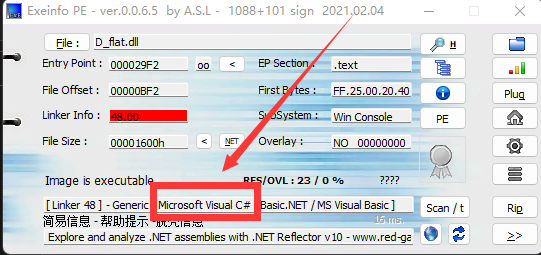
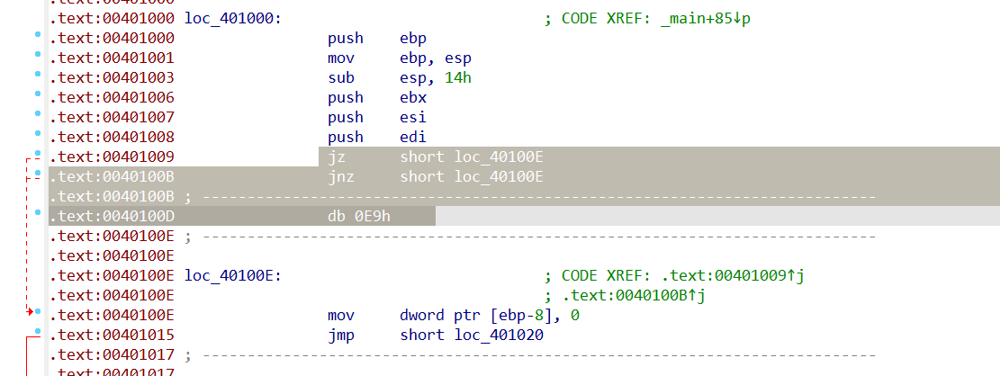
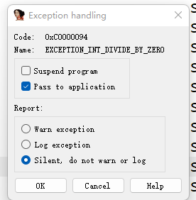
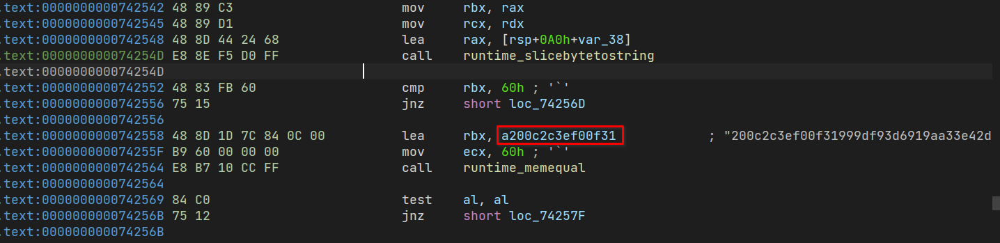
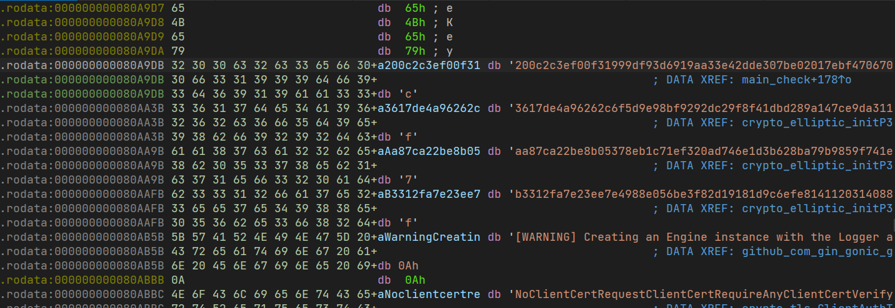

## By 云之君

### checkin

考察对ida的简单使用

#### 解题思路

使用IDA打开，或者使用任何一款文本编辑器/十六进制编辑器打开，搜索moectf得flag。

### begin

主要考察对ida的简单使用和C语言的基础理解以及简单异或加密

#### 解题思路

64位IDA打开，F5得到如下伪代码：

```c
int __cdecl main(int argc, const char **argv, const char **envp)
{
  size_t v3; // rbx
  char Str[108]; // [rsp+20h] [rbp-60h] BYREF
  int i; // [rsp+8Ch] [rbp+Ch]

  sub_4016D0(argc, argv, envp);
  puts("<---Welcome to moectf2022!--->");
  puts("Xor is very interesting and useful! You can learn it by various search engines.\n");
  printf("Input your flag, and I will check for you:");
  scanf("%s", Str);
  for ( i = 0; ; ++i )
  {
    v3 = i;
    if ( v3 >= strlen(Str) )
      break;
    Str[i] ^= 0x19u;
  }
  if ( !strcmp(Str, Str2) )
    puts("\nGood job!!! You know how to decode my flag by xor!");
  else
    puts("\nQwQ. Something wrong. Please try again. >_<");
  return 0;
}
```

题目逻辑就是对输入Str逐个异或0x19，然后跟Str2比较。在IDA中双击Str2可以得到密文，选中密文数据按shift+e可以提取数据，去写一个异或解密脚本即可。

#### 解题脚本

```python
enc = [116,118,124,122,109,127,98,65,41,107,70,40,106,70,106,41,70,112,119,109,42,107,42,106,109,112,119,126,56,56,56,56,56,100]
flag=''

for i in enc:
    flag += chr(i ^ 0x19)

print(flag)
```

### EquationPy

python逆向的简单考察，uncompyle6工具的使用

#### 解题思路

文件为pyc格式，所以首先尝试使用uncompyle6查看其python源码，也可以使用[在线网站](https://tool.lu/pyc/)进行反编译得到python代码。

反编译得到如下python代码：

```python
print('Maybe z3 can help you solve this challenge.')
print('Now give me your flag, and I will check for you.')
flag = input('Input your flag:')
if len(flag) == 22 and ord(flag[0]) * 7072 + ord(flag[1]) * 2523 + ord(flag[2]) * 6714 + ord(flag[3]) * 8810 + ord(flag[4]) * 6796 + ord(flag[5]) * 2647 + ord(flag[6]) * 1347 + ord(flag[7]) * 1289 + ord(flag[8]) * 8917 + ord(flag[9]) * 2304 + ord(flag[10]) * 5001 + ord(flag[11]) * 2882 + ord(flag[12]) * 7232 + ord(flag[13]) * 3192 + ord(flag[14]) * 9676 + ord(flag[15]) * 5436 + ord(flag[16]) * 4407 + ord(flag[17]) * 6269 + ord(flag[18]) * 9623 + ord(flag[19]) * 6230 + ord(flag[20]) * 6292 + ord(flag[21]) * 57 == 10743134 and ord(flag[0]) * 3492 + ord(flag[1]) * 1613 + ord(flag[2]) * 3234 + ord(flag[3]) * 5656 + ord(flag[4]) * 9182 + ord(flag[5]) * 4240 + ord(flag[6]) * 8808 + ord(flag[7]) * 9484 + ord(flag[8]) * 4000 + ord(flag[9]) * 1475 + ord(flag[10]) * 2616 + ord(flag[11]) * 2766 + ord(flag[12]) * 6822 + ord(flag[13]) * 1068 + ord(flag[14]) * 9768 + ord(flag[15]) * 1420 + ord(flag[16]) * 4528 + ord(flag[17]) * 1031 + ord(flag[18]) * 8388 + ord(flag[19]) * 2029 + ord(flag[20]) * 2463 + ord(flag[21]) * 32 == 9663091 and ord(flag[0]) * 9661 + ord(flag[1]) * 1108 + ord(flag[2]) * 2229 + ord(flag[3]) * 1256 + ord(flag[4]) * 7747 + ord(flag[5]) * 5775 + ord(flag[6]) * 5211 + ord(flag[7]) * 2387 + ord(flag[8]) * 1997 + ord(flag[9]) * 4045 + ord(flag[10]) * 7102 + ord(flag[11]) * 7853 + ord(flag[12]) * 5596 + ord(flag[13]) * 6952 + ord(flag[14]) * 8883 + ord(flag[15]) * 5125 + ord(flag[16]) * 9572 + ord(flag[17]) * 1149 + ord(flag[18]) * 7583 + ord(flag[19]) * 1075 + ord(flag[20]) * 9804 + ord(flag[21]) * 72 == 10521461 and ord(flag[0]) * 4314 + ord(flag[1]) * 3509 + ord(flag[2]) * 6200 + ord(flag[3]) * 5546 + ord(flag[4]) * 1705 + ord(flag[5]) * 9518 + ord(flag[6]) * 2975 + ord(flag[7]) * 2689 + ord(flag[8]) * 2412 + ord(flag[9]) * 8659 + ord(flag[10]) * 5459 + ord(flag[11]) * 7572 + ord(flag[12]) * 3042 + ord(flag[13]) * 9701 + ord(flag[14]) * 4697 + ord(flag[15]) * 9863 + ord(flag[16]) * 1296 + ord(flag[17]) * 1278 + ord(flag[18]) * 5721 + ord(flag[19]) * 5116 + ord(flag[20]) * 4147 + ord(flag[21]) * 52 == 9714028 and ord(flag[0]) * 2310 + ord(flag[1]) * 1379 + ord(flag[2]) * 5900 + ord(flag[3]) * 4876 + ord(flag[4]) * 5329 + ord(flag[5]) * 6485 + ord(flag[6]) * 6610 + ord(flag[7]) * 7179 + ord(flag[8]) * 7897 + ord(flag[9]) * 1094 + ord(flag[10]) * 4825 + ord(flag[11]) * 8101 + ord(flag[12]) * 9519 + ord(flag[13]) * 3048 + ord(flag[14]) * 3168 + ord(flag[15]) * 2775 + ord(flag[16]) * 4366 + ord(flag[17]) * 4066 + ord(flag[18]) * 7490 + ord(flag[19]) * 5533 + ord(flag[20]) * 2139 + ord(flag[21]) * 87 == 10030960 and ord(flag[0]) * 1549 + ord(flag[1]) * 8554 + ord(flag[2]) * 6510 + ord(flag[3]) * 6559 + ord(flag[4]) * 5570 + ord(flag[5]) * 1003 + ord(flag[6]) * 8562 + ord(flag[7]) * 6793 + ord(flag[8]) * 3509 + ord(flag[9]) * 4965 + ord(flag[10]) * 6111 + ord(flag[11]) * 1229 + ord(flag[12]) * 5654 + ord(flag[13]) * 2204 + ord(flag[14]) * 2217 + ord(flag[15]) * 5039 + ord(flag[16]) * 5657 + ord(flag[17]) * 9426 + ord(flag[18]) * 7604 + ord(flag[19]) * 5883 + ord(flag[20]) * 5285 + ord(flag[21]) * 17 == 10946682 and ord(flag[0]) * 2678 + ord(flag[1]) * 4369 + ord(flag[2]) * 7509 + ord(flag[3]) * 1564 + ord(flag[4]) * 7777 + ord(flag[5]) * 2271 + ord(flag[6]) * 9696 + ord(flag[7]) * 3874 + ord(flag[8]) * 2212 + ord(flag[9]) * 6764 + ord(flag[10]) * 5727 + ord(flag[11]) * 5971 + ord(flag[12]) * 5876 + ord(flag[13]) * 9959 + ord(flag[14]) * 4604 + ord(flag[15]) * 8461 + ord(flag[16]) * 2350 + ord(flag[17]) * 3564 + ord(flag[18]) * 1831 + ord(flag[19]) * 6088 + ord(flag[20]) * 4575 + ord(flag[21]) * 9 == 10286414 and ord(flag[0]) * 8916 + ord(flag[1]) * 8647 + ord(flag[2]) * 4522 + ord(flag[3]) * 3579 + ord(flag[4]) * 5319 + ord(flag[5]) * 9124 + ord(flag[6]) * 9535 + ord(flag[7]) * 5125 + ord(flag[8]) * 3235 + ord(flag[9]) * 3246 + ord(flag[10]) * 3378 + ord(flag[11]) * 9221 + ord(flag[12]) * 1875 + ord(flag[13]) * 1008 + ord(flag[14]) * 6262 + ord(flag[15]) * 1524 + ord(flag[16]) * 8851 + ord(flag[17]) * 4367 + ord(flag[18]) * 7628 + ord(flag[19]) * 9404 + ord(flag[20]) * 2065 + ord(flag[21]) * 9 == 11809388 and ord(flag[0]) * 9781 + ord(flag[1]) * 9174 + ord(flag[2]) * 3771 + ord(flag[3]) * 6972 + ord(flag[4]) * 6425 + ord(flag[5]) * 7631 + ord(flag[6]) * 8864 + ord(flag[7]) * 9117 + ord(flag[8]) * 4328 + ord(flag[9]) * 3919 + ord(flag[10]) * 6517 + ord(flag[11]) * 7165 + ord(flag[12]) * 6895 + ord(flag[13]) * 3609 + ord(flag[14]) * 3878 + ord(flag[15]) * 1593 + ord(flag[16]) * 9098 + ord(flag[17]) * 6432 + ord(flag[18]) * 2584 + ord(flag[19]) * 8403 + ord(flag[20]) * 4029 + ord(flag[21]) * 30 == 13060508 and ord(flag[0]) * 2511 + ord(flag[1]) * 8583 + ord(flag[2]) * 2428 + ord(flag[3]) * 9439 + ord(flag[4]) * 3662 + ord(flag[5]) * 3278 + ord(flag[6]) * 8305 + ord(flag[7]) * 1100 + ord(flag[8]) * 7972 + ord(flag[9]) * 8510 + ord(flag[10]) * 8552 + ord(flag[11]) * 9993 + ord(flag[12]) * 6855 + ord(flag[13]) * 1702 + ord(flag[14]) * 1640 + ord(flag[15]) * 3787 + ord(flag[16]) * 8161 + ord(flag[17]) * 2110 + ord(flag[18]) * 5320 + ord(flag[19]) * 3313 + ord(flag[20]) * 9286 + ord(flag[21]) * 74 == 10568195 and ord(flag[0]) * 4974 + ord(flag[1]) * 4445 + ord(flag[2]) * 7368 + ord(flag[3]) * 9132 + ord(flag[4]) * 5894 + ord(flag[5]) * 7822 + ord(flag[6]) * 7923 + ord(flag[7]) * 6822 + ord(flag[8]) * 2698 + ord(flag[9]) * 3643 + ord(flag[10]) * 8392 + ord(flag[11]) * 4126 + ord(flag[12]) * 1941 + ord(flag[13]) * 6641 + ord(flag[14]) * 2949 + ord(flag[15]) * 7405 + ord(flag[16]) * 9980 + ord(flag[17]) * 6349 + ord(flag[18]) * 3328 + ord(flag[19]) * 8766 + ord(flag[20]) * 9508 + ord(flag[21]) * 65 == 12514783 and ord(flag[0]) * 4127 + ord(flag[1]) * 4703 + ord(flag[2]) * 6409 + ord(flag[3]) * 4907 + ord(flag[4]) * 5230 + ord(flag[5]) * 3371 + ord(flag[6]) * 5666 + ord(flag[7]) * 3194 + ord(flag[8]) * 5448 + ord(flag[9]) * 8415 + ord(flag[10]) * 4525 + ord(flag[11]) * 4152 + ord(flag[12]) * 1467 + ord(flag[13]) * 5254 + ord(flag[14]) * 2256 + ord(flag[15]) * 1643 + ord(flag[16]) * 9113 + ord(flag[17]) * 8805 + ord(flag[18]) * 4315 + ord(flag[19]) * 8371 + ord(flag[20]) * 1919 + ord(flag[21]) * 2 == 10299950 and ord(flag[0]) * 6245 + ord(flag[1]) * 8783 + ord(flag[2]) * 6059 + ord(flag[3]) * 9375 + ord(flag[4]) * 9253 + ord(flag[5]) * 1974 + ord(flag[6]) * 8867 + ord(flag[7]) * 6423 + ord(flag[8]) * 2577 + ord(flag[9]) * 6613 + ord(flag[10]) * 2040 + ord(flag[11]) * 2209 + ord(flag[12]) * 4147 + ord(flag[13]) * 7151 + ord(flag[14]) * 1011 + ord(flag[15]) * 9446 + ord(flag[16]) * 4362 + ord(flag[17]) * 3073 + ord(flag[18]) * 3006 + ord(flag[19]) * 5499 + ord(flag[20]) * 8850 + ord(flag[21]) * 23 == 11180727 and ord(flag[0]) * 1907 + ord(flag[1]) * 9038 + ord(flag[2]) * 3932 + ord(flag[3]) * 7054 + ord(flag[4]) * 1135 + ord(flag[5]) * 5095 + ord(flag[6]) * 6962 + ord(flag[7]) * 6481 + ord(flag[8]) * 7049 + ord(flag[9]) * 5995 + ord(flag[10]) * 6233 + ord(flag[11]) * 1321 + ord(flag[12]) * 4455 + ord(flag[13]) * 8181 + ord(flag[14]) * 5757 + ord(flag[15]) * 6953 + ord(flag[16]) * 3167 + ord(flag[17]) * 5508 + ord(flag[18]) * 4602 + ord(flag[19]) * 1420 + ord(flag[20]) * 3075 + ord(flag[21]) * 25 == 10167536 and ord(flag[0]) * 1489 + ord(flag[1]) * 9236 + ord(flag[2]) * 7398 + ord(flag[3]) * 4088 + ord(flag[4]) * 4131 + ord(flag[5]) * 1657 + ord(flag[6]) * 9068 + ord(flag[7]) * 6420 + ord(flag[8]) * 3970 + ord(flag[9]) * 3265 + ord(flag[10]) * 5343 + ord(flag[11]) * 5386 + ord(flag[12]) * 2583 + ord(flag[13]) * 2813 + ord(flag[14]) * 7181 + ord(flag[15]) * 9116 + ord(flag[16]) * 4836 + ord(flag[17]) * 6917 + ord(flag[18]) * 1123 + ord(flag[19]) * 7276 + ord(flag[20]) * 2257 + ord(flag[21]) * 65 == 10202212 and ord(flag[0]) * 2097 + ord(flag[1]) * 1253 + ord(flag[2]) * 1469 + ord(flag[3]) * 2731 + ord(flag[4]) * 9565 + ord(flag[5]) * 9185 + ord(flag[6]) * 1095 + ord(flag[7]) * 8666 + ord(flag[8]) * 2919 + ord(flag[9]) * 7962 + ord(flag[10]) * 1497 + ord(flag[11]) * 6642 + ord(flag[12]) * 4108 + ord(flag[13]) * 6892 + ord(flag[14]) * 7161 + ord(flag[15]) * 7552 + ord(flag[16]) * 5666 + ord(flag[17]) * 4060 + ord(flag[18]) * 7799 + ord(flag[19]) * 5080 + ord(flag[20]) * 8516 + ord(flag[21]) * 43 == 10435786 and ord(flag[0]) * 1461 + ord(flag[1]) * 1676 + ord(flag[2]) * 4755 + ord(flag[3]) * 7982 + ord(flag[4]) * 3860 + ord(flag[5]) * 1067 + ord(flag[6]) * 6715 + ord(flag[7]) * 4019 + ord(flag[8]) * 4983 + ord(flag[9]) * 2031 + ord(flag[10]) * 1173 + ord(flag[11]) * 2241 + ord(flag[12]) * 2594 + ord(flag[13]) * 8672 + ord(flag[14]) * 4810 + ord(flag[15]) * 7963 + ord(flag[16]) * 7749 + ord(flag[17]) * 5730 + ord(flag[18]) * 9855 + ord(flag[19]) * 5858 + ord(flag[20]) * 2349 + ord(flag[21]) * 71 == 9526385 and ord(flag[0]) * 9025 + ord(flag[1]) * 9536 + ord(flag[2]) * 1515 + ord(flag[3]) * 8177 + ord(flag[4]) * 6109 + ord(flag[5]) * 4856 + ord(flag[6]) * 6692 + ord(flag[7]) * 4929 + ord(flag[8]) * 1010 + ord(flag[9]) * 3995 + ord(flag[10]) * 3511 + ord(flag[11]) * 5910 + ord(flag[12]) * 3501 + ord(flag[13]) * 3731 + ord(flag[14]) * 6601 + ord(flag[15]) * 6200 + ord(flag[16]) * 8177 + ord(flag[17]) * 5488 + ord(flag[18]) * 5957 + ord(flag[19]) * 9661 + ord(flag[20]) * 4956 + ord(flag[21]) * 48 == 11822714 and ord(flag[0]) * 4462 + ord(flag[1]) * 1940 + ord(flag[2]) * 5956 + ord(flag[3]) * 4965 + ord(flag[4]) * 9268 + ord(flag[5]) * 9627 + ord(flag[6]) * 3564 + ord(flag[7]) * 5417 + ord(flag[8]) * 2039 + ord(flag[9]) * 7269 + ord(flag[10]) * 9667 + ord(flag[11]) * 4158 + ord(flag[12]) * 2856 + ord(flag[13]) * 2851 + ord(flag[14]) * 9696 + ord(flag[15]) * 5986 + ord(flag[16]) * 6237 + ord(flag[17]) * 5845 + ord(flag[18]) * 5467 + ord(flag[19]) * 5227 + ord(flag[20]) * 4771 + ord(flag[21]) * 72 == 11486796 and ord(flag[0]) * 4618 + ord(flag[1]) * 8621 + ord(flag[2]) * 8144 + ord(flag[3]) * 7115 + ord(flag[4]) * 1577 + ord(flag[5]) * 8602 + ord(flag[6]) * 3886 + ord(flag[7]) * 3712 + ord(flag[8]) * 1258 + ord(flag[9]) * 7063 + ord(flag[10]) * 1872 + ord(flag[11]) * 9855 + ord(flag[12]) * 4167 + ord(flag[13]) * 7615 + ord(flag[14]) * 6298 + ord(flag[15]) * 7682 + ord(flag[16]) * 8795 + ord(flag[17]) * 3856 + ord(flag[18]) * 6217 + ord(flag[19]) * 5764 + ord(flag[20]) * 5076 + ord(flag[21]) * 93 == 11540145 and ord(flag[0]) * 7466 + ord(flag[1]) * 8442 + ord(flag[2]) * 4822 + ord(flag[3]) * 7639 + ord(flag[4]) * 2049 + ord(flag[5]) * 7311 + ord(flag[6]) * 5816 + ord(flag[7]) * 8433 + ord(flag[8]) * 5905 + ord(flag[9]) * 4838 + ord(flag[10]) * 1251 + ord(flag[11]) * 8184 + ord(flag[12]) * 6465 + ord(flag[13]) * 4634 + ord(flag[14]) * 5513 + ord(flag[15]) * 3160 + ord(flag[16]) * 6720 + ord(flag[17]) * 9205 + ord(flag[18]) * 6671 + ord(flag[19]) * 7716 + ord(flag[20]) * 1905 + ord(flag[21]) * 29 == 12227250 and ord(flag[0]) * 5926 + ord(flag[1]) * 9095 + ord(flag[2]) * 2048 + ord(flag[3]) * 4639 + ord(flag[4]) * 3035 + ord(flag[5]) * 9560 + ord(flag[6]) * 1591 + ord(flag[7]) * 2392 + ord(flag[8]) * 1812 + ord(flag[9]) * 6732 + ord(flag[10]) * 9454 + ord(flag[11]) * 8175 + ord(flag[12]) * 7346 + ord(flag[13]) * 6333 + ord(flag[14]) * 9812 + ord(flag[15]) * 2034 + ord(flag[16]) * 6634 + ord(flag[17]) * 1762 + ord(flag[18]) * 7058 + ord(flag[19]) * 3524 + ord(flag[20]) * 7462 + ord(flag[21]) * 11 == 11118093:
    print('Congratulate!!!You are right!')
else:
    print('What a pity...Please try again >__<')
```

阅读代码可以发现是一个21元的方程组。题目提示了使用z3来解方程组，可以自行学习z3的使用方法。
在提取表达式时，VSCode的多光标操作可以帮助提高一些效率。

> 按住alt+shift拖动光标可以在同一列添加多个光标
> 选中一部分字符，按ctrl+f2可以选中所有相同的字符

#### 解题脚本

```python
from z3 import *

flag = [Int("input[%d]"%i) for i in range(22)]

s = Solver()
s.add(flag[0] * 7072 + flag[1] * 2523 + flag[2] * 6714 + flag[3] * 8810 + flag[4] * 6796 + flag[5] * 2647 + flag[6] * 1347 + flag[7] * 1289 + flag[8] * 8917 + flag[9] * 2304 + flag[10] * 5001 + flag[11] * 2882 + flag[12] * 7232 + flag[13] * 3192 + flag[14] * 9676 + flag[15] * 5436 + flag[16] * 4407 + flag[17] * 6269 + flag[18] * 9623 + flag[19] * 6230 + flag[20] * 6292 + flag[21] * 57 == 10743134)
s.add(flag[0] * 3492 + flag[1] * 1613 + flag[2] * 3234 + flag[3] * 5656 + flag[4] * 9182 + flag[5] * 4240 + flag[6] * 8808 + flag[7] * 9484 + flag[8] * 4000 + flag[9] * 1475 + flag[10] * 2616 + flag[11] * 2766 + flag[12] * 6822 + flag[13] * 1068 + flag[14] * 9768 + flag[15] * 1420 + flag[16] * 4528 + flag[17] * 1031 + flag[18] * 8388 + flag[19] * 2029 + flag[20] * 2463 + flag[21] * 32 == 9663091)
s.add(flag[0] * 9661 + flag[1] * 1108 + flag[2] * 2229 + flag[3] * 1256 + flag[4] * 7747 + flag[5] * 5775 + flag[6] * 5211 + flag[7] * 2387 + flag[8] * 1997 + flag[9] * 4045 + flag[10] * 7102 + flag[11] * 7853 + flag[12] * 5596 + flag[13] * 6952 + flag[14] * 8883 + flag[15] * 5125 + flag[16] * 9572 + flag[17] * 1149 + flag[18] * 7583 + flag[19] * 1075 + flag[20] * 9804 + flag[21] * 72 == 10521461)
s.add(flag[0] * 4314 + flag[1] * 3509 + flag[2] * 6200 + flag[3] * 5546 + flag[4] * 1705 + flag[5] * 9518 + flag[6] * 2975 + flag[7] * 2689 + flag[8] * 2412 + flag[9] * 8659 + flag[10] * 5459 + flag[11] * 7572 + flag[12] * 3042 + flag[13] * 9701 + flag[14] * 4697 + flag[15] * 9863 + flag[16] * 1296 + flag[17] * 1278 + flag[18] * 5721 + flag[19] * 5116 + flag[20] * 4147 + flag[21] * 52 == 9714028)
s.add(flag[0] * 2310 + flag[1] * 1379 + flag[2] * 5900 + flag[3] * 4876 + flag[4] * 5329 + flag[5] * 6485 + flag[6] * 6610 + flag[7] * 7179 + flag[8] * 7897 + flag[9] * 1094 + flag[10] * 4825 + flag[11] * 8101 + flag[12] * 9519 + flag[13] * 3048 + flag[14] * 3168 + flag[15] * 2775 + flag[16] * 4366 + flag[17] * 4066 + flag[18] * 7490 + flag[19] * 5533 + flag[20] * 2139 + flag[21] * 87 == 10030960)
s.add(flag[0] * 1549 + flag[1] * 8554 + flag[2] * 6510 + flag[3] * 6559 + flag[4] * 5570 + flag[5] * 1003 + flag[6] * 8562 + flag[7] * 6793 + flag[8] * 3509 + flag[9] * 4965 + flag[10] * 6111 + flag[11] * 1229 + flag[12] * 5654 + flag[13] * 2204 + flag[14] * 2217 + flag[15] * 5039 + flag[16] * 5657 + flag[17] * 9426 + flag[18] * 7604 + flag[19] * 5883 + flag[20] * 5285 + flag[21] * 17 == 10946682)
s.add(flag[0] * 2678 + flag[1] * 4369 + flag[2] * 7509 + flag[3] * 1564 + flag[4] * 7777 + flag[5] * 2271 + flag[6] * 9696 + flag[7] * 3874 + flag[8] * 2212 + flag[9] * 6764 + flag[10] * 5727 + flag[11] * 5971 + flag[12] * 5876 + flag[13] * 9959 + flag[14] * 4604 + flag[15] * 8461 + flag[16] * 2350 + flag[17] * 3564 + flag[18] * 1831 + flag[19] * 6088 + flag[20] * 4575 + flag[21] * 9 == 10286414)
s.add(flag[0] * 8916 + flag[1] * 8647 + flag[2] * 4522 + flag[3] * 3579 + flag[4] * 5319 + flag[5] * 9124 + flag[6] * 9535 + flag[7] * 5125 + flag[8] * 3235 + flag[9] * 3246 + flag[10] * 3378 + flag[11] * 9221 + flag[12] * 1875 + flag[13] * 1008 + flag[14] * 6262 + flag[15] * 1524 + flag[16] * 8851 + flag[17] * 4367 + flag[18] * 7628 + flag[19] * 9404 + flag[20] * 2065 + flag[21] * 9 == 11809388)
s.add(flag[0] * 9781 + flag[1] * 9174 + flag[2] * 3771 + flag[3] * 6972 + flag[4] * 6425 + flag[5] * 7631 + flag[6] * 8864 + flag[7] * 9117 + flag[8] * 4328 + flag[9] * 3919 + flag[10] * 6517 + flag[11] * 7165 + flag[12] * 6895 + flag[13] * 3609 + flag[14] * 3878 + flag[15] * 1593 + flag[16] * 9098 + flag[17] * 6432 + flag[18] * 2584 + flag[19] * 8403 + flag[20] * 4029 + flag[21] * 30 == 13060508)
s.add(flag[0] * 2511 + flag[1] * 8583 + flag[2] * 2428 + flag[3] * 9439 + flag[4] * 3662 + flag[5] * 3278 + flag[6] * 8305 + flag[7] * 1100 + flag[8] * 7972 + flag[9] * 8510 + flag[10] * 8552 + flag[11] * 9993 + flag[12] * 6855 + flag[13] * 1702 + flag[14] * 1640 + flag[15] * 3787 + flag[16] * 8161 + flag[17] * 2110 + flag[18] * 5320 + flag[19] * 3313 + flag[20] * 9286 + flag[21] * 74 == 10568195)
s.add(flag[0] * 4974 + flag[1] * 4445 + flag[2] * 7368 + flag[3] * 9132 + flag[4] * 5894 + flag[5] * 7822 + flag[6] * 7923 + flag[7] * 6822 + flag[8] * 2698 + flag[9] * 3643 + flag[10] * 8392 + flag[11] * 4126 + flag[12] * 1941 + flag[13] * 6641 + flag[14] * 2949 + flag[15] * 7405 + flag[16] * 9980 + flag[17] * 6349 + flag[18] * 3328 + flag[19] * 8766 + flag[20] * 9508 + flag[21] * 65 == 12514783)
s.add(flag[0] * 4127 + flag[1] * 4703 + flag[2] * 6409 + flag[3] * 4907 + flag[4] * 5230 + flag[5] * 3371 + flag[6] * 5666 + flag[7] * 3194 + flag[8] * 5448 + flag[9] * 8415 + flag[10] * 4525 + flag[11] * 4152 + flag[12] * 1467 + flag[13] * 5254 + flag[14] * 2256 + flag[15] * 1643 + flag[16] * 9113 + flag[17] * 8805 + flag[18] * 4315 + flag[19] * 8371 + flag[20] * 1919 + flag[21] * 2 == 10299950)
s.add(flag[0] * 6245 + flag[1] * 8783 + flag[2] * 6059 + flag[3] * 9375 + flag[4] * 9253 + flag[5] * 1974 + flag[6] * 8867 + flag[7] * 6423 + flag[8] * 2577 + flag[9] * 6613 + flag[10] * 2040 + flag[11] * 2209 + flag[12] * 4147 + flag[13] * 7151 + flag[14] * 1011 + flag[15] * 9446 + flag[16] * 4362 + flag[17] * 3073 + flag[18] * 3006 + flag[19] * 5499 + flag[20] * 8850 + flag[21] * 23 == 11180727)
s.add(flag[0] * 1907 + flag[1] * 9038 + flag[2] * 3932 + flag[3] * 7054 + flag[4] * 1135 + flag[5] * 5095 + flag[6] * 6962 + flag[7] * 6481 + flag[8] * 7049 + flag[9] * 5995 + flag[10] * 6233 + flag[11] * 1321 + flag[12] * 4455 + flag[13] * 8181 + flag[14] * 5757 + flag[15] * 6953 + flag[16] * 3167 + flag[17] * 5508 + flag[18] * 4602 + flag[19] * 1420 + flag[20] * 3075 + flag[21] * 25 == 10167536)
s.add(flag[0] * 1489 + flag[1] * 9236 + flag[2] * 7398 + flag[3] * 4088 + flag[4] * 4131 + flag[5] * 1657 + flag[6] * 9068 + flag[7] * 6420 + flag[8] * 3970 + flag[9] * 3265 + flag[10] * 5343 + flag[11] * 5386 + flag[12] * 2583 + flag[13] * 2813 + flag[14] * 7181 + flag[15] * 9116 + flag[16] * 4836 + flag[17] * 6917 + flag[18] * 1123 + flag[19] * 7276 + flag[20] * 2257 + flag[21] * 65 == 10202212)
s.add(flag[0] * 2097 + flag[1] * 1253 + flag[2] * 1469 + flag[3] * 2731 + flag[4] * 9565 + flag[5] * 9185 + flag[6] * 1095 + flag[7] * 8666 + flag[8] * 2919 + flag[9] * 7962 + flag[10] * 1497 + flag[11] * 6642 + flag[12] * 4108 + flag[13] * 6892 + flag[14] * 7161 + flag[15] * 7552 + flag[16] * 5666 + flag[17] * 4060 + flag[18] * 7799 + flag[19] * 5080 + flag[20] * 8516 + flag[21] * 43 == 10435786)
s.add(flag[0] * 1461 + flag[1] * 1676 + flag[2] * 4755 + flag[3] * 7982 + flag[4] * 3860 + flag[5] * 1067 + flag[6] * 6715 + flag[7] * 4019 + flag[8] * 4983 + flag[9] * 2031 + flag[10] * 1173 + flag[11] * 2241 + flag[12] * 2594 + flag[13] * 8672 + flag[14] * 4810 + flag[15] * 7963 + flag[16] * 7749 + flag[17] * 5730 + flag[18] * 9855 + flag[19] * 5858 + flag[20] * 2349 + flag[21] * 71 == 9526385)
s.add(flag[0] * 9025 + flag[1] * 9536 + flag[2] * 1515 + flag[3] * 8177 + flag[4] * 6109 + flag[5] * 4856 + flag[6] * 6692 + flag[7] * 4929 + flag[8] * 1010 + flag[9] * 3995 + flag[10] * 3511 + flag[11] * 5910 + flag[12] * 3501 + flag[13] * 3731 + flag[14] * 6601 + flag[15] * 6200 + flag[16] * 8177 + flag[17] * 5488 + flag[18] * 5957 + flag[19] * 9661 + flag[20] * 4956 + flag[21] * 48 == 11822714)
s.add(flag[0] * 4462 + flag[1] * 1940 + flag[2] * 5956 + flag[3] * 4965 + flag[4] * 9268 + flag[5] * 9627 + flag[6] * 3564 + flag[7] * 5417 + flag[8] * 2039 + flag[9] * 7269 + flag[10] * 9667 + flag[11] * 4158 + flag[12] * 2856 + flag[13] * 2851 + flag[14] * 9696 + flag[15] * 5986 + flag[16] * 6237 + flag[17] * 5845 + flag[18] * 5467 + flag[19] * 5227 + flag[20] * 4771 + flag[21] * 72 == 11486796)
s.add(flag[0] * 4618 + flag[1] * 8621 + flag[2] * 8144 + flag[3] * 7115 + flag[4] * 1577 + flag[5] * 8602 + flag[6] * 3886 + flag[7] * 3712 + flag[8] * 1258 + flag[9] * 7063 + flag[10] * 1872 + flag[11] * 9855 + flag[12] * 4167 + flag[13] * 7615 + flag[14] * 6298 + flag[15] * 7682 + flag[16] * 8795 + flag[17] * 3856 + flag[18] * 6217 + flag[19] * 5764 + flag[20] * 5076 + flag[21] * 93 == 11540145)
s.add(flag[0] * 7466 + flag[1] * 8442 + flag[2] * 4822 + flag[3] * 7639 + flag[4] * 2049 + flag[5] * 7311 + flag[6] * 5816 + flag[7] * 8433 + flag[8] * 5905 + flag[9] * 4838 + flag[10] * 1251 + flag[11] * 8184 + flag[12] * 6465 + flag[13] * 4634 + flag[14] * 5513 + flag[15] * 3160 + flag[16] * 6720 + flag[17] * 9205 + flag[18] * 6671 + flag[19] * 7716 + flag[20] * 1905 + flag[21] * 29 == 12227250)
s.add(flag[0] * 5926 + flag[1] * 9095 + flag[2] * 2048 + flag[3] * 4639 + flag[4] * 3035 + flag[5] * 9560 + flag[6] * 1591 + flag[7] * 2392 + flag[8] * 1812 + flag[9] * 6732 + flag[10] * 9454 + flag[11] * 8175 + flag[12] * 7346 + flag[13] * 6333 + flag[14] * 9812 + flag[15] * 2034 + flag[16] * 6634 + flag[17] * 1762 + flag[18] * 7058 + flag[19] * 3524 + flag[20] * 7462 + flag[21] * 11 == 11118093)
if s.check() == sat:
    m = s.model()
    for i in range(22):
        print(chr(int(str(m[flag[i]]))),end = '')
```

### D flat

考察C#逆向。

#### 解题思路

对D_flat.dll查壳可以发现是用C#编写的：



对于C#逆向可以使用dnspy来反编译。

D_flat.dll拖进dnspy，得到如下C#代码：

```cs
using System;
using System.Text;

// Token: 0x02000002 RID: 2
internal class D_flate
{
    // Token: 0x06000001 RID: 1 RVA: 0x00002050 File Offset: 0x00000250
    private static void Main()
    {
        int f = 0;
        int[] flag = new int[]
        {
            109,111,101,99,116,102,123,68,95,102,108,97,116,101,95,105,115,95,67,95,115,104,97,114,112,33,125
        };
        Console.WriteLine("In music theory, there is a note that has the same pitch as D flat.");
        Console.WriteLine("Do you know it?\nNow plz input your flag:");
        string input = Console.ReadLine();
        byte[] byteArray = Encoding.ASCII.GetBytes(input);
        for (int i = 0; i < input.Length; i++)
        {
            if (flag[i] == (int)byteArray[i])
            {
                f++;
            }
        }
        if (f == flag.Length)
        {
            Console.WriteLine("TTTTTQQQQQQLLLLLLL!!! This is your flag!");
            return;
        }
        Console.WriteLine("QwQ, plz try again.");
    }
}
```

就是把输入跟flag逐个比对，写个脚本把flag转为字符串即可。

#### 解题脚本

```python
flag = [109,111,101,99,116,102,123,68,95,102,108,97,116,101,95,105,115,95,67,95,115,104,97,114,112,33,125]
print(bytes(flag))
```

### chicken_soup

考察花指令。对萌新来讲可能还有如何理解移位操作。

#### 解题思路

F5得到如下伪代码：

```c
int __cdecl main(int argc, const char **argv, const char **envp)
{
  int result; // eax
  char v4[100]; // [esp+10h] [ebp-68h] BYREF

  puts("I poisoned the program... Can you reverse it?!");
  puts("Come on! Give me your flag:");
  sub_4012A0("%s", v4);
  if ( strlen(v4) == 38 )
  {
    ((void (__cdecl *)(char *))loc_401000)(v4);
    ((void (__cdecl *)(char *))loc_401080)(v4);
    if ( sub_401110(v4, &unk_403000) )
      puts("\nTTTTTTTTTTQQQQQQQQQQQQQLLLLLLLLL!!!!");
    else
      puts("\nQwQ, please try again.");
    result = 0;
  }
  else
  {
    puts("\nQwQ, please try again.");
    result = 0;
  }
  return result;
}
```

可以看到就是对输入用loc_401000和loc_401080进行了加密，然后跟unk_403000进行对比。
双击loc_401000可以发现跳转到了汇编代码，IDA拖着大红色，后面有一堆杂乱的数据无法识别，这是因为IDA的分析被花指令扰乱了。
在loc_40100D按U将代码转为未定义的数据，然后在unk_40100E处按C转为代码。40100D处是无用指令，就是它扰乱了IDA的分析，所以我们要将它patch掉。



选中这3句按ctrl+alt+k，输入`nop`然后点patch，对40100D处的0x90也按C转为代码，然后在loc_401000处按P创建函数，F5就可以得到伪代码。
loc_401000是一个加的操作，即`input[i] += input[i + 1];`，loc_401080是一个移位的操作，即`input[i] = ((input[i] >> 4) | (input[i] << 4)) & 0xff;`，就是将每一个字节的前4bit放到后4bit，后4bit放到前4bit。理解了这一点，就很容易写出解密脚本。

#### 解题脚本

```python
enc = [0xcd,0x4d,0x8c,0x7d,0xad,0x1e,0xbe,0x4a,0x8a,0x7d,0xbc,0x7c,0xfc,0x2e,0x2a,0x79,0x9d,0x6a,0x1a,0xcc,0x3d,0x4a,0xf8,0x3c,0x79,0x69,0x39,0xd9,0xdd,0x9d,0xa9,0x69,0x4c,0x8c,0xdd,0x59,0xe9,0xd7]

for i in range(len(enc)):
    enc[i] = ((enc[i] >> 4) | (enc[i] << 4)) & 0xff

for i in range(len(enc)-1, 0, -1):
    enc[i-1] -= enc[i]

print(bytes(enc))
```

#### 题目源码

``` c
#include<stdio.h>
#include<string.h>

unsigned char check[] = { 0xcd,0x4d,0x8c,0x7d,0xad,0x1e,0xbe,0x4a,0x8a,0x7d,0xbc,0x7c,0xfc,0x2e,0x2a,0x79,0x9d,0x6a,0x1a,0xcc,0x3d,0x4a,0xf8,0x3c,0x79,0x69,0x39,0xd9,0xdd,0x9d,0xa9,0x69,0x4c,0x8c,0xdd,0x59,0xe9,0xd7,0 };

//moectf{p4tch_pr0gr4m_t0_d3c0mpi1e_it!}
void enc1(unsigned char* input)
{
    __asm {
        jz label
        jnz label
        _emit 0xe9
        label:
    }
    for (int i = 0; i < strlen((const char*)input) - 1; i++)
        input[i] += input[i + 1];
}

void enc2(unsigned char* input)
{
    __asm {
        jz label
        jnz label
        _emit 0xe9
        label:
    }

    for (int i = 0; i < strlen((const char*)input); i++)
        input[i] = ((input[i] >> 4) | (input[i] << 4)) & 0xff;
}

int my_strcmp(unsigned char* s1, unsigned char* s2)
{
    int i = 0, f = 0;

    while (i < 38)
        if (s1[i] == s2[i++])
            f++;

    if (f == 38)
        return 1;
    else
        return 0;
}

int main()
{
    unsigned char input[100];
    puts("I poisoned the program... Can you reverse it?!");
    puts("Come on! Give me your flag:");
    scanf_s("%s", input, 100);

    if (strlen((const char*)input) != 38)
    {
        puts("\nQwQ, please try again.");
        return 0;
    }
 
    enc1(input);
    enc2(input);

    if(my_strcmp(input,check))
        puts("\nTTTTTTTTTTQQQQQQQQQQQQQLLLLLLLLL!!!!");
    else
        puts("\nQwQ, please try again.");

    return 0;
}
```

### fake key

考察动态调试。

#### 解题思路

题目已经提示，密钥是假的，以及可以通过动态调试来获取随机数。
F5得到的伪代码如下：

```c
int __cdecl main(int argc, const char **argv, const char **envp)
{
  char Str[112]; // [rsp+20h] [rbp-80h] BYREF
  int v5; // [rsp+90h] [rbp-10h]
  int v6; // [rsp+94h] [rbp-Ch]
  int j; // [rsp+98h] [rbp-8h]
  int i; // [rsp+9Ch] [rbp-4h]

  sub_401800(argc, argv, envp);
  v6 = strlen(::Str);
  puts("I changed the key secretly, you can't find the right key!");
  puts("And I use random numbers to rot my input, you can never guess them!");
  puts("Unless you debug to get the key and random numbers...");
  puts("Now give me your flag:");
  scanf("%s", Str);
  v5 = strlen(Str);
  for ( i = 0; i < v5; ++i )
    Str[i] ^= ::Str[i % v6];
  for ( j = 0; j < v5; ++j )
    Str[j] += rand() % 10;
  if ( (unsigned int)sub_4015A2(Str, &unk_403020) )
    puts("\nRight! TTTTTQQQQQLLLLL!!!");
  else
    puts("QwQ, plz try again.");
  return 0;
}
```

这道题比较迷惑的点可能在于IDA的命名问题。实际上line18中`Str[i] ^= ::Str[i % v6];`所使用的两个Str并不是同一个变量。选中变量名按N可以对其进行重命名。对代码重命名之后可以得到比较清晰的伪代码：

```c
int __cdecl main(int argc, const char **argv, const char **envp)
{
  char input[112]; // [rsp+20h] [rbp-80h] BYREF
  int input_len; // [rsp+90h] [rbp-10h]
  int key_len; // [rsp+94h] [rbp-Ch]
  int j; // [rsp+98h] [rbp-8h]
  int i; // [rsp+9Ch] [rbp-4h]

  sub_401800(argc, argv, envp);
  key_len = strlen(key);
  puts("I changed the key secretly, you can't find the right key!");
  puts("And I use random numbers to rot my input, you can never guess them!");
  puts("Unless you debug to get the key and random numbers...");
  puts("Now give me your flag:");
  scanf("%s", input);
  input_len = strlen(input);
  for ( i = 0; i < input_len; ++i )
    input[i] ^= key[i % key_len];
  for ( j = 0; j < input_len; ++j )
    input[j] += rand() % 10;
  if ( (unsigned int)strcmp(input, &enc) )
    puts("\nRight! TTTTTQQQQQLLLLL!!!");
  else
    puts("QwQ, plz try again.");
  return 0;
}
```

可以看到首先对输入与密钥进行循环异或，然后加上一个随机数。
双击key会发现是字符串`yunzh1jun`。在line17下断点调试起来程序，双击key，会发现key变成了`yunzh1junTCL,trackYYDS`，这才是真正的key。
关于如何获取随机数，可以在line19下断，提取出此时的input数据，然后跑完整个for循环，再提取input数据，两者相减就是生成的随机数。

#### 解题脚本

```python
enc = [0x15, 0x21, 0x0F, 0x19, 0x25, 0x5B, 0x19, 0x39, 0x5F, 0x3A, 
  0x3B, 0x30, 0x74, 0x07, 0x43, 0x3F, 0x09, 0x5A, 0x34, 0x0C, 
  0x74, 0x3F, 0x1E, 0x2D, 0x27, 0x21, 0x12, 0x16, 0x1F]
key = b'yunzh1junTCL,trackYYDS'

add1 = [0x11, 0x1D, 0x06, 0x12, 0x00, 0x59, 0x02, 0x1D, 0x06, 0x3C, 
  0x2B, 0x24, 0x44, 0x1C, 0x1A, 0x09, 0x0B, 0x03, 0x31, 0x31, 
  0x2C, 0x3B, 0x11, 0x1D, 0x06, 0x12, 0x00, 0x59, 0x02]
add2 = [0x12, 0x24, 0x0A, 0x12, 0x09, 0x5D, 0x0A, 0x25, 0x08, 0x40, 
  0x30, 0x29, 0x45, 0x23, 0x1B, 0x0A, 0x10, 0x05, 0x38, 0x37, 
  0x2D, 0x3F, 0x13, 0x20, 0x08, 0x14, 0x01, 0x5F, 0x0A]

flag=''
for i in range(len(enc)):
    flag += chr((enc[i] - add2[i] + add1[i]) ^ key[i % len(key)])

print(flag)
```

#### 题目源码

``` c
#include<stdio.h>
#include<string.h>
#include<stdlib.h>
unsigned char check[] = {21,33,15,25,37,91,25,57,95,58,59,48,116,7,67,63,9,90,52,12,116,63,30,45,39,33,18,22,31,0};
unsigned char key[100] = {"yunzh1jun"};
//moectf{D3bug_t0_g3t_7he_Key!}

__attribute((constructor)) static void fun()
{
    strcat(key,"TCL,trackYYDS");
}

int main()
{
    int len = strlen(key);
    unsigned char input[100];

    puts("I changed the key secretly, you can't find the right key!");
    puts("And I use random numbers to rot my input, you can never guess them!");
    puts("Unless you debug to get the key and random numbers...");
    puts("Now give me your flag:");

    scanf("%s", input);
    int len_ipt = strlen(input);

    for(int i = 0; i < len_ipt; i++)
    input[i] ^= key[i % len];

    for(int i = 0; i < len_ipt; i++)
    input[i] += rand() % 10;

    if(!strcmp(input, check))
    puts("\nRight! TTTTTQQQQQLLLLL!!!");
    else
    puts("QwQ, plz try again.");

    return 0;
}
```

### Art

考察UPX壳，以及异或取模的深搜爆破。

#### 解题思路

查壳可以发现有UPX壳，我并没有做什么魔改，用脱壳机脱壳即可。
脱壳后拖进IDA，F5得到伪代码：

```c
int __cdecl main(int argc, const char **argv, const char **envp)
{
  char input_cpy[112]; // [rsp+20h] [rbp-60h] BYREF
  char input[108]; // [rsp+90h] [rbp+10h] BYREF
  int i; // [rsp+FCh] [rbp+7Ch]

  sub_402030(argc, argv, envp);
  puts("Do you know UPX???");
  puts("Oh no...Something seems to be wrong...My equations has multiple solutions...");
  puts("May be I can check it by a hash algorithm. You can never reverse it!!!");
  printf("Input your flag:");
  scanf("%s", input);
  for ( i = 0; i <= 27; ++i )
    input_cpy[i] = input[i];
  for ( i = 1; i <= 27; ++i )
    input[i - 1] ^= (input[i - 1] % 17 + input[i]) ^ 0x19;
  if ( !strcmp(input, &enc) && (unsigned int)sub_401550(input_cpy) )
    puts("\nGood job!!! You know UPX and hash!!!");
  else
    puts("\nQwQ. Something wrong. Please try again. >_<");
  return 0;
}
```

sub_401550是一个SHA1，用来限制多解的情况。整个加密逻辑只有一句，即`input[i - 1] ^= (input[i - 1] % 17 + input[i]) ^ 0x19;`。只有最后一位是已知，所以正常思路应该是从最后一位开始爆破，又由于涉及到多解，所以要使用深搜算法来爆破。但是这个题由于明文第一位已知，所以可以直接从前往后爆破。这个题确实没出好，这波背大锅。

#### 解题脚本

此处给出预期解的脚本，即使用深搜算法从后往前爆破：

```python
check = [0x2, 0x18, 0xf, 0xf8, 0x19, 0x4, 0x27, 0xd8, 0xeb, 0x0, 0x35, 0x48, 0x4d, 0x2a, 0x45, 0x6b, 0x59, 0x2e, 0x43, 0x1, 0x18, 0x5c, 0x9, 0x9, 0x9, 0x9, 0xb5, 0x7d]
tmp = [0]*28
tmp[len(check)-1]=check[-1]

def DFS(deep):
    if deep == 0:
        print(bytes(tmp))
    else:
        for i in range(0xff):
            if (i ^ 0x19) ^ (i % 0x11 + tmp[deep]) == check[deep - 1]:
                tmp[deep - 1] = i
                DFS(deep - 1)
DFS(len(check)-1)

# 本来应该每个解验证哈希的，但是不验证也行，直接看，满足flag格式，是有意义的字符串就彳亍（逃
```

### fake code

考察对汇编代码的理解。

#### 解题思路

本题是希望萌新们可以尝试一下阅读汇编代码的，不要过于依赖伪代码。关于此题的详细情况我已经在题目附件的pdf说得很清楚了，就不再多说。
F5得到的伪代码如下(部分变量和函数我做了重命名)：

```c
int __cdecl main(int argc, const char **argv, const char **envp)
{
  int result; // eax
  int i; // [rsp+20h] [rbp-B8h]
  int tmp; // [rsp+24h] [rbp-B4h]
  __int64 len_input; // [rsp+30h] [rbp-A8h]
  char input[112]; // [rsp+50h] [rbp-88h] BYREF

  tmp = 0;
  puts("Can you read my assembly in exception?");
  puts("Give me your flag:");
  sub_140001290("%s", input);
  len_input = -1i64;
  do
    ++len_input;
  while ( input[len_input] );
  if ( len_input == 51 )
  {
    for ( i = 0; i < 51; ++i )
    {
      tmp = (127 * tmp + 102) % 255;
      input[i] ^= box[key];
    }
    if ( (unsigned int)strcmp(&enc, input) )
      puts("\nTTTTTTTTTTQQQQQQQQQQQQQLLLLLLLLL!!!!");
    else
      puts("\nQwQ, please try again.");
    result = 0;
  }
  else
  {
    puts("\nQwQ, please try again.");
    result = 0;
  }
  return result;
}
```

具体而言，需要分析的汇编代码是以下3个部分：

```assembly
.text:00000001400011B8 loc_1400011B8:                          ; DATA XREF: .rdata:0000000140003880↓o
.text:00000001400011B8 ;   __try { // __except at loc_1400011E9
.text:00000001400011B8                 imul    eax, [rsp+0D8h+tmp], 7Fh
.text:00000001400011BD                 add     eax, 66h ; 'f'
.text:00000001400011C0                 cdq
.text:00000001400011C1                 mov     ecx, 0FFh
.text:00000001400011C6                 idiv    ecx
.text:00000001400011C8                 mov     eax, edx
.text:00000001400011CA                 mov     [rsp+0D8h+tmp], eax
.text:00000001400011CE                 mov     eax, [rsp+0D8h+tmp]
.text:00000001400011D2                 sar     eax, 7
.text:00000001400011D5                 mov     [rsp+0D8h+var_B0], eax
.text:00000001400011D9                 mov     eax, 1
.text:00000001400011DE                 cdq
.text:00000001400011DF                 idiv    [rsp+0D8h+var_B0]
.text:00000001400011E3                 mov     [rsp+0D8h+var_B0], eax
.text:00000001400011E7                 jmp     short loc_140001212
.text:00000001400011E7 ;   } // starts at 1400011B8
.text:00000001400011E9 ; ---------------------------------------------------------------------------
.text:00000001400011E9
.text:00000001400011E9 loc_1400011E9:                          ; DATA XREF: .rdata:0000000140003880↓o
.text:00000001400011E9 ;   __except(loc_1400020D0) // owned by 1400011B8
.text:00000001400011E9                 imul    eax, cs:key, 61h ; 'a'
.text:00000001400011F0                 add     eax, 65h ; 'e'
.text:00000001400011F3                 cdq
.text:00000001400011F4                 mov     ecx, 0E9h
.text:00000001400011F9                 idiv    ecx
.text:00000001400011FB                 mov     eax, edx
.text:00000001400011FD                 mov     cs:key, eax
.text:0000000140001203                 mov     eax, cs:key
.text:0000000140001209                 xor     eax, 29h
.text:000000014000120C                 mov     cs:key, eax
.text:0000000140001212
.text:0000000140001212 loc_140001212:                          ; CODE XREF: main+E7↑j
.text:0000000140001212                 movsxd  rax, [rsp+0D8h+var_B8]
.text:0000000140001217                 movsxd  rcx, cs:key
.text:000000014000121E                 lea     rdx, box
.text:0000000140001225                 movzx   ecx, byte ptr [rdx+rcx]
.text:0000000140001229                 movzx   eax, [rsp+rax+0D8h+input]
.text:000000014000122E                 xor     eax, ecx
.text:0000000140001230                 movsxd  rcx, [rsp+0D8h+var_B8]
.text:0000000140001235                 mov     [rsp+rcx+0D8h+input], al
.text:0000000140001239                 jmp     loc_1400011A3
```

其中line3到line9对应的伪代码是`tmp = (127 * tmp + 102) % 255;`，line10到line12对应的是`t = tmp >> 7;`，line13到line16对应的是`t = 1 / t;`，即对tmp右移7位后将之作为除数。如果tmp的首位为0，则会触发除零异常，否则不会触发异常。
except块中对应的代码即`key = (97 * key + 101) % 233; key ^= 0x29;`，loc_140001212即`input[i] ^= box[key];`，IDA的伪代码中已经给出。
知道整体思路之后，逆向去写解密脚本即可。

本题也可以通过patch try块中的jmp来获取except块的伪代码。具体而言，except块中的代码之所以不会被IDA反编译，是因为它不在程序的正常执行流中（即触发异常才会执行），所以IDA不会识别。但是如果我们手动去patch一条指令让它跳转到except块，也就是强制except块进入正常执行流，那么IDA就会把它当成正常代码来识别。

当然，本题用到的加密只是一个简单的异或，也可以通过动态调试的方法获取数据。具体而言，当程序完成对输入的加密之后，提取出加密后的数据，跟输入异或，就可以得到被用于异或的数据。关于如何设置IDA的异常处理，可以在选择本地Windows调试器后点击debugger选项卡中的debugger options，选择左下角的edit exceptions，由于本题只触发了除零异常，所以找到整数除零异常（`EXCEPTION_INT_DIVIDE_BY_ZERO`)，选择pass to application和silent，下断调试即可。



#### 解题脚本

```python
enc = [30,112,122,110,234,131,158,239,150,226,178,213,153,187,187,120,185,61,110,56,66,194,134,255,99,189,250,121,163,109,96,148,179,66,17,195,144,137,189,239,212,151,248,123,139,11,45,117,126,221,203]
box = [172, 4, 88, 176, 69, 150, 159, 46, 65, 21, 24, 41, 177, 51, 170, 18, 13, 137, 230, 250, 243, 196, 189, 231, 112, 138, 148, 193, 133, 157, 163, 242, 63, 130, 142, 215, 3, 147, 61, 19, 5, 107, 65, 3, 150, 118, 227, 177, 138, 74, 34, 85, 196, 25, 245, 85, 166, 31, 14, 97, 39, 203, 31, 158, 90, 122, 227, 21, 64, 148, 71, 222, 0, 1, 145, 102, 183, 205, 34, 100, 245, 165, 156, 104, 165, 82, 134, 189, 176, 221, 118, 40, 171, 22, 149, 197, 38, 44, 246, 57, 190, 0, 165, 173, 227, 147, 158, 227, 5, 160, 176, 29, 176, 22, 11, 91, 51, 149, 164, 9, 22, 135, 86, 31, 131, 78, 74, 60, 85, 54, 111, 187, 76, 75, 157, 177, 174, 229, 142, 200, 251, 14, 41, 138, 187, 252, 32, 98, 4, 45, 128, 97, 214, 193, 204, 59, 137, 197, 139, 213, 38, 88, 214, 182, 160, 80, 117, 171, 23, 131, 127, 55, 43, 160, 29, 44, 207, 199, 224, 229, 73, 201, 250, 107, 192, 152, 102, 153, 146, 0, 2, 212, 117, 70, 34, 5, 53, 209, 75, 197, 173, 224, 142, 69, 59, 80, 21, 181, 46, 133, 48, 137, 84, 18, 222, 241, 90, 240, 43, 167, 27, 74, 38, 93, 152, 212, 161, 190, 209, 77, 126, 56, 222, 11, 10, 84, 184, 115, 109, 173, 140, 30, 217, 49, 95, 86, 126, 189, 72, 50, 152, 46, 62, 235, 162, 29]
key = 0x19
index = 0
lst = []
for i in range(len(enc)):
  index = (0x7f * index + 0x66) % 0xff
  if index >> 7 == 0:
    key = (97 * key + 101) % 233
    key ^= 0x29
  print(chr(enc[i] ^ box[key]), end='')
```

#### 题目源码

``` c
#include <stdio.h>
#include <string.h>
#include <Windows.h>
#include <exception>

int key = 0x19;

unsigned char box[] = { 172, 4, 88, 176, 69, 150, 159, 46, 65, 21, 24, 41, 177, 51, 170, 18, 13, 137, 230, 250, 243, 196, 189, 231, 112, 138, 148, 193, 133, 157, 163, 242, 63, 130, 142, 215, 3, 147, 61, 19, 5, 107, 65, 3, 150, 118, 227, 177, 138, 74, 34, 85, 196, 25, 245, 85, 166, 31, 14, 97, 39, 203, 31, 158, 90, 122, 227, 21, 64, 148, 71, 222, 0, 1, 145, 102, 183, 205, 34, 100, 245, 165, 156, 104, 165, 82, 134, 189, 176, 221, 118, 40, 171, 22, 149, 197, 38, 44, 246, 57, 190, 0, 165, 173, 227, 147, 158, 227, 5, 160, 176, 29, 176, 22, 11, 91, 51, 149, 164, 9, 22, 135, 86, 31, 131, 78, 74, 60, 85, 54, 111, 187, 76, 75, 157, 177, 174, 229, 142, 200, 251, 14, 41, 138, 187, 252, 32, 98, 4, 45, 128, 97, 214, 193, 204, 59, 137, 197, 139, 213, 38, 88, 214, 182, 160, 80, 117, 171, 23, 131, 127, 55, 43, 160, 29, 44, 207, 199, 224, 229, 73, 201, 250, 107, 192, 152, 102, 153, 146, 0, 2, 212, 117, 70, 34, 5, 53, 209, 75, 197, 173, 224, 142, 69, 59, 80, 21, 181, 46, 133, 48, 137, 84, 18, 222, 241, 90, 240, 43, 167, 27, 74, 38, 93, 152, 212, 161, 190, 209, 77, 126, 56, 222, 11, 10, 84, 184, 115, 109, 173, 140, 30, 217, 49, 95, 86, 126, 189, 72, 50, 152, 46, 62, 235, 162, 29};
unsigned char check[] = { 30,112,122,110,234,131,158,239,150,226,178,213,153,187,187,120,185,61,110,56,66,194,134,255,99,189,250,121,163,109,96,148,179,66,17,195,144,137,189,239,212,151,248,123,139,11,45,117,126,221,203,0 };

int FilterFunc(int dwExceptionCode)
{
    if (dwExceptionCode == EXCEPTION_INT_DIVIDE_BY_ZERO)
        return EXCEPTION_EXECUTE_HANDLER;

    return EXCEPTION_CONTINUE_SEARCH;
}

int my_strcmp(unsigned char* s1, unsigned char* s2)
{
    int i = 0, f = 0;

    while (i < 51)
        if (s1[i] == s2[i++])
            f++;

    if (f == 51)
        return 1;
    else
        return 0;
}

int main()
{
    unsigned char input[100];
    //unsigned char input[100] = {"moectf{Re4d_4ssemb1y_t0_g3t_the_m4gic_key_0f_Tr4ck}"};
    int index = 0, tmp, i;

    puts("Can you read my assembly in exception?");
    puts("Give me your flag:");
    scanf_s("%s", input, 100);

    if (strlen((const char*)input) != 51)
    {
        puts("\nQwQ, please try again.");
        return 0;
    }

    for (i = 0; i < 51; i++)
    {

        __try {
            index = (0x7f * index + 0x66) % 0xff;
            tmp = index >> 7;
            tmp = 1 / tmp;
        }
        __except (FilterFunc(GetExceptionCode())) {
            key = (97 * key + 101) % 233;
            key ^= 0x29;
            //printf("catch i = %d\n", i);
        }

        input[i] ^= box[key];

    }

    if (strcmp(check, input))
        puts("\nTTTTTTTTTTQQQQQQQQQQQQQLLLLLLLLL!!!!");
    else
        puts("\nQwQ, please try again.");
    return 0;
}
```

### broken hash

考察SEH，patch程序，以及编写交互脚本。

#### 解题思路

这个题被非预期的比较多，但还是说一下预期解。

本题使用了一个哈希算法（SHA1，魔改了部分参数）对flag每一位计算哈希，然后跟密文对比验证。当然，只取了最终哈希值的前4个字节（防止直接用SHA1去查彩虹表）。
预期解法是去patch程序输出，让程序能够输出check过的长度（即for循环中的i）。具体而言，这个循环是每次验证一位，不正确就退出循环，所以当我们的输入只有前3个字符正确的时候，i退出时应该是3；前4个字符正确的时候，i退出时应该是4。我们想办法让程序输出这个i，然后每一位去尝试每一个可见字符。i每自增一次，我们就知道当前这一位字符是正确的。当然了，这道题使用异常处理隐藏了真正的输出，真正的输出字符附在密文的最后，进行了一个异或0xff的解密之后才输出。，且加了反调试，如果是在调试状态下，不会进入异常，会进入假的print。

具体操作上，就是把

```assembly
.text:0000000140001DEF loc_140001DEF:                          ; DATA XREF: .rdata:00000001400038F0↓o
.text:0000000140001DEF ;   __except(loc_140002D40) // owned by 140001DE9
.text:0000000140001DEF                 lea     rax, dword_140005000
.text:0000000140001DF6                 add     rax, 160h
.text:0000000140001DFC                 mov     rcx, rax
.text:0000000140001DFF                 call    sub_140001050
.text:0000000140001E04                 lea     rax, dword_140005000
.text:0000000140001E0B                 add     rax, 160h
.text:0000000140001E11                 mov     rdx, rax
.text:0000000140001E14                 lea     rcx, aS_1       ; "%s"
.text:0000000140001E1B                 call    sub_140001E80
.text:0000000140001E20                 xor     eax, eax
.text:0000000140001E22                 jmp     short loc_140001E5A
```

patch成

```assembly
.text:0000000140001DEF ;   __except(loc_140002D40) // owned by 140001DE9
.text:0000000140001DEF                 lea     rax, unk_140005000
.text:0000000140001DF6                 add     rax, 160h
.text:0000000140001DFC                 mov     rcx, rax
.text:0000000140001DFF                 call    sub_140001050
.text:0000000140001E04                 lea     rax, [rsp+0E8h+var_C8]
.text:0000000140001E09                 nop
.text:0000000140001E0A                 nop
.text:0000000140001E0B                 nop
.text:0000000140001E0C                 nop
.text:0000000140001E0D                 nop
.text:0000000140001E0E                 nop
.text:0000000140001E0F                 nop
.text:0000000140001E10                 nop
.text:0000000140001E11                 mov     rdx, rax
.text:0000000140001E14                 lea     rcx, aS_1       ; "%s"
.text:0000000140001E1B                 call    sub_140001E80
.text:0000000140001E20                 xor     eax, eax
.text:0000000140001E22                 jmp     short loc_140001E5A
```

然后edit -> patch program -> apply patches to input file，点OK保存文件，然后写一个脚本来爆破flag.

当然了，因为哈希算法本质上还是一个映射，这个题即把每一个字符映射到一个4字节的值上，所以可以输入所有的可见字符，获取其对应的映射值，跟最终的密文对比，就可以获得相应的字符。（呜呜呜背大锅）非预期之后，前面加的异常处理以及反调试就没有任何用处了。

#### 解题脚本

```python
import subprocess

flag = 'moectf{'
for i in range(7, 88):
    for j in range(0x21,0x7f):
        tmp = flag + chr(j) * (88 - i)

        p = subprocess.Popen(["Broken_hash.exe"], stdin=subprocess.PIPE, stdout=subprocess.PIPE, stderr=subprocess.PIPE)
        p.stdin.write(tmp.encode())
        p.stdin.close()
        out = p.stdout.read()
        p.stdout.close()

        if out[-1] > i:
            flag += chr(j)
            #print(flag)
            break
flag += '}'
print(flag)
```

#### 题目源码

``` c
#include <stdio.h>
#include <string.h>
#include <Windows.h>
#include <exception>
#include "sha1.h"

int sha1_test(BYTE* input);
int Filter_div0(int dwExceptionCode);
void sha1(BYTE* input);
void decode(unsigned int* string);
void trigger_exception();
void hook();

#ifdef _WIN64
#pragma comment(linker,"/INCLUDE:_tls_used")
#else
#pragma comment(linker,"/INCLUDE:__tls_used")
#endif // _WIN64
 
void NTAPI MY_TLS_CALLBACK(PVOID DllHandle, DWORD Reason, PVOID Reserved);
//TLS
void NTAPI MY_TLS_CALLBACK(PVOID DllHandle, DWORD Reason, PVOID Reserved)
{
	dbg = IsDebuggerPresent();
}
 
extern "C"
#ifdef _WIN64
#pragma const_seg(".CRT$XLX")
const
#else
#pragma data_seg(".CRT$XLX")
#endif
PIMAGE_TLS_CALLBACK pTLS_CALLBACKs[] = { MY_TLS_CALLBACK,0 };
#pragma data_seg()
#pragma const_seg()


unsigned int check[100];
unsigned int enc[] = { 0x64744c9a,0x47c2ff1,0xa2d74292,0x85bef77e,0x711fcbf7,0x669e1609,0x6bbd9db6,0x6941c8a4,0xb16e48b3,0xde321186,0x5251e8c2,0xfb8f95a7,0x711fcbf7,0xcb5c3fad,0x36568af5,0xfb8f95a7,0x82acf96a,0x75dcd570,0x7ef00e40,0xfb8f95a7,0x4be9314a,0xcb5c3fad,0xa2d74292,0xde321186,0xfb8f95a7,0x46927fa8,0xb16e48b3,0xd7c1a410,0x567375c3,0x711fcbf7,0xfb8f95a7,0x9c19f0f3,0xd035e914,0xfb8f95a7,0x6941c8a4,0xb7d1395,0xd7c1a410,0xc87a7c7e,0xfb8f95a7,0xd7c1a410,0xde321186,0x5251e8c2,0xfb8f95a7,0xd5380c52,0xbea99d3b,0xcedb7952,0xfb8f95a7,0x73456320,0xd7c1a410,0xde321186,0xfb8f95a7,0x581d99e5,0xa2d74292,0x711fcbf7,0xfb8f95a7,0x6372812,0xfb8f95a7,0x73456320,0xcedb7952,0xef53e254,0xfb8f95a7,0x9f12424d,0x669e1609,0xfb8f95a7,0x9c19f0f3,0xfecf7685,0xb7d1395,0x1833e8b1,0xfb8f95a7,0x9f66dd04,0xa2d74292,0xd7c1a410,0xfb8f95a7,0x6941c8a4,0x866caf4f,0x47c2ff1,0x64744c9a,0xfb8f95a7,0xd5380c52,0xcedb7952,0xde321186,0x81453d43,0xcb5c3fad,0xb16e48b3,0xc578f843,0xcedb7952,0xde321186,0xe38c6f07,0x8b9e97a8,0x8fdf9edf,0xd1868b96,0x93afd1d1,0x8d8bdf85,0x989edf86,0xdf91969e,0xf5c3a0c1,0 };
//moectf{F1nd_th3_SEH_7hen_B1a5t_My_Fla9_and_Y0u_Can_Get_A_Cup_Of_Milk_Tea_From_YunZh1Jun}
char right[] = { "TTTTQQQQQQQLLLLL!!!!!\nThis is your flag!!!\nHave fun in moectf2022 and insist on learning reverse engineering!\n" };
char wrong[] = { "What a pity...Plz try again >_<\n" };
int pass = 1, dbg = 0;

int main()
{
	void (*phook)();
	phook = trigger_exception;

	if (dbg)
		phook = hook;

	BYTE input[100];
	char* result;

	puts("This is a surprise!");
	printf("Give me your flag: ");
	scanf_s("%s", input, 100);

	if (strlen((const char*)input) != 88)
	{
		puts("Wrong length!");
		return 0;
	}

	sha1(input);

	for (int i = 0; i < 88; i++)
	{
		pass = pass && (check[i] == enc[i]);
		if (!pass)
			break;
	}

	__try {
		phook();
	}
	__except (Filter_div0(GetExceptionCode())) {
		decode(enc + 88);
		printf("%s", (char*)(enc + 88));
		return 0;
	}

	if (pass)
		result = right;
	else
		result = wrong;

	printf("%s", result);

	return 0;
}

void sha1(BYTE* input)
{
	pass = sha1_test(input);
}

int sha1_test(BYTE* input)
{
	BYTE tmp[2];
	BYTE buf[SHA1_BLOCK_SIZE];
	SHA1_CTX ctx;

	for (int j = 0; j < 88; j++)
	{
		tmp[0] = input[j];

		sha1_init(&ctx);
		sha1_update(&ctx, tmp, 1);
		sha1_final(&ctx, buf);

		check[j] = (buf[3] << 24) | (buf[2] << 16) | (buf[1] << 8) | buf[0];

		//printf("%#x,", check);
	}
	//printf("\n");
	return pass;
}

void decode(unsigned int* string)
{
	for (int i = 0; i < 8; i++)
		string[i] ^= 0xffffffff;
}

void trigger_exception()
{
	int i = 1 / pass;
}

void hook()
{
	int i = 1 + pass;
}

int Filter_div0(int dwExceptionCode)
{
	if (dwExceptionCode == EXCEPTION_INT_DIVIDE_BY_ZERO)
		return EXCEPTION_EXECUTE_HANDLER;

	return EXCEPTION_CONTINUE_SEARCH;
}
```

## By wuliao

### HEX

出这道题，仅仅只是帮助萌新认识一下二进制文件的概念，可用的工具有很多，文本编辑器/十六进制编辑器打开，搜索moectf得flag。

> 包含在 ASCII及扩展 ASCII 字符中编写的数据或程序指令的文件。计算机文件基本上分为二种：二进制文件和 ASCII（也称纯文本文件），图形文件及文字处理程序等计算机程序都属于二进制文件。这些文件含有特殊的格式及计算机代码。ASCII 则是可以用任何文字处理程序阅读的简单文本文件。

```HEX
4:FE73h: 72 2E 5F 4D 49 4E 47 57 5F 49 4E 53 54 41 4C 4C  r._MINGW_INSTALL 
4:FE83h: 5F 44 45 42 55 47 5F 4D 41 54 48 45 52 52 00 5F  _DEBUG_MATHERR._ 
4:FE93h: 5F 69 6D 70 5F 5F 63 6F 6D 6D 6F 64 65 00 44 65  _imp__commode.De 
4:FEA3h: 6C 65 74 65 43 72 69 74 69 63 61 6C 53 65 63 74  leteCriticalSect 
4:FEB3h: 69 6F 6E 00 5F 5F 52 55 4E 54 49 4D 45 5F 50 53  ion.__RUNTIME_PS 
4:FEC3h: 45 55 44 4F 5F 52 45 4C 4F 43 5F 4C 49 53 54 5F  EUDO_RELOC_LIST_ 
4:FED3h: 45 4E 44 5F 5F 00 2E 72 65 66 70 74 72 2E 5F 5F  END__..refptr.__ 
4:FEE3h: 78 63 5F 7A 00 5F 5F 5F 63 72 74 5F 78 74 5F 65  xc_z.___crt_xt_e 
4:FEF3h: 6E 64 5F 5F 00 5F 5F 6D 69 6E 67 77 5F 61 70 70  nd__.__mingw_app 
4:FF03h: 5F 74 79 70 65 00 20 20 20 20 20 6D 6F 65 63 74  _type.     moect 
4:FF13h: 66 7B 48 65 6C 6C 6F 5F 48 65 78 7D              f{Hello_Hex}
```

PS:貌似把flag放在后面算是一种常见的水题套路

### Base

考察一个简单的换表Base64，帮助萌新认识一下Base64这种算法。~~其实我一开始想魔改一下的但被毙了~~

> Base64一种编码，可以帮助不可见字符转换成可见字符而被广泛运用。（具体算法请搜索一下）

而且还没有扣符号表，base64_decode直接亮明了qwq

拖进IDA，F5得到伪代码：

```c
  _main(argc, argv, envp);
  strcpy(v7, "1wX/yRrA4RfR2wj72Qv52x3L5qa=");
  text_46("Welcome to moectf,plz input your flag!\n");
  gets(Str2);
  base64_decode(v7, Str1);
  if ( !strcmp(Str1, Str2) )
    text_46("great!");
  else
    text_46("wrong!");
  gets(v4);
  return 0;
}
```

进入base64_decode

```c
__int64 __fastcall base64_decode(char *a1, char *a2)
{
  int v2; // eax
  int v3; // eax
  int v4; // eax
  char v6[4]; // [rsp+23h] [rbp-Dh] BYREF
  unsigned __int8 i; // [rsp+27h] [rbp-9h]
  unsigned int v8; // [rsp+28h] [rbp-8h]
  int v9; // [rsp+2Ch] [rbp-4h]

  v9 = 0;
  v8 = 0;
  while ( a1[v9] )
  {
    memset(v6, 255, sizeof(v6));
    for ( i = 0; i <= 0x3Fu; ++i )
    {
      if ( base64char[i] == a1[v9] )
        v6[0] = i;
    }
    for ( i = 0; i <= 0x3Fu; ++i )
    {
      if ( base64char[i] == a1[v9 + 1] )
        v6[1] = i;
    }
    for ( i = 0; i <= 0x3Fu; ++i )
    {
      if ( base64char[i] == a1[v9 + 2] )
        v6[2] = i;
```

base64char直接直球符号表

```c
                        assume cs:_rdata
.rdata:0000000140009000                               ;org 140009000h
.rdata:0000000140009000 61 62 63 64 65 66 67 68 69 6A+aAbcdefghijklmn db 'abcdefghijklmnopqrstuvwxyz0123456789+/ABCDEFGHIJKLMNOPQRSTUVWXYZ',0
.rdata:0000000140009000 6B 6C 6D 6E 6F 70 71 72 73 74+                                        ; DATA XREF: .data:base64char↑o
.rdata:0000000140009041 00 00 00 00 00 00 00          align 8
```

然后就可以随便写一个换表脚本

~~或者从网上如山般的脚本随便抄一个~~

```python
import base64
import string

str1 = "1wX/yRrA4RfR2wj72Qv52x3L5qa="

string1 = "abcdefghijklmnopqrstuvwxyz0123456789+/ABCDEFGHIJKLMNOPQRSTUVWXYZ"
string2 = "ABCDEFGHIJKLMNOPQRSTUVWXYZabcdefghijklmnopqrstuvwxyz0123456789+/"

print (base64.b64decode(str1.translate(str.maketrans(string1,string2))))
```

## By track

### EzTea

解题脚本

```c
#include <stdio.h>
#include <stdint.h>

uint32_t k[4] = {1, 2, 3, 4};
uint8_t sec[] = { 0x17, 0x65, 0x54, 0x89, 0xed, 0x65, 0x46, 0x32,
                  0x3d, 0x58, 0xa9, 0xfd, 0xe2, 0x5e, 0x61, 0x97,
                  0xe4, 0x60, 0xf1, 0x91, 0x73, 0xe9, 0xe9, 0xa2,
                  0x59, 0xcb, 0x9a, 0x99, 0xec, 0xb1, 0xe1, 0x7d };

void decrypt (uint32_t* v, uint32_t* k) {
    uint32_t v0 = v[0], v1 = v[1], sum = 0xa6768e00;
    uint32_t delta = 0xd33b470;
    for (int i = 0; i < 32; i++) {
        // printf("DE_SUM_%d: %#x\n", i, sum);
        v1 -= ((v0<<4) + k[2]) ^ (v0 + sum) ^ ((v0>>5) + k[3]);
        v0 -= ((v1<<4) + k[0]) ^ (v1 + sum) ^ ((v1>>5) + k[1]);
        sum -= delta;
    }
    v[0] = v0;
    v[1] = v1;
}

int main() {
    for (int i = 0; i < 32; i += 8) {
        uint32_t v[2] = {*(uint32_t *)&sec[i], *(uint32_t *)&sec[i+4]};
        decrypt(v, k);
        printf("%s", (char *)v);
    }
    return 0;
}
```

## By DX3906

### Android Cracker

出这道题目仅仅是让选手们接触下安卓逆向，知晓基本工具的使用。可用的工具有很多，百度一搜就有，我习惯使用Jeb

安卓程序主逻辑一般都在MainActivity里，使用工具对其进行反编译就能看到checkFlag函数

```java
public void checkFlag(View view) {
        ++MainActivity.tryCnt;
        Intent intent = new Intent(this, ShowResultActivity.class);
        String v2 = ((EditText)this.findViewById(0x7F0801C0)).getText().toString();  // id:editTextInput
        String message = new String("Wrong!");
        if(v2.equals("moectf{Andr01d_1s_so00oo_e@sy_t0_cr4ck!!!}")) {
            message = "Congratulations!";
        }

        intent.putExtra("com.example.myapplication.MESSAGE", message);
        this.startActivity(intent);
    }
```

flag：`moectf{Andr01d_1s_so00oo_e@sy_t0_cr4ck!!!}`

### EzRisc-v

题如其名，题目的二进制文件是拿Risc-v工具链编译生成的

> RISC-V是一个基于精简指令集（RISC）原则的开源指令集架构

更多详细信息请善用搜索引擎

想要对其进行逆向，就要寻找反汇编器和反编译器，经出题人验证过可用的工具有ghidra和jeb（还有其他可用的工具请自行探索）。

ghidra开源免费，但伪代码会比较难看。jeb免费版本不支持risc-v，付费版破解资源得花时间找找，伪代码比较好看

使用工具进行反汇编、反编译后，找到main函数如下：

```c
// jeb4分析得到的伪代码
long long main(long long param0, long long param1, long long param2, long long param3, long long param4, long long param5, long long param6, long long param7) {
    char v0, v1;
    long long v2;

    *(long long*)&v0 = 0x4b425f4d5a5c5654L;
    long long v3 = 5334626248450263560L, v4 = 0x6656560909564a66L, v5 = 5569365367937914632L;
    int v6 = 0x18005708;
    short v7 = 0x1818;
    char v8 = 68;
    _IO_puts("Welcome to moeCTF 2022");
    _IO_puts("Plz input your flag:");
    __isoc99_scanf(361648L, (long long)&v1, 5334626248450263560L, 0x6656560909564a66L, 0x1818L, &loc_58000, param6, param7);
    int v9 = 0;
    do {
        long long v10 = ((unsigned long long)*(char*)((long long)v9 + (long long)&v1) ^ 0x39L) & 0xffL;
        if((unsigned long long)*(char*)((long long)v9 + (long long)&v0) == v10) {
            ++v9;
        }
        else {
            _IO_printf("ops, wrong input!\nPlease try again", v2, 5334626248450263560L, 0x6656560909564a66L, v10, &loc_58000, param6, param7);
            return 0L;
        }
    }
    while(v9 <= 38);

    _IO_printf("congratulations!!! you are right", v2, 5334626248450263560L, 0x6656560909564a66L, (long long)v9, &loc_58000, param6, param7);
    return 0L;
}
```

出题时写的源代码如下：

```c
#include<stdio.h>

int main(){
    char input[50];
    char enc_flag[] = {84, 86, 92, 90, 77, 95, 66, 75, 8, 74, 90, 20, 79, 102, 8, 74, 102, 74, 86, 9, 9, 86, 86, 102, 8, 87, 77, 92, 75, 92, 74, 77, 8, 87, 0, 24, 24, 24, 68};
    printf("Welcome to moeCTF 2022\n");
    printf("Plz input your flag:\n");
    scanf("%s", input);
    for(int i=0; i<39; i++){
        if((input[i] ^ 0x39) != enc_flag[i]){
            printf("ops, wrong input!\nPlease try again");
            return 0;
        }
    }
    printf("congratulations!!! you are right");
    return 0;
}
```

对于本题，分析伪代码需要选手理解：从数据存储上来说，不同的数据类型只是所占字节数不同。

伪代码中的v0, v3, v4, v5, v6, v7, v8对应源代码中的enc_flag数组，同时取值写脚本时需注意字节序问题（详细请自行了解大小端序相关）

得到数据和加密逻辑之后，接下来的任务就和《逆向工程之入门指北》中的例子没什么两样了，不再赘述

flag：`moectf{r1sc-v_1s_so00oo_1nterest1n9!!!}`

### gogogo

出这道题的背景是出题人在学go，就像让大家都~~折磨一下~~玩一玩

众所周知，go逆向是块硬骨头，主要问题在于：通常难以定位主要逻辑进行分析

考虑到本次比赛主要受众是新生，所以没有扣符号表，降低了难度

题目所给的二进制文件是个http server，运行后会在本机8080端口开启服务，监听本机（必须是127.0.0.1）特定http请求进行响应（需要了解一些Get、Post方法的相关知识），题目源码已开源，github地址：https://github.com/DX39061/MoeCTF2022_gogogo

但其实要做这道题仅仅静态分析就足够了，低版本IDA可以使用IDA Golang Helper优化伪代码，出题人的IDA7.7自动分析就已经很好看了。对于go逆向，当你没啥思路时，建议从后往前翻函数列表（算是经验吧

处理flag相关http请求的逻辑在`main_flagHandler`（地址0x7432A0，基址为0，下同）

```c
void __fastcall main_flagHandler()
{
  __int64 v0; // rax
  __int64 v1; // r14
  __int128 v2; // xmm15
  char *v3; // rax
  _QWORD *v4; // rax
  _QWORD *v5; // rax
  _QWORD *v6; // rax
  __int64 v7; // [rsp-20h] [rbp-50h]
  __int64 v8; // [rsp-20h] [rbp-50h]
  void *retaddr; // [rsp+30h] [rbp+0h] BYREF
  __int64 v10; // [rsp+38h] [rbp+8h]

  if ( (unsigned __int64)&retaddr <= *(_QWORD *)(v1 + 16) )
    runtime_morestack_noctxt_abi0();
  v10 = v0;
  v3 = (char *)github_com_gin_gonic_gin__ptr_Context_Query();
  qword_AD3898 = (__int64)"flagfnofform";
  if ( runtime_writeBarrier )
    runtime_gcWriteBarrier();
  else
    main_flag = v3;
  if ( !"flagfnofform" )
  {
    runtime_makemap_small();
    v7 = runtime_mapassign_faststr();
    *v4 = &unk_771820;
    if ( !runtime_writeBarrier )
    {
      v4[1] = &off_89A170;
LABEL_9:
      runtime_convT();
      github_com_gin_gonic_gin__ptr_Context_Render(v7);
      *(_BYTE *)(v10 + 104) = 63;
      return;
    }
LABEL_8:
    runtime_gcWriteBarrierCX();
    goto LABEL_9;
  }
  if ( !(unsigned __int8)main_check() )
  {
    runtime_makemap_small();
    v7 = runtime_mapassign_faststr();
    *v6 = &unk_771820;
    if ( !runtime_writeBarrier )
    {
      v6[1] = &off_89A180;
      goto LABEL_9;
    }
    goto LABEL_8;
  }
  runtime_makemap_small();
  v8 = runtime_mapassign_faststr();
  *v5 = &unk_771820;
  if ( runtime_writeBarrier )
    runtime_gcWriteBarrierCX();
  else
    v5[1] = &off_89A100;
  runtime_convT();
  github_com_gin_gonic_gin__ptr_Context_Render(v8);
  *(_OWORD *)(v10 + 216) = v2;
  if ( runtime_writeBarrier )
    runtime_gcWriteBarrier();
  else
    *(_QWORD *)(v10 + 208) = 0LL;
}
```

主要逻辑在`main_check`（地址0x7423E0）

```c
_BOOL8 __fastcall main_check()
{
  __int64 v0; // rax
  __int64 v1; // r14
  __int64 v2; // rax
  __int64 v3; // rax
  unsigned __int64 v4; // rdx
  __int64 v5; // rsi
  __int64 v6; // rbx
  unsigned __int64 v7; // rdi
  unsigned __int8 v9; // r9
  char v10; // r9
  __int64 v11; // rbx
  __int64 v12[2]; // [rsp+10h] [rbp-48h] BYREF
  char v13; // [rsp+38h] [rbp-20h] BYREF
  __int64 v14; // [rsp+40h] [rbp-18h]
  void *v15; // [rsp+48h] [rbp-10h]
  __int64 v16; // [rsp+60h] [rbp+8h]

  if ( (unsigned __int64)&v13 <= *(_QWORD *)(v1 + 16) )
    runtime_morestack_noctxt_abi0();
  v16 = v0;
  qmemcpy(v12, "---moeCTF2022---", sizeof(v12));
  v15 = (void *)runtime_newobject();
  qmemcpy(v15, "---moeCTF2022---", 16);
  runtime_stringtoslicebyte();
  v2 = main_AesEncrypt();
  if ( v12 )
    return 0LL;
  v14 = v2;
  v3 = runtime_makeslice();
  v4 = 2 * v16;
  v5 = v14;
  v6 = 0LL;
  v7 = 0LL;
  while ( v16 > v6 )
  {
    v9 = *(_BYTE *)(v6 + v5);
    if ( v7 >= v4 )
      runtime_panicIndex();
    *(_BYTE *)(v3 + v7) = a0123456789abcd_0[v9 >> 4];
    v10 = a0123456789abcd_0[v9 & 0xF];
    if ( v4 <= v7 + 1 )
      runtime_panicIndex();
    *(_BYTE *)(v7 + v3 + 1) = v10;
    ++v6;
    v7 += 2LL;
  }
  v11 = v3;
  runtime_slicebytetostring();
  return v11 == 96 && (unsigned __int8)runtime_memequal();
}
```

实际就是对flag进行AES加密（模式为CBC，key和iv都是`---moeCTF2022---`），与密文比对，源代码如下：

```c
func check(flag string) bool {
    encFlag := "200c2c3ef00f31999df93d6919aa33e42dde307be02017ebf47067099ed0bddc525d5dba0f83c122159b89ae715907cc"
    key := []byte("---moeCTF2022---")
    iv := []byte("---moeCTF2022---")
    encrypt, err := AesEncrypt([]byte(flag), key, iv)
    if err != nil {
        return false
    }
    if hex.EncodeToString(encrypt) == encFlag {
        return true
    }
    return false
}
```

密文需查看汇编代码才能找到





由于go存储字符串末尾没有`\0`，所以某些版本IDA可能会无法分割上面这些数据，混在一起。这时可以由上面伪代码倒数第二行`v11 == 96`猜出密文长度为96位，从而手动分割数据拿到密文

至于密文解密，出题时候亲测在线网站可解，网上各种脚本也很多，就不赘述

flag：`moeCTF{g0l@ng_1s_4n_1nte^est1n9_lan9ua9e}`
